<div align="center">

# PKPM Agent 用户手册

**新一代建筑结构设计智能体软件 · V2.0**

</div>

<div align="center">

[**⬇️ 立即下载 PKPM Agent 2.1.1**](https://update.pkpm.cn/PKPM2010/Soft/Agent/PKPMAgent_Setup_2.1.1.exe) &nbsp;·&nbsp; [**📋 更新说明**](CHANGELOG.md) &nbsp;·&nbsp; [**😊许愿池 & ☹️点我吐槽**](https://gitee.com/pkpmgh/PKPMAgentRelease/issues/ICWL5R) &nbsp;·&nbsp; [**💬 加入交流群**](#交流群)

</div>

## 1. 产品简介

**✨ PKPM Agent 设计智能体**

是一款基于大语言模型的新一代建筑结构设计智能体软件。本版本依托前沿 AI 大模型技术完成全方位迭代，完成从"工具辅助"到"专属智能设计伙伴"的跨越式升级。

通过自然语言交互，PKPM Agent 可以：

- 🏗️ **深度操控 PKPM**：结构建模、荷载布置、计算分析、结果提取
- 🧮 **多软件协同**：实时操控 SAP2000、ETABS、STAAD.Pro、Rhino、AutoCAD
- 📄 **文档全流程自动化**：一键生成 Word / Excel / PPT，处理与转换 PDF
- 🐍 **Python 收藏复用**：常用操作可保存为可复用的自定义指令

**🚀 V2.0 核心升级**

- **独立客户端**：升级为独立桌面应用，**无需依托 PKPM 主程序**，可单独安装部署。
- **双登录体系**：支持个人注册与企业统一账号两种登录方式。
- **MCP 并行互联**：多款工程软件并行连接，打通数据壁垒。
- 原生 PKPM 功能全面强化，新增 **ETABS / SAP2000 / Rhino** 深度操控。
- **AutoCAD 协同全面升级**：自动绘图、智能改图、图纸信息提取、结果回注。
- **Office 全流程自动化**：Word / Excel / PPT 一键生成。
- **PDF 处理能力**：正式报告合并、提取、归档及矢量 PDF 转换 CAD。
- **分级安全权限管控**：全新三级安全机制。

## 2. 核心架构

**三大核心技术深度融合**

1. **大模型服务**：由构力科技统一提供模型服务，内置接入 **GLM、Kimi、Qwen 等主流旗舰大模型**，开箱即用、无需自行配置 API Key，可根据任务需要自由切换。
2. **SKILL 技能系统**：内置结构设计领域专业知识库，封装建模、计算、绘图、文档生成等完整操作规范，实现"渐进式披露"的智能任务匹配。
3. **MCP 模型上下文协议**：标准化通信协议层，将各工程软件的 API 统一映射为 Python 可调用接口，打通 Agent 与专业软件之间的数据壁垒。通过 **MCP 服务配置页**，还可自行接入更多外部工具。

<div align="center">
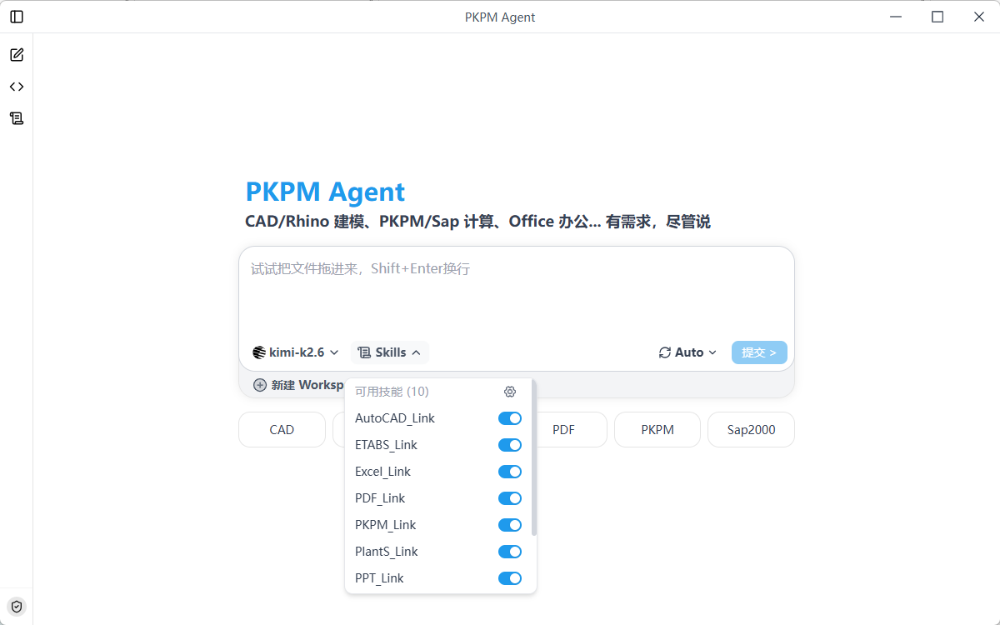
</div>

**自研 Agent 框架（harness-engineering）**

系统基于 LangChain 深度定制，构建了自研的 Agent 执行框架 **harness-engineering**，为智能体提供稳定、可控的任务执行底座，核心能力包括：

- **安全审批**：分级权限管控，敏感操作前触发人工确认，守住底层安全红线。
- **动态加载**：按任务需要动态挂载 MCP 连接与 Skills 技能，用什么加载什么，降低干扰与 Token 消耗。
- **任务规划**：自主拆解复杂需求，规划多步执行链路并根据反馈动态调整。
- **脚本执行**：内置 Shell 与 Python 脚本执行能力，直接调用各软件的 Python API 完成实际操作。

## 3. 快速开始

### 3.1 环境要求

- 💻 **按需安装对应软件**：PKPM 2027R1.0-64 及以上、AutoCAD 2018 及以上、SAP2000 / ETABS / STAAD.Pro / Rhino（使用对应功能时需安装并可正常启动）。
- 🌐 **需连接网络**（用于大模型调用）。

### 3.2 登录

启动软件后进入登录界面，支持 **账号 / 验证码 / 微信** 三种登录方式：

- **个人用户**：可使用手机号 + 密码登录，或点击 **注册账号** 免费注册。
- **企业用户**：点击右上角 **企业授权**，使用企业统一账号登录。
- **邀请码**：在登录时填写邀请码可获取额外赠送额度（选填）。

<div align="center">
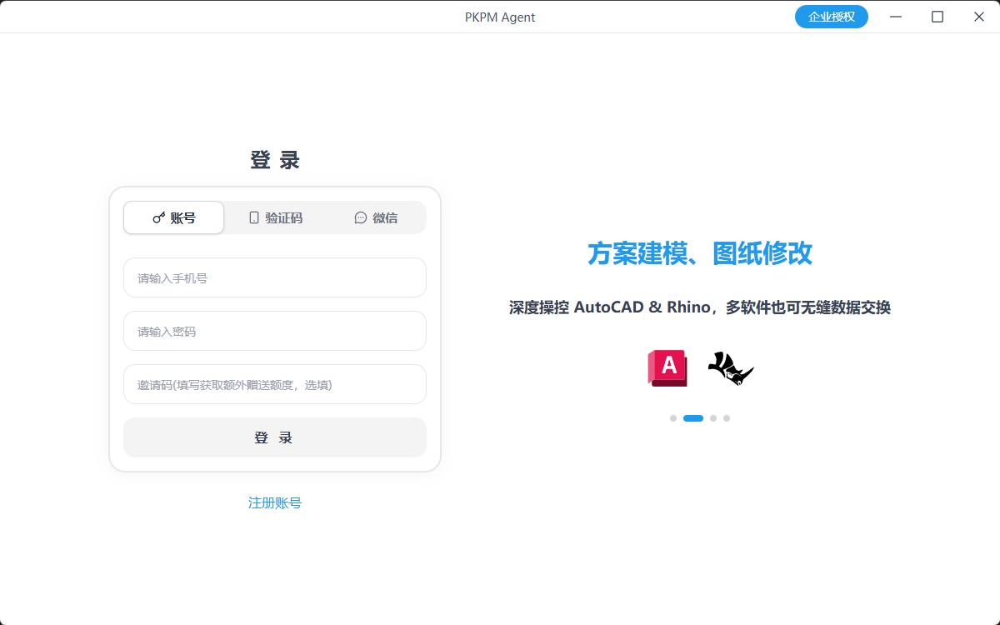
</div>

### 3.3 主界面

登录后进入主界面。左侧为 **新建任务 / python 快捷指令 / skills 技能 / 历史会话** 导航栏，中间为对话输入区，可直接把文件拖入对话框，`Shift + Enter` 换行。

对话框下方可以：

- 切换 **大模型**（如 glm-5.2）；
- 选择 **Skills 技能**；
- 切换 **权限模式**（Ask / Auto / Full）；
- 新建 **Workspace** 工作区。

下方还提供 CAD / Rhino / Office / PDF / PKPM / Sap2000 等常用能力快捷入口。

<div align="center">
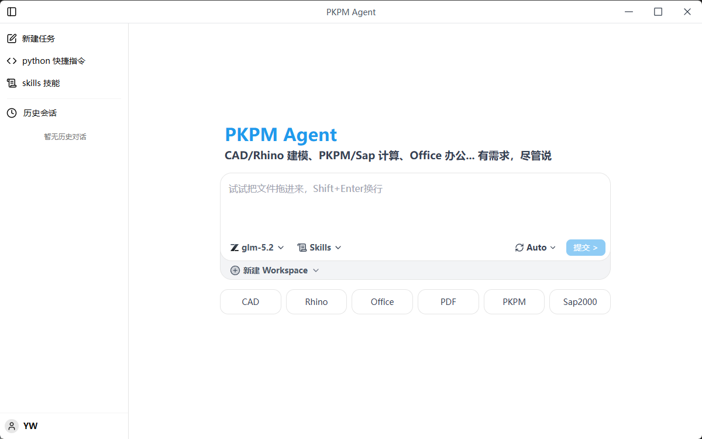
</div>

### 3.4 账号与设置

点击左下角用户头像，可打开 **余额 & 邀请码、产品说明、检查更新、授权验证、切换企业版、退出登录** 等菜单项。

<div align="center">
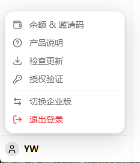
</div>

## 4. Skills 技能系统

**将经验、方法转化为 skills，相似任务轻松复用。** 系统内置多套专业技能，覆盖各软件操控与文档处理能力。点击左侧 **skills 技能**，可查看并管理所有技能。

| 技能 | 能力 |
| --- | --- |
| `pkpm_link` | 连接 PKPM，完成建模、荷载布置、楼层组装、计算与结果提取 |
| `sap2000_link` | 操控 SAP2000 进行建模、分析与结果提取 |
| `etabs_link` | 操控 ETABS 进行建模、分析与结果提取 |
| `staad_link` | 操控 STAAD.Pro 进行建模、计算与结果读取 |
| `rhino_link` | 操控 Rhino 完成建模、绘图、曲面、网格等 3D 建模任务 |
| `autocad_link` | 操控 AutoCAD 完成绘图、改图、图纸信息提取 |
| `word_link` / `excel_link` / `ppt_link` | 操作 Word / Excel / PPT 完成文档创建、编辑与套用模板 |
| `pdf_link` | 处理 PDF 文件的合并、提取、归档与转换 |

> **⚠️ 注意**：关闭某个技能后，Agent 将丧失相应能力。只启用必要的技能可提高效率与准确性，并**大幅降低 Token 消耗**。

除内置技能外，还支持**自定义技能**：把常用的工作流程沉淀为技能，重复使用。在对话框输入「/」即可快速选用技能。

<div align="center">
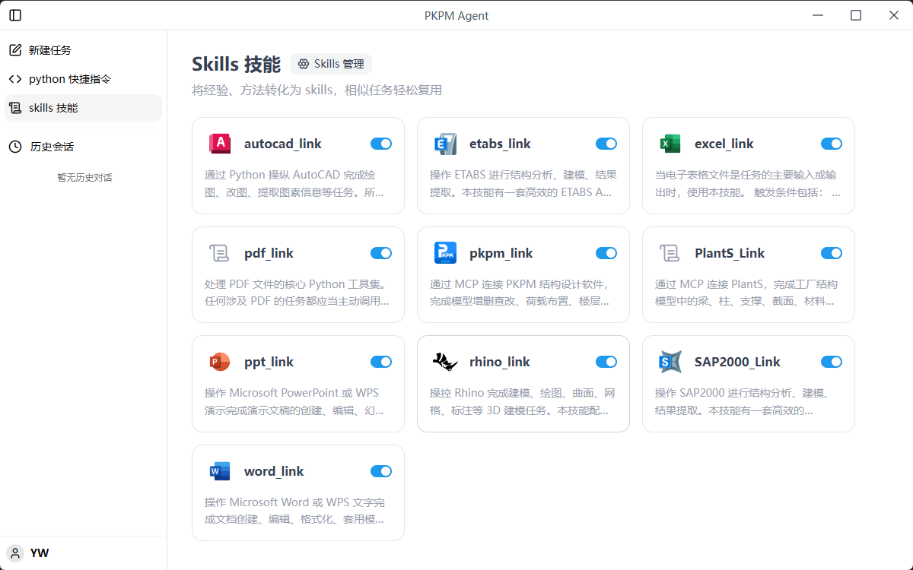
</div>

## 5. 主要功能

### 5.1 操控 PKPM

- **结构模型操作**：创建 / 修改 / 删除梁、柱、墙、板、支撑等构件；定义截面属性与材料等级；操作节点坐标、轴线网格、楼层标高；查询现有模型的几何与属性信息。
- **荷载与工况管理**：施加恒载、活载、风载、地震作用等荷载；定义荷载工况与组合系数；处理吊车、温度、支座沉降等特殊工况。
- **楼层与组装**：创建标准层、定义层高与复制关系、进行楼层组装；修改 / 读取结构总体控制参数（抗震等级、烈度、结构体系等）。
- **计算分析与结果提取**：自动调用 SATWE 计算；提取内力、位移、配筋、应力、周期、振型等结果；读取构件验算结果（轴压比、剪压比、层间位移角等）与计算书文本。

<div align="center">


</div>

### 5.2 操控 SAP2000

通过 `sap2000_link` 技能，使用 Python COM 接口操控 SAP2000：

- **结构建模**：框架、壳、实体、索、钩/隙单元；标准型钢与自定义截面；预应力、桥梁、变截面等特殊单元。
- **荷载与分析**：集中力、分布力、温度、支座沉降、车辆荷载等；线性/非线性静力、模态、反应谱、时程、屈曲、Pushover 等分析类型。
- **结果提取**：节点位移、单元内力、支座反力、模态信息、屈曲系数；钢构件应力比、混凝土配筋结果。
- **典型用途**：处理空间桁架、大跨结构、桥梁等复杂空间结构的补充分析。

<div align="center">

</div>

### 5.3 操控 ETABS

通过 `etabs_link` 技能，使用 Python COM 接口操控 ETABS：

- **结构建模**：点、线、面、实体单元；框架/板/墙截面与材料；楼层标高、轴网、刚性隔板；支座约束、弹簧、阻尼器、隔震/耗能装置等。
- **荷载与工况**：恒载、活载、风载、地震、温度等荷载；多种荷载模式；静力、反应谱、时程、Pushover 等分析工况及组合。
- **分析与结果**：自动运行计算、检查模型完整性；提取内力、位移、层间位移角、模态、反力、应力及设计结果。
- **数据联动**：将模型数据或结果导出到 Excel / Word / PPT，自动生成分析报告或对比表格。

### 5.4 操控 STAAD.Pro

通过 `staad_link` 技能，可让智能体直接在 STAAD.Pro 中完成结构建模、计算分析并读取结果：

- **结构建模**：创建节点、杆件、板单元；定义截面属性与材料；布置支座约束。
- **荷载与参数**：施加恒载、活载、风载等荷载；定义荷载工况与组合；设置地震参数。
- **计算与结果**：自动执行分析计算，提取节点位移、构件内力、支座反力等结果。

### 5.5 操控 Rhino

通过 `rhino_link` 技能，使用 Python COM 接口操控 Rhino（犀牛）：

- **几何创建**：NURBS 曲线与曲面（拉伸、旋转、放样、扫掠）、实体与网格布尔运算。
- **建筑与结构建模**：参数化生成建筑外形、幕墙分格、结构构件定位；批量生成梁、柱、支撑等三维实体。
- **编辑与出图**：平移/旋转/缩放/镜像/阵列、几何分析、图层管理、尺寸标注与视图控制。
- **联动应用**：将复杂曲面数据导出供 ETABS / SAP2000 / PKPM 分析，或基于结果生成优化后的建筑形体。

<div align="center">
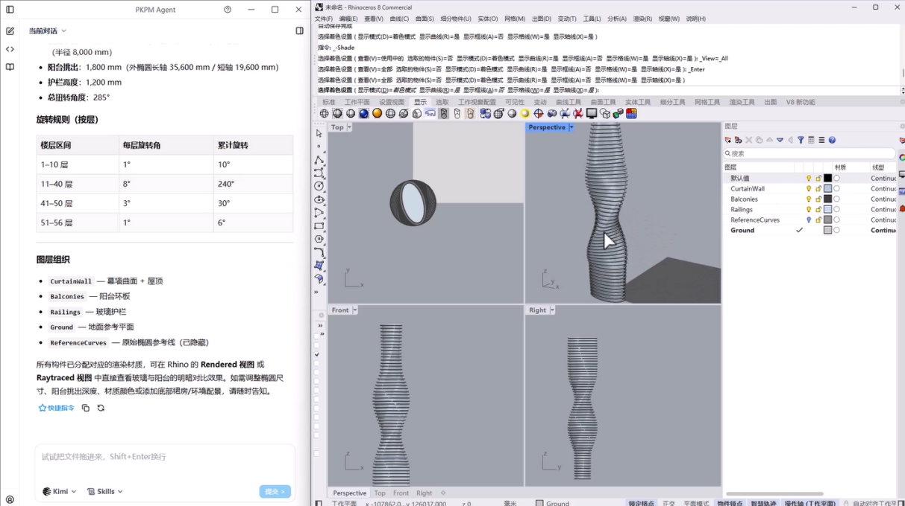
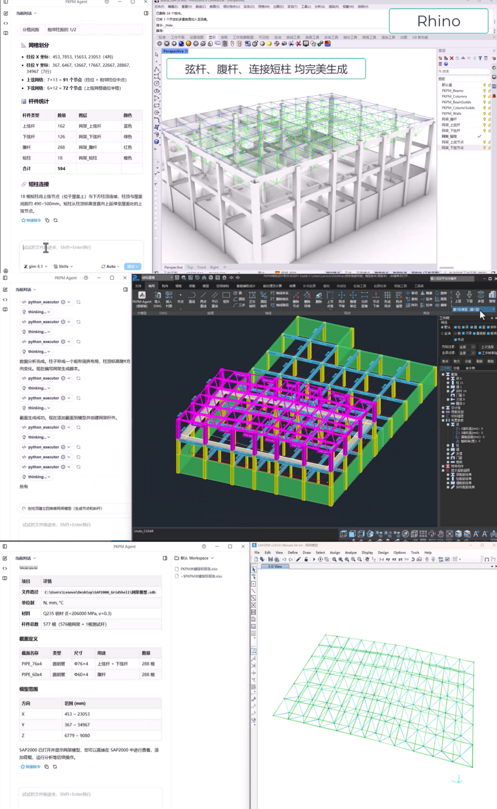
</div>

### 5.6 操控 AutoCAD

通过 `autocad_link` 技能，使用 Python COM 接口操控 AutoCAD：

- **自动绘图**：根据数据或指令绘制轴线、梁线、柱截面、剪力墙轮廓、支撑等；添加文字、尺寸标注；插入标准节点详图、柱表、图框等图块。
- **智能改图**：批量移动/复制/旋转/缩放；按规则批量修改图层、颜色、线型；批量删除多余图元；统一文字与标注样式。
- **图纸信息提取**：一键提取图中文字、坐标、多段线顶点；按图层筛选；读取当前选中对象信息。
- **数据联动**：实现 AutoCAD ↔ PKPM / ETABS / SAP2000 双向互通——模型转图、结果回注、底图建模。

> **使用前提**：已安装 AutoCAD（建议 2018 及以上版本），可正常启动，图纸文件未加密或写保护。

<div align="center">

</div>

### 5.7 文档与报告（Word / Excel / PPT / PDF）

深度集成 Microsoft Office、WPS Office 及 PDF 处理工具：

- **Word**：结构设计计算书、技术报告自动生成。
- **Excel**：配筋结果导出、数据报表与统计表制作。
- **PPT**：项目汇报材料、技术演示文稿一键生成。
- **PDF**：正式报告合并、提取与归档，矢量 PDF 转换 CAD。

支持字体、字号、页边距、表格样式等格式参数的详细指定，满足企业标准化文档输出需求。

<div align="center">


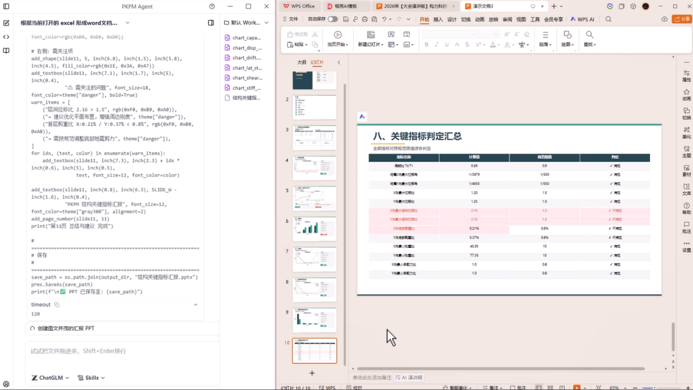
</div>

## 6. 其他功能

### 6.1 Python 收藏系统

- 自动记录执行过程中生成的 Python 脚本。
- 支持将常用操作保存为可命名、可描述的自定义指令。
- 支持参数化标记，执行时可修改参数，实现"一键复用 / 修改"。
- 适用于重复性模型检查、标准化建模流程、批量处理等场景。

<div align="center">
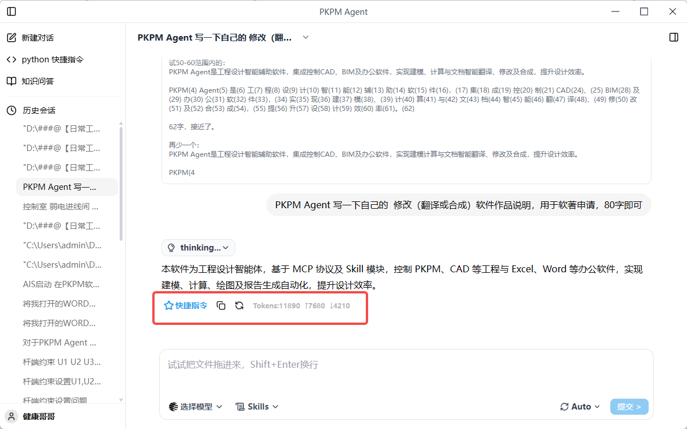
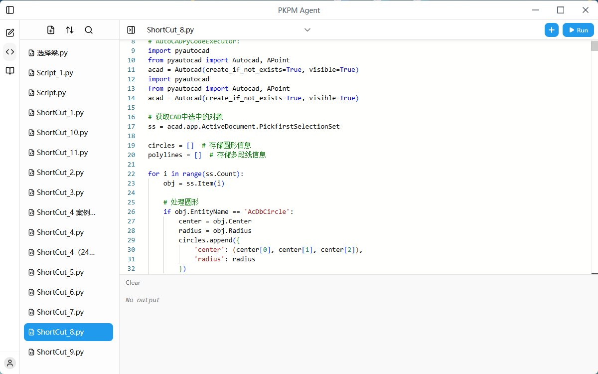
</div>

### 6.2 交互体验优化

- **意图识别增强**：即使表述不够精确或包含口语化表达，也能准确匹配专业功能（例如"改一下梁"可结合上下文推断为截面调整或配筋修改）。
- **对话式工作流**：遵循"连接 → 检索 → 执行"三步模式，降低学习成本。
- **关键步骤主动确认**：智能体在执行关键步骤时会主动向你确认，减少理解偏差和返工。
- **智能连接管理**：执行任务时自动建立 MCP 连接、断开后自动重连；长时间计算导致软件重启后，Agent 自动恢复连接并反馈结果。

### 6.3 权限控制

系统提供三级权限控制模式，规范智能体的自动执行行为，兼顾效率与安全：

- **请求批准（Ask）**：在执行任何可能影响原始数据或文件的操作前（覆盖保存、修改模型、启动计算等）均会发起确认请求；只读操作（数据分析、读取、报告生成等）自动完成。
- **替我审批（Auto）**：根据内置安全策略自主判断，对符合规范的标准操作自动审批执行，仅在触及安全红线或不确定时才请示，适合常规工程设计任务。
- **完全访问（Full）**：在严格遵守底层安全禁令（禁止删除文件、修改系统配置、提权、格式化等破坏性指令）前提下，拥有最大化自主执行权限，适合流程熟悉的资深用户。

> 无论处于何种权限模式，系统底层安全红线始终强制生效，从根本上杜绝文件误删、系统篡改及越权操作等风险。

<div align="center">
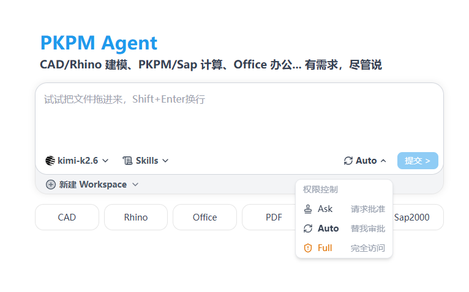
</div>

## 7. 二次开发

**我们支持用户自定义工具供大模型调用，编写完成后，将会展示在 工具管理-> 用户自定义 页面下**

支持在Python快捷指令中调用用户自定义的工具，无需import


打开 UserDefineTool.py，编写MCP工具，示例代码如下：
```python
from PKPMMCP.Base import *
__Tag = ToolAnnotations(title = "用户自定义") 

#示例代码
@mcp.tool(annotations=__Tag)
def add(a, b) -> bool:
    """ 加法运算器 """   
    return a + b
```
**二次开发环境配置流程如下：**
- 开启 VSCode 打开 PKPM2027RXXX > Ribbon > PythonEnv 文件夹
- 选择PKPM python 环境作为 VSCode 的解释器


- 可以使用 Base.py 文件提供的基础类和工具

- 开启 UserDefineTool.py，编写自己的MCP工具，可以直接使用 PKPM 的 Python API
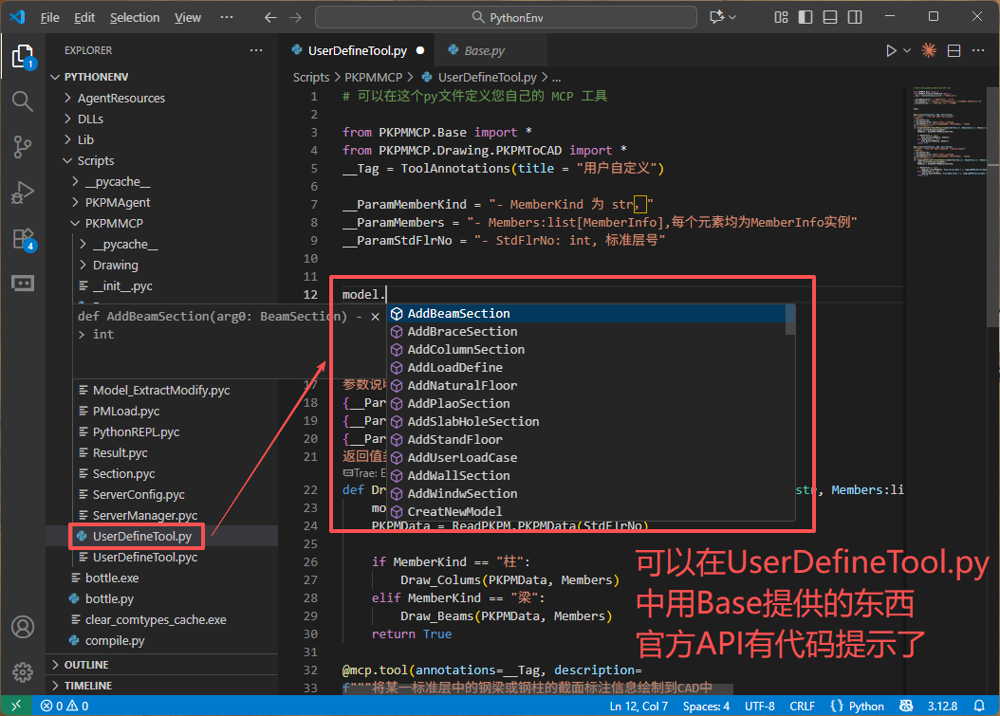

<a id="交流群"></a>

## 8. 加入交流群

扫码加入 **PKPM Agent 工程设计智能体** 用户交流群，反馈问题、分享经验、获取最新动态：

<div align="center">

</div>
