<div align="center">

# PKPM Agent 用户手册

**工程设计智能体 · V2.5**

</div>

<div align="center">

[**⬇️ 立即下载 PKPM Agent 2.5.0**](https://update.pkpm.cn/PKPM2010/Soft/Agent/PKPMAgent_Setup_2.5.0.exe) &nbsp;·&nbsp; [**📋 更新说明**](CHANGELOG.md) &nbsp;·&nbsp; [**😊许愿池 & ☹️点我吐槽**](https://gitee.com/pkpmgh/PKPMAgentRelease/issues/ICWL5R) &nbsp;·&nbsp; [**💬 加入交流群**](#交流群)

</div>

---

## 1. 产品简介

**✨ PKPM Agent 工程设计智能体**

<div align="center">
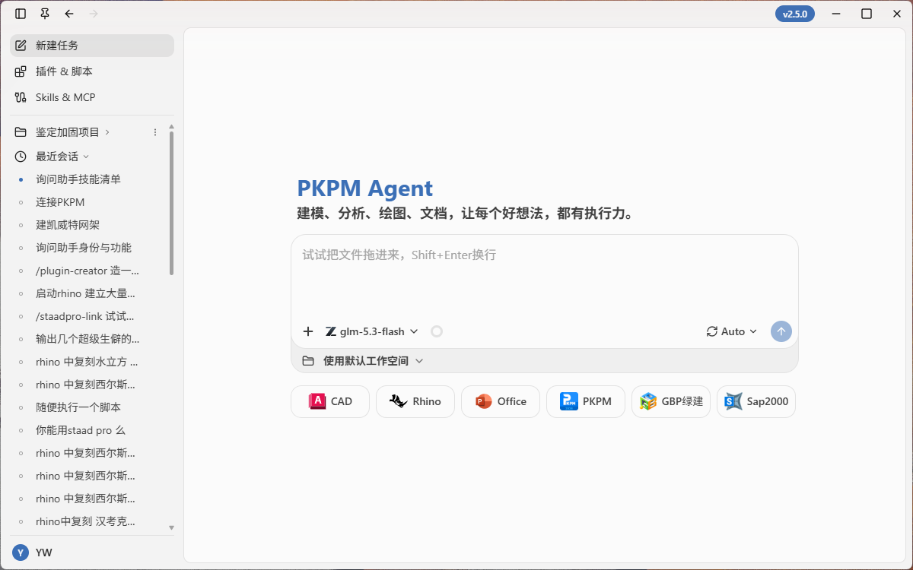
<br>
<sub>▲ PKPM Agent 主界面：左侧为导航与按工作空间分组的会话，中间为对话区</sub>
</div>

通过自然语言交互，PKPM Agent 可以：

- 🏗️ **深度操控 PKPM**：结构建模、荷载布置、计算分析、结果提取，覆盖三维主线、STS 钢结构、JCCAD 基础等模块
- 📐 **图纸审查**：识别并校审 DWG 施工图，审查意见标注回 AutoCAD 图纸，一键导出 Word 审查报告
- 🧮 **多软件协同**：实时操控 SAP2000、ETABS、STAAD.Pro、Abaqus、Tekla Structures、SAUSG、Rhino、AutoCAD、BIMBase / PlantS
- 🌿 **绿色低碳**：连接 PKPM 绿色低碳系列软件，绿建评价、碳排放、能耗分析一键计算
- 📄 **文档全流程自动化**：一键生成 Word / Excel / PPT，处理与转换 PDF
- 🧩 **插件 & 脚本复用**：常用对话和脚本可保存为带参数表单的可复用插件，一次配置、多次使用

**🚀 V2.5 核心升级**

- **界面全新改版**：灰色外壳配白色正文，顶栏新增窗口置顶与前进 / 后退按钮；中文字体换用思源黑体，1080p 屏幕下文字明显更清晰。
- **深色模式**：浅色 / 深色 / 跟随系统三种外观，一键切换，界面配色全面适配。
- **新增 PKPM 图纸审查**：对 DWG 施工图进行识别与校审，审查意见可标注回 AutoCAD 图纸，并导出 Word 审查报告。
- **新增 Abaqus 联动**：建模、提交计算到查看结果全流程可用，内置 2024 / 2025 / 2026 各版本 API 文档。
- **新增 Tekla Structures 联动**：自动识别正在运行的版本并匹配对应 API，支持查询、建模与修改。
- **新增 SAUSG 联动（Beta）**：支持模型查看、修改、查询等操作。
- **新增 PKPM 绿色低碳 GBP（Beta）**：绿建评价、碳排放、能耗分析一键计算，快捷提问新增绿建示例。
- **新增 PKPM STS（钢结构）模块联动**，以及 **PKPM JCCAD（基础）模块联动（Beta）**。
- **内置 BIMBase 参数化组件**：可直接检索 pyp3d 建模函数并生成脚本。
- **Token 用量可见**：悬停在每轮回答末尾的操作栏，即可查看本会话累计消耗。
- **插件参数新增「文件」类型**：点「浏览…」直接选择文件，不用再手动粘贴路径；往对话框拖入文件也不再限制格式。
- **Skills 与 MCP 页面重排**：技能按用途分组，详情弹窗统一；MCP 列表显示中文名称与用途说明，尚未成熟的模块标注「Beta」。
- **启动提速**：登录与授权检查并入启动动画，不再额外等待。

---

## 2. 核心架构

**三大核心技术深度融合**

1. **大模型服务**：由构力科技统一提供模型服务，内置接入 **GLM、Kimi、Qwen、DeepSeek 等主流旗舰大模型**，开箱即用、无需自行配置 API Key，可根据任务需要自由切换。
2. **SKILL 技能系统**：内置结构设计领域专业知识库，封装建模、计算、绘图、文档生成等完整操作规范，实现"渐进式披露"的智能任务匹配。
3. **MCP 模型上下文协议**：标准化通信协议层，将各工程软件的 API 统一映射为 Python 可调用接口，打通 Agent 与专业软件之间的数据壁垒。通过 **MCP 接口页**，还可自行接入更多外部工具。

除内置模型外，还支持在模型选择菜单中点击「+」**添加自定义第三方模型**：选择服务商（Kimi、ChatGLM、Qwen、DeepSeek、SiliconFlow）、填写模型 ID 与 API 地址 / 密钥，检测连接通过后即可启用，支持按量计费与 Coding Plan 两种接入方式。

<div align="center">
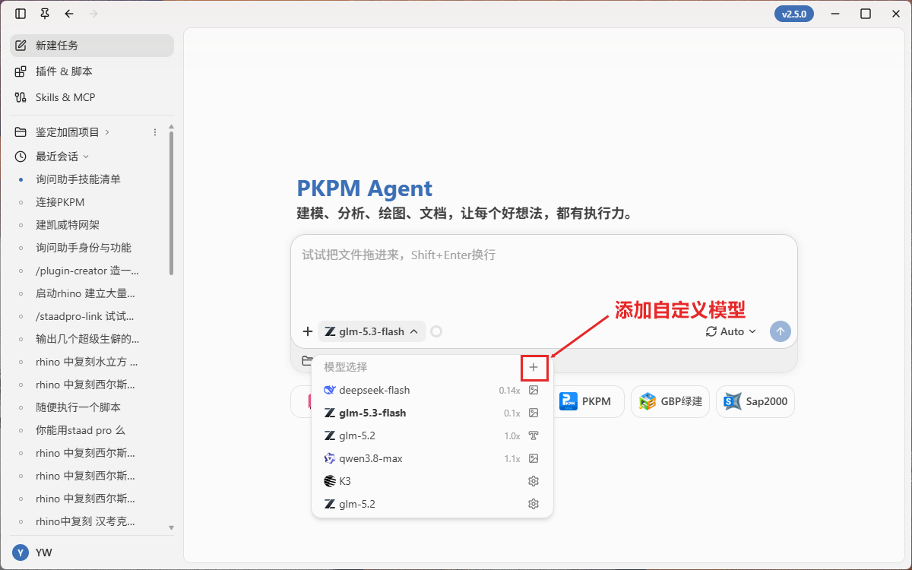
<br>
<sub>▲ 在模型选择菜单中点击「+」添加自定义第三方模型</sub>
</div>

<div align="center">
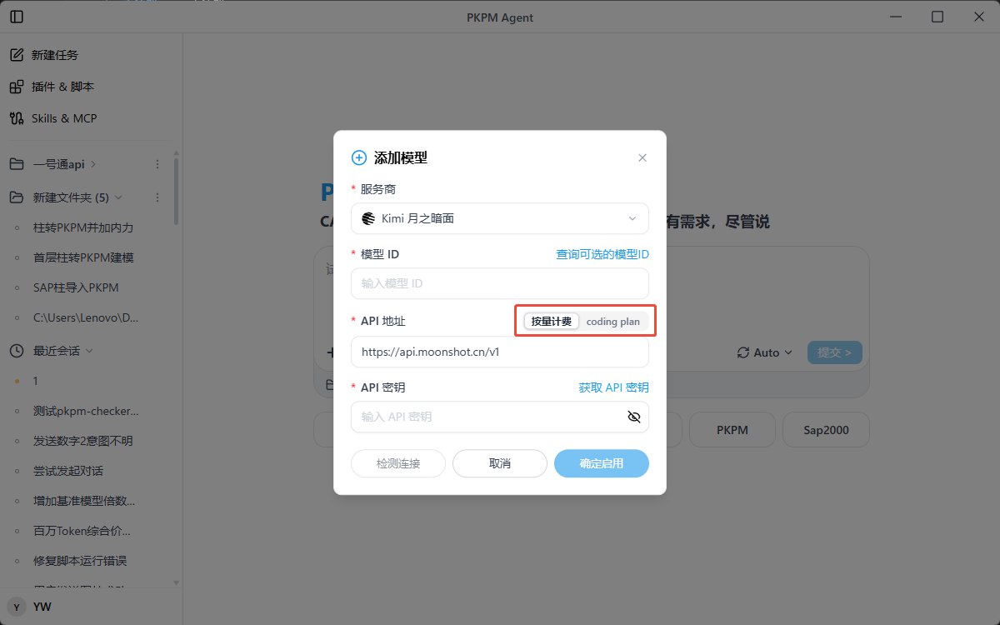
<br>
<sub>▲ 自定义第三方模型配置页面：选择服务商、填写模型 ID 与 API 密钥，检测连接后启用</sub>
</div>

**自研 Agent 框架（harness-engineering）**

系统基于 LangChain 深度定制，构建了自研的 Agent 执行框架 **harness-engineering**，为智能体提供稳定、可控的任务执行底座，核心能力包括：

- **安全审批**：分级权限管控，敏感操作前触发人工确认，守住底层安全红线。
- **动态加载**：按任务需要动态挂载 MCP 连接与 Skills 技能，用什么加载什么，降低干扰与 Token 消耗。
- **任务规划**：自主拆解复杂需求，规划多步执行链路并根据反馈动态调整。
- **脚本执行**：内置 Shell 与 Python 脚本执行能力，直接调用各软件的 Python API 完成实际操作。

---

## 3. 快速开始

### 3.1 环境要求

- 💻 **按需安装对应软件**（使用对应功能时需安装并可正常启动）：
  - PKPM 2027R1.0-64 及以上（含 STS、JCCAD、图纸审查、绿色低碳等模块）
  - AutoCAD 2018 及以上
  - SAP2000 / ETABS / STAAD.Pro / Rhino
  - Abaqus 2024 / 2025 / 2026、Tekla Structures 2020 ~ 2026、SAUSG
  - BIMBase / PlantS
- 🌐 **需连接网络**（用于大模型调用）。

### 3.2 登录

启动软件后进入登录界面，支持 **账号 / 验证码 / 微信** 三种登录方式；登录与授权检查已并入启动动画，登录后直接进入主界面。

- **个人用户**：可使用手机号 + 密码登录，或点击 **注册账号** 免费注册。
- **邀请码**：在登录时填写邀请码可获取额外赠送额度（选填）。
- **企业用户（锁码授权）**：点击 **使用锁码授权**，在弹出的 PKPM 授权工具中完成本机授权；授权后该按钮变为 **跳过登录**，可不登录直接进入。

<div align="center">

<br>
<sub>▲ 登录界面：支持账号 / 验证码 / 微信登录，下方为注册账号与锁码授权入口</sub>
</div>

### 3.3 主界面

登录后进入主界面（见第 1 节配图）：

- **顶栏**：从左到右依次为收起 / 展开侧栏、**窗口置顶**、**后退 / 前进**（在会话与各页面之间切换），右侧显示当前版本号。
- **左侧导航**：**新建任务 / 插件 & 脚本 / Skills & MCP**，下方是 **按工作空间分组的历史会话** 与最近会话。
- **中间对话区**：可直接把任意格式的文件（或整个文件夹）拖入对话框，`Shift + Enter` 换行。

对话框下方可以：

- 点「**+**」添加文件和图片，或选择 **Skills 技能**；
- 切换 **大模型**（如 glm-5.3-flash），模型列表中会标注各模型的 **Token 消耗速度倍率**与支持的模态（文本 / 视觉等）；
- 查看 **上下文用量指示**（模型名右侧的圆环，悬停显示已用百分比）；
- 切换 **权限模式**（Ask / Auto / Full）；
- 选择会话所属的 **工作空间**。

再往下是 CAD / Rhino / Office / PKPM / GBP绿建 / Sap2000 六个快捷提问入口。

<div align="center">
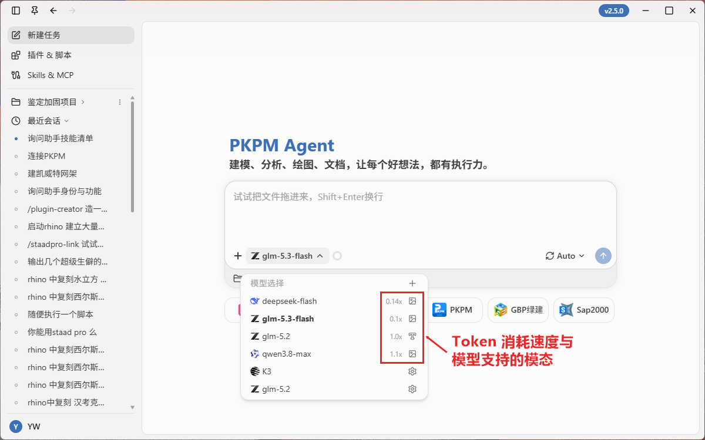
<br>
<sub>▲ 模型列表：标注各模型的 Token 消耗速度倍率与支持的模态</sub>
</div>

历史会话**按工作空间分组**展示，点工作空间右侧的「⋮」可 **新建任务 / 打开文件夹 / 重命名 / 删除**，多个项目并行管理互不干扰：

<div align="center">
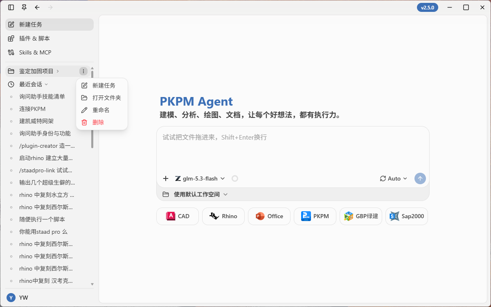
<br>
<sub>▲ 历史会话按工作空间自动分组，点「⋮」可管理工作空间</sub>
</div>

### 3.4 快捷提问

点击对话框下方的快捷入口，会展开该软件的示例任务。点击示例只把内容填入输入框、不会直接发送，可以改好参数再发：

<div align="center">
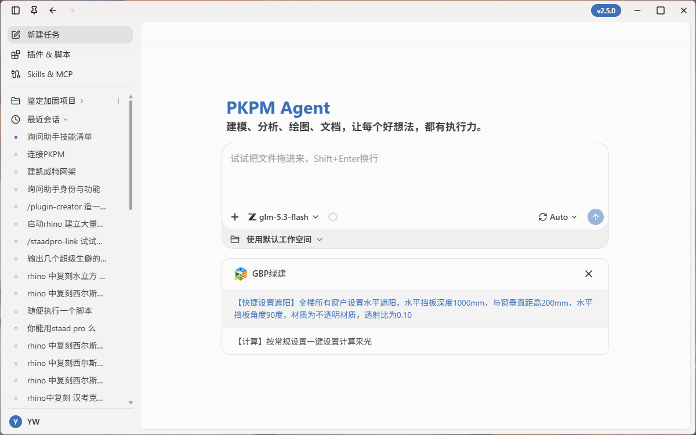
<br>
<sub>▲ 点击「GBP绿建」展开绿建示例，点击示例后内容填入输入框</sub>
</div>

### 3.5 账号、外观与设置

点击左下角用户头像，可打开 **余额 & 邀请码、语言（中 / 英）、外观、产品说明、检查更新、退出登录** 等菜单项。**外观** 下可选 **浅色模式 / 深色模式 / 跟随系统**。

<div align="center">
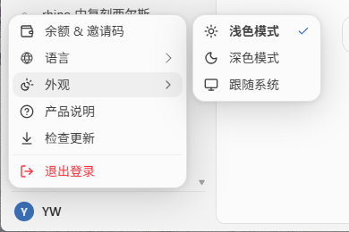
<br>
<sub>▲ 用户头像菜单：外观下可切换浅色 / 深色 / 跟随系统</sub>
</div>

<div align="center">
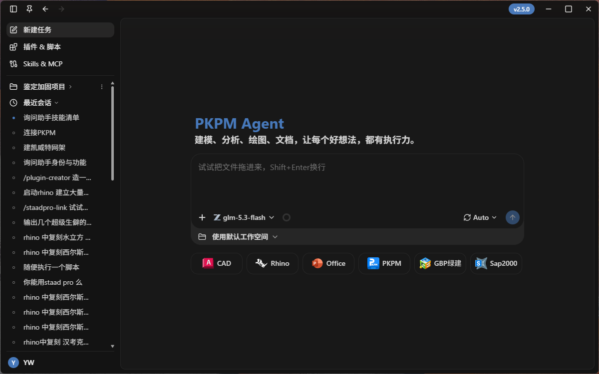
<br>
<sub>▲ 深色模式下的主界面</sub>
</div>

---

## 4. 插件 & 脚本系统

**一次成功的任务，下次不必重来。** 任意一条回答下方都可点击 **插件 & 脚本**，将本次任务 **制作成插件** 或 **保存到脚本**，是日常工作中沉淀复用效率最高的功能：

- **插件**：自动把任务提炼为带**参数表单**的界面——跨度、截面、材料等参数留空可填，以后填入参数点击 **RUN** 即可一键执行，一次配置、多次使用；还支持「恢复默认参数」。
- **脚本**：执行过程中生成的 Python 脚本自动收藏，可随时查看、编辑、运行。
- **Agent 协同**：插件与脚本既可从对话中收藏，也可由 Agent 直接创建；点击 **「让 Agent 修改」** 可把脚本连同运行结果一键交给 Agent 修改或修复。
- 适用于重复性模型检查、标准化建模流程、批量处理等场景。

<div align="center">
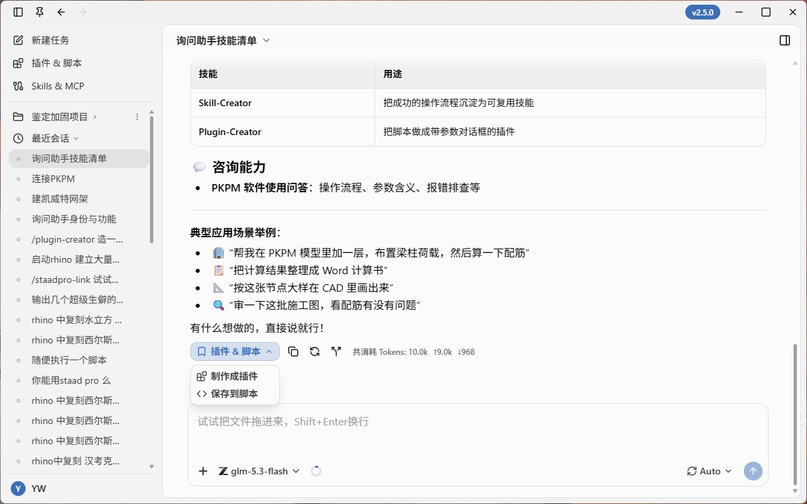
<br>
<sub>▲ 任意一条回答下方均可将本次任务制作成插件或保存到脚本</sub>
</div>

插件会自动生成参数表单，填入参数、点击 RUN 即可重复执行整个任务：

<div align="center">
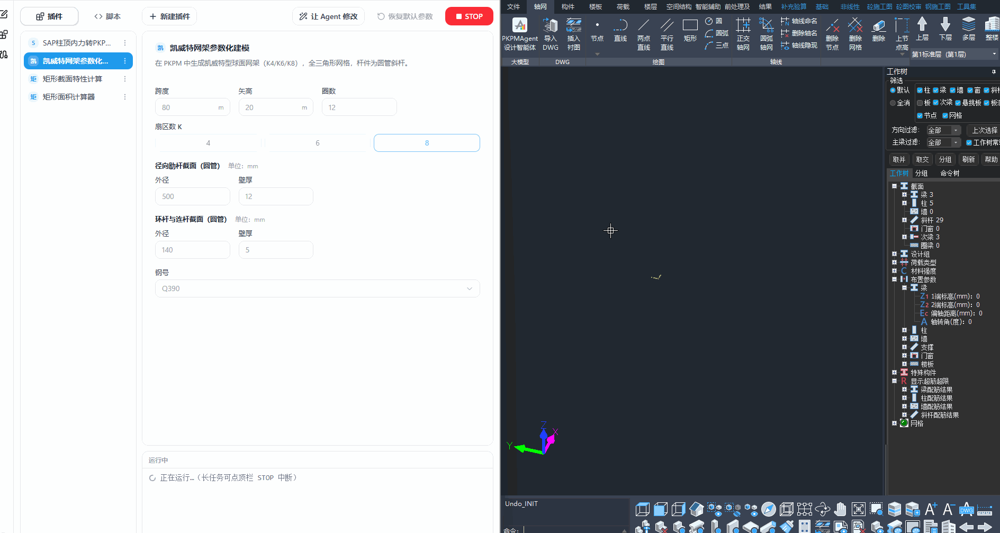
<br>
<sub>▲ 插件填入参数后一键执行</sub>
</div>

参数表单支持数值、文本、开关、下拉选项、目录和**文件**等类型；目录和文件类型的参数旁有「**浏览…**」按钮，可直接在弹出的对话框里选择，不用再手动粘贴路径：

<div align="center">
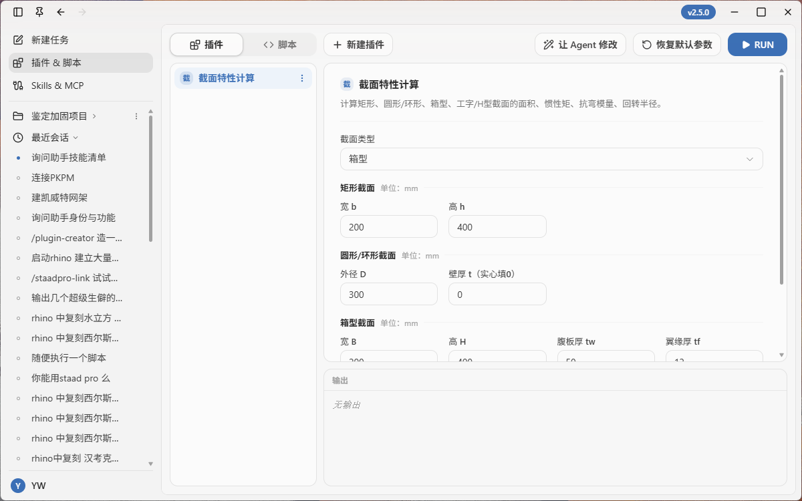
<br>
<sub>▲ 插件页面：左侧为插件列表，右侧为参数表单，顶部可「让 Agent 修改」「恢复默认参数」或「RUN」</sub>
</div>

脚本既可从对话中收藏，也可由 Agent 直接创建、修改与修复：

<div align="center">
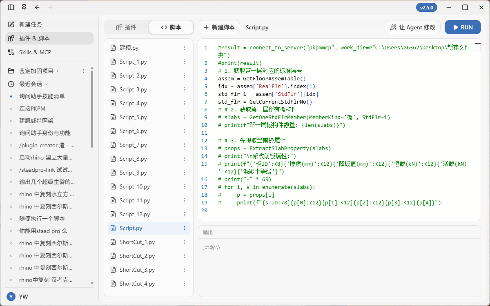
<br>
<sub>▲ 脚本页面：查看、编辑、运行脚本，或交给 Agent 修改</sub>
</div>

---

## 5. Skills 技能与 MCP 接口

### 5.1 Skills 技能

**将经验、方法转化为 skills，相似任务轻松复用。** 系统内置多套专业技能，按用途分为建筑设计、结构设计、通用办公和其他四组。点击左侧 **Skills & MCP**，可查看并管理所有技能。

| 分组 | 技能 | 能力 |
| --- | --- | --- |
| 建筑设计 | `AutoCAD-Link` | 操控 AutoCAD 完成绘图、改图、图纸信息提取 |
| 建筑设计 | `Rhino-Link` | 操控 Rhino 完成建模、绘图、曲面、网格等 3D 建模任务 |
| 建筑设计 | `bimbase-parametric-component` | 用 pyp3d 编写 BIMBase 参数化建模脚本，并在 BIMBase 中执行 |
| 建筑设计 | `GBP-link`（Beta） | 连接 PKPM 绿色低碳系列软件，完成建模、节能、风环境、采光、碳排放等计算 |
| 结构设计 | `PKPM-Link` | 连接 PKPM，完成建模、荷载布置、楼层组装、计算与结果提取 |
| 结构设计 | `pkpm-checker` | PKPM 图纸审查：识别校审 DWG 施工图，结果可标注回 CAD、导出 Word 报告 |
| 结构设计 | `sap2000-link` | 操控 SAP2000 进行建模、分析与结果提取 |
| 结构设计 | `ETABS-Link` | 操控 ETABS 进行建模、分析与结果提取 |
| 结构设计 | `staadpro-link` | 操控 STAAD.Pro 进行建模、计算与结果读取 |
| 结构设计 | `abaqus-link` | 操作 Abaqus 完成建模、修改、网格、分析设置、作业提交和结果提取 |
| 结构设计 | `tekla-link` | 控制正在运行的 Tekla Structures，完成模型读取、创建、修改与节点组件操作 |
| 结构设计 | `SSG-link`（Beta） | 连接 SAUSG，完成模型查看、修改、查询 |
| 结构设计 | `PlantS-Link` | 连接 PlantS（BIMBase），完成工厂结构模型的梁、柱、支撑等构件操作 |
| 通用办公 | `Word-Link` / `Excel-Link` / `PPT-Link` | 操作 Word / Excel / PPT 完成文档创建、编辑与套用模板 |
| 通用办公 | `PDF-Link` | 处理 PDF 文件的合并、提取、归档与转换 |
| 其他 | `plugin-creator` / `skill-creator` | 把一次成功的对话做成插件，或沉淀为新技能 |

> **⚠️ 注意**：关闭某个技能后，Agent 将丧失相应能力。只启用必要的技能可提高效率与准确性，并**大幅降低 Token 消耗**。标注「Beta」的技能尚未成熟，默认关闭，需要时手动开启。

<div align="center">
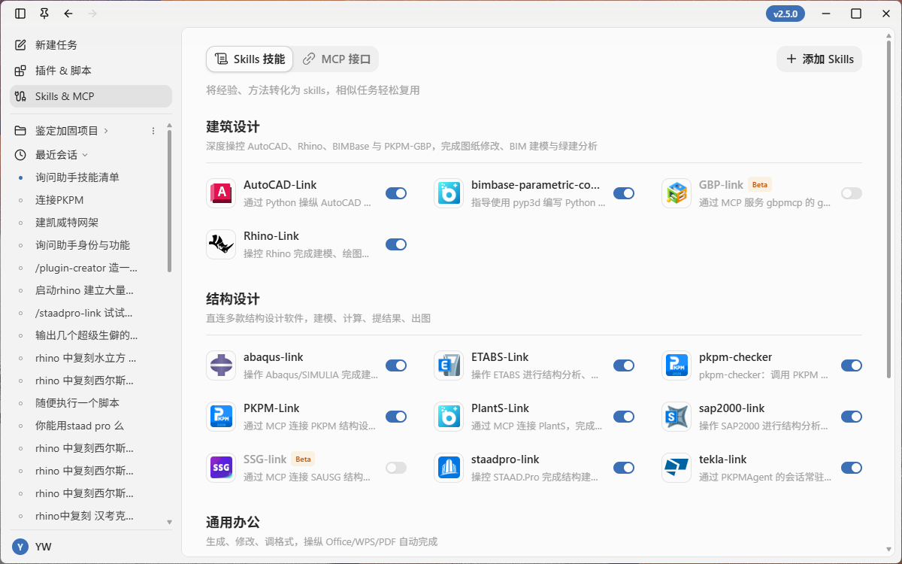
<br>
<sub>▲ Skills 技能管理界面：技能按用途分组，可启用 / 关闭技能，或添加第三方技能</sub>
</div>

点击任意技能卡片可打开详情弹窗，查看完整说明，并可直接「立即使用」：

<div align="center">
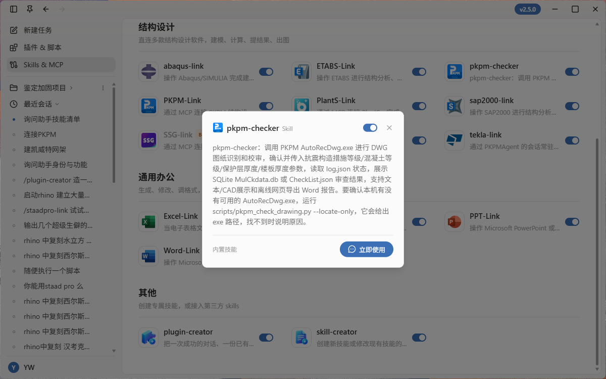
<br>
<sub>▲ 技能详情弹窗</sub>
</div>

除内置技能外，还支持**自定义技能**：把常用的工作流程沉淀为技能，重复使用。点击 **添加 Skills** 可接入第三方技能；在对话框输入「/」即可快速选用技能：

<div align="center">
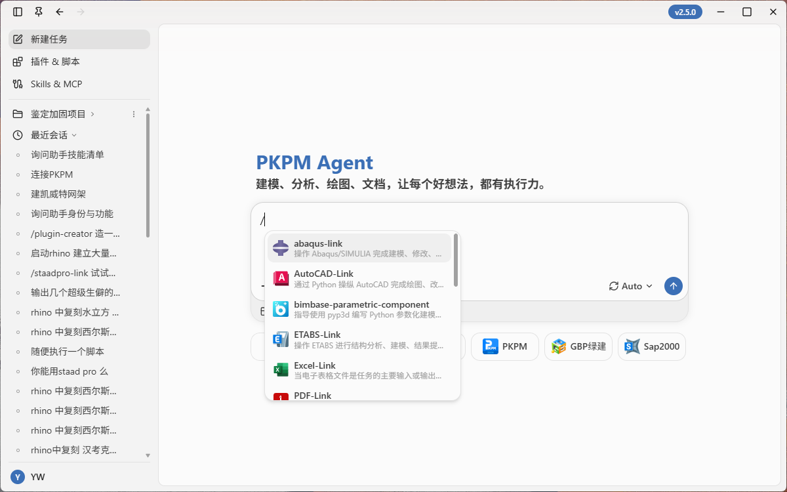
<br>
<sub>▲ 在对话框输入「/」快速选择技能</sub>
</div>

### 5.2 MCP 接口

**MCP 接口** 页列出了 Agent 可连接的各个软件服务，以中文名称和用途说明显示，可按需启停：

| 名称 | 用途 |
| --- | --- |
| PKPM | PKPM 三维主线模块，含鉴定加固功能 |
| PKPM STS | PKPM 二维钢结构模块 |
| PKPM JCCAD（Beta） | PKPM 基础模块 |
| SAUSG（Beta） | SAUSG 非线性动力弹塑性分析软件，含减震、隔震、加固等模块 |
| PlantS | 基于 BIMBase 的三维工厂结构设计系统 |
| BIMBase 参数化组件 | Python 组件建模指南，pyp3d 建模脚本的函数文档检索 |
| PKPM 绿色低碳（Beta） | PKPM 绿色低碳模块，含节能、风环境、采光、碳排放等计算 |

点击 **添加 MCP** 可接入更多外部工具，扩展 Agent 的能力边界。

<div align="center">
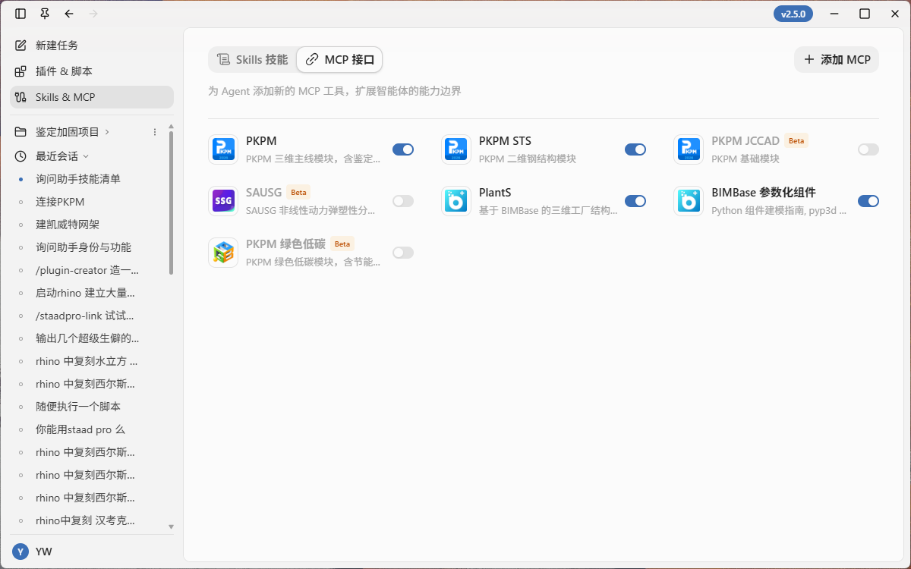
<br>
<sub>▲ MCP 接口页面：显示中文名称与用途说明，尚未成熟的模块标注「Beta」</sub>
</div>

---

## 6. 主要功能

### 6.1 操控 PKPM

- **结构模型操作**：创建 / 修改 / 删除梁、柱、墙、板、支撑等构件；定义截面属性与材料等级；操作节点坐标、轴线网格、楼层标高；查询现有模型的几何与属性信息。
- **荷载与工况管理**：施加恒载、活载、风载、地震作用等荷载；定义荷载工况与组合系数；处理吊车、温度、支座沉降等特殊工况。
- **楼层与组装**：创建标准层、定义层高与复制关系、进行楼层组装；修改 / 读取结构总体控制参数（抗震等级、烈度、结构体系等）。
- **计算分析与结果提取**：自动调用 SATWE 计算；提取内力、位移、配筋、应力、周期、振型等结果；读取构件验算结果（轴压比、剪压比、层间位移角等）与计算书文本。
- **多模块联动**：除三维主线模块外，还可连接 **STS 钢结构** 与 **JCCAD 基础**（Beta）模块，在 MCP 接口页开启即可。
- **连接正在运行的 PKPM**：会一并记录其启动参数，计算完成后可按原模块重新打开。

<div align="center">
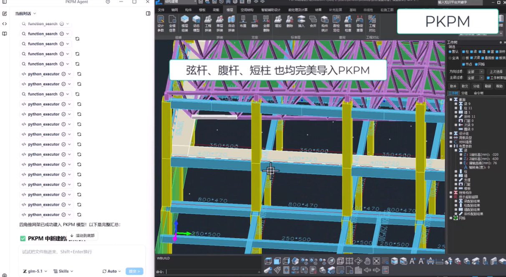
<br>
<sub>▲ 通过自然语言指令操控 PKPM 完成结构建模</sub>
</div>

建模完成后，可直接指令 Agent 启动计算并提取分析结果：

<div align="center">
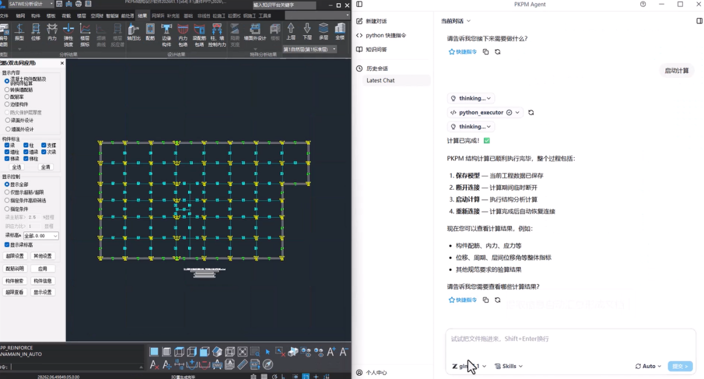
<br>
<sub>▲ 自动调用 SATWE 计算并提取结果</sub>
</div>

### 6.2 PKPM 图纸审查

通过 `pkpm-checker` 技能，对 DWG 施工图进行识别与校审：

- **识别校审**：把 DWG 施工图交给 Agent，确认抗震构造措施等级、混凝土等级、保护层厚度、楼板厚度等参数后自动识别并审查。
- **查看结果**：审查意见可在对话中以文本查看，也可标注回 AutoCAD 图纸中对应位置。
- **导出报告**：一键导出 Word 审查报告。

> **使用前提**：本机已安装 PKPM（图纸审查依赖 PKPM 自带的施工图识别程序）；查看标注需安装 AutoCAD。

### 6.3 操控 SAP2000

通过 `sap2000-link` 技能，使用 Python COM 接口操控 SAP2000：

- **结构建模**：框架、壳、实体、索、钩/隙单元；标准型钢与自定义截面；预应力、桥梁、变截面等特殊单元。
- **荷载与分析**：集中力、分布力、温度、支座沉降、车辆荷载等；线性/非线性静力、模态、反应谱、时程、屈曲、Pushover 等分析类型。
- **结果提取**：节点位移、单元内力、支座反力、模态信息、屈曲系数；钢构件应力比、混凝土配筋结果。
- **典型用途**：处理空间桁架、大跨结构、桥梁等复杂空间结构的补充分析。

<div align="center">
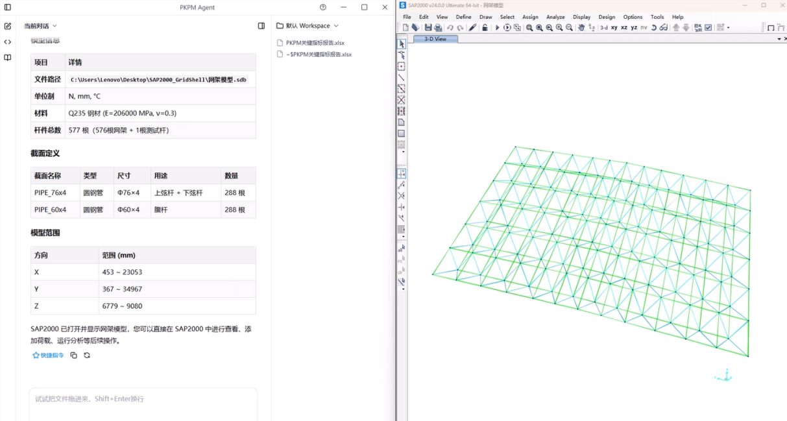
<br>
<sub>▲ 操控 SAP2000 完成建模与分析</sub>
</div>

### 6.4 操控 ETABS

通过 `ETABS-Link` 技能，使用 Python COM 接口操控 ETABS：

- **结构建模**：点、线、面、实体单元；框架/板/墙截面与材料；楼层标高、轴网、刚性隔板；支座约束、弹簧、阻尼器、隔震/耗能装置等。
- **荷载与工况**：恒载、活载、风载、地震、温度等荷载；多种荷载模式；静力、反应谱、时程、Pushover 等分析工况及组合。
- **分析与结果**：自动运行计算、检查模型完整性；提取内力、位移、层间位移角、模态、反力、应力及设计结果。
- **数据联动**：将模型数据或结果导出到 Excel / Word / PPT，自动生成分析报告或对比表格。

### 6.5 操控 STAAD.Pro

通过 `staadpro-link` 技能，可让智能体直接在 STAAD.Pro 中完成结构建模、计算分析并读取结果：

- **结构建模**：创建节点、杆件、板单元；定义截面属性与材料；布置支座约束。
- **荷载与参数**：施加恒载、活载、风载等荷载；定义荷载工况与组合；设置地震参数。
- **计算与结果**：自动执行分析计算，提取节点位移、构件内力、支座反力等结果。

### 6.6 操控 Abaqus

通过 `abaqus-link` 技能操控 Abaqus / SIMULIA，从建模到看结果全流程可用：

- **建模与修改**：几何、材料、装配、分析步、边界条件、载荷、网格划分与分析设置。
- **提交与结果**：提交作业、查询计算状态、提取并判定结果。
- **按版本匹配 API**：内置 2024 / 2025 / 2026 各版本 API 文档，连接后按实际版本查询，脚本写法与所装版本一致。

对话中提到 Abaqus、SIMULIA 或 `.cae` / `.inp` / `.odb` 文件时，技能会自动启用。

### 6.7 操控 Tekla Structures

通过 `tekla-link` 技能，实时控制正在运行的 Tekla Structures：

- **自动识别版本**：连接后识别当前运行的 Tekla 版本，匹配 2020 ~ 2026 对应的 Open API。
- **模型操作**：读取当前模型，创建与修改构件，操作节点组件，完成批量化的工程自动化任务。

### 6.8 操控 SAUSG（Beta）

通过 `SSG-link` 技能连接 SAUSG 非线性动力弹塑性分析软件，可对模型进行查看、修改与查询，涉及梁、柱、墙、板等构件、楼层与性能目标。该功能仍在完善中，需在 Skills 与 MCP 接口页手动开启。

### 6.9 操控 Rhino

通过 `Rhino-Link` 技能，使用 Python COM 接口操控 Rhino（犀牛）：

- **几何创建**：NURBS 曲线与曲面（拉伸、旋转、放样、扫掠）、实体与网格布尔运算。
- **建筑与结构建模**：参数化生成建筑外形、幕墙分格、结构构件定位；批量生成梁、柱、支撑等三维实体。
- **编辑与出图**：平移/旋转/缩放/镜像/阵列、几何分析、图层管理、尺寸标注与视图控制。
- **联动应用**：将复杂曲面数据导出供 ETABS / SAP2000 / PKPM 分析，或基于结果生成优化后的建筑形体。

<div align="center">

<br>
<sub>▲ 操控 Rhino 进行参数化建模</sub>
</div>

各软件之间可无缝联动，例如网架结构在多款软件间流转建模与分析：

<div align="center">

<br>
<sub>▲ 网架结构在多软件间流转：Rhino 造型 → 分析软件计算</sub>
</div>

### 6.10 操控 AutoCAD

通过 `AutoCAD-Link` 技能，使用 Python COM 接口操控 AutoCAD：

- **自动绘图**：根据数据或指令绘制轴线、梁线、柱截面、剪力墙轮廓、支撑等；添加文字、尺寸标注；插入标准节点详图、柱表、图框等图块。
- **智能改图**：批量移动/复制/旋转/缩放；按规则批量修改图层、颜色、线型；批量删除多余图元；统一文字与标注样式。
- **图纸信息提取**：一键提取图中文字、坐标、多段线顶点；按图层筛选；读取当前选中对象信息。
- **数据联动**：实现 AutoCAD ↔ PKPM / ETABS / SAP2000 双向互通——模型转图、结果回注、底图建模。

> **使用前提**：已安装 AutoCAD（建议 2018 及以上版本），可正常启动，图纸文件未加密或写保护。

<div align="center">
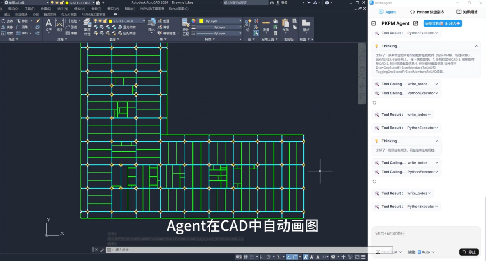
<br>
<sub>▲ PKPM Agent 操控 AutoCAD 自动绘图</sub>
</div>

### 6.11 BIMBase 与 PlantS

- **PlantS 工厂结构**：通过 `PlantS-Link` 技能连接 PlantS（基于 BIMBase 的三维工厂结构设计系统），完成梁、柱、支撑、截面、材料等构件的创建、查询与修改。
- **BIMBase 参数化组件**：通过 `bimbase-parametric-component` 技能，用自然语言描述几何形状，Agent 检索 pyp3d 建模函数并生成参数化建模脚本，可直接在 BIMBase 内嵌的 Python 环境中执行。

### 6.12 PKPM 绿色低碳 GBP（Beta）

通过 `GBP-link` 技能连接 PKPM 绿色低碳系列软件：

- **建筑建模**：标准层、墙、幕墙、门窗、柱、屋顶、遮阳、房间等建模与楼层组装。
- **专业计算**：节能、室外风 / 室内风、空气质量、碳排放 / 碳评价、采光、热舒适、声环境、负荷预测等一键计算。
- **快捷提问**：主界面「GBP绿建」入口内置了遮阳设置、采光计算等示例，点击即可填入。

该功能仍在完善中，需在 Skills 与 MCP 接口页手动开启。

### 6.13 文档与报告（Word / Excel / PPT / PDF）

深度集成 Microsoft Office、WPS Office 及 PDF 处理工具，支持字体、字号、页边距、表格样式等格式参数的详细指定，满足企业标准化文档输出需求：

- **Word**：结构设计计算书、技术报告自动生成。
- **Excel**：配筋结果导出、数据报表与统计表制作。
- **PPT**：项目汇报材料、技术演示文稿一键生成。
- **PDF**：正式报告合并、提取与归档，矢量 PDF 转换 CAD。

**生成 Excel** —— 配筋结果导出与数据报表制作：

<div align="center">
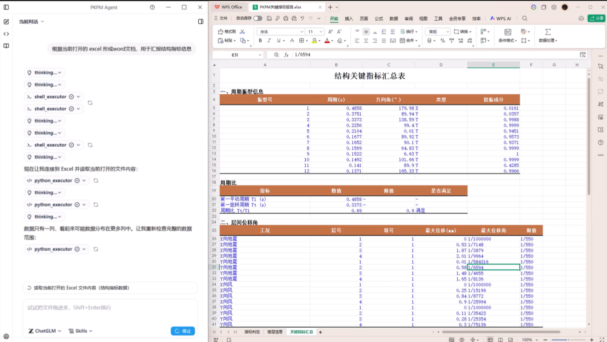
<br>
<sub>▲ 一键生成 Excel 数据报表</sub>
</div>

**生成 Word** —— 结构设计计算书与技术报告自动生成：

<div align="center">
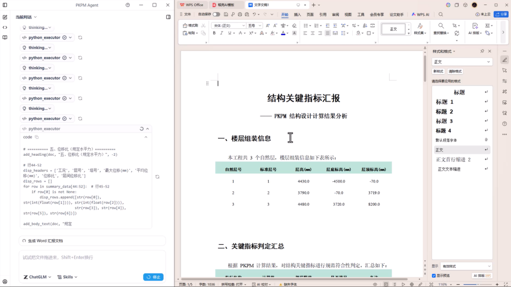
<br>
<sub>▲ 自动生成 Word 计算书</sub>
</div>

**生成 PPT** —— 项目汇报材料与技术演示文稿一键生成：

<div align="center">

<br>
<sub>▲ 一键生成 PPT 汇报材料</sub>
</div>

---

## 7. 其他功能

### 7.1 交互体验

- **意图识别增强**：即使表述不够精确或包含口语化表达，也能准确匹配专业功能（例如"改一下梁"可结合上下文推断为截面调整或配筋修改）。
- **对话式工作流**：遵循"连接 → 检索 → 执行"三步模式，降低学习成本。
- **关键步骤主动确认**：智能体在执行关键步骤时会主动向你确认，减少理解偏差和返工。
- **智能连接管理**：执行任务时自动建立 MCP 连接、断开后自动重连；长时间计算导致软件重启后，Agent 自动恢复连接并反馈结果。
- **多会话并行**：最多可同时运行三个会话，任务在后台完成或出错时收到系统通知，点击通知直接跳回对应会话。

**对话分支**：任意一条回答旁点击「从此处创建新聊天」，即可从该节点分支出新会话，尝试不同思路互不干扰：

<div align="center">
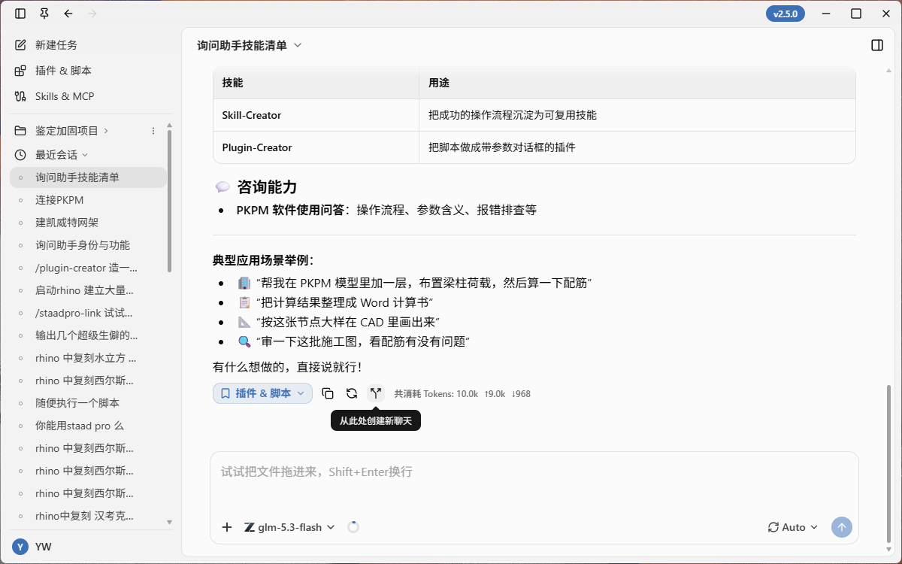
<br>
<sub>▲ 从任意一条回答创建对话分支</sub>
</div>

**上下文用量指示 + 智能压缩**：点击模型名右侧的圆环，可查看上下文占用明细（系统工具 / 系统提示词 / 对话消息 / 空闲空间），长会话自动**智能压缩**，长任务不再轻易达到上限：

<div align="center">
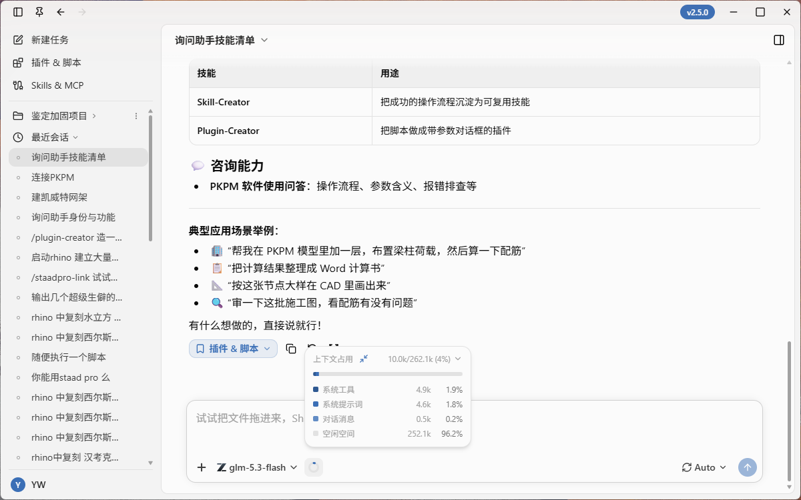
<br>
<sub>▲ 实时查看上下文占用情况</sub>
</div>

**Token 用量**：把鼠标悬停在每轮回答末尾的操作栏上，即可看到本会话从开头累计到这一轮的 Token 消耗（↑ 输入、↓ 输出）：

<div align="center">
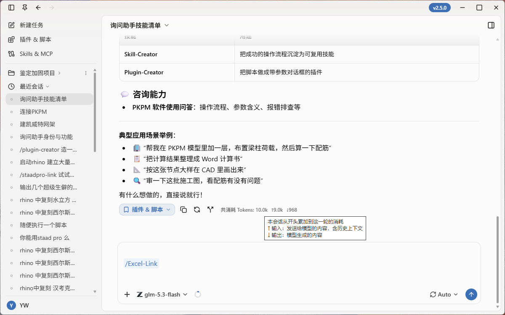
<br>
<sub>▲ 悬停操作栏查看累计 Token 用量</sub>
</div>

### 7.2 权限控制

系统提供三级权限控制模式，规范智能体的自动执行行为，兼顾效率与安全：

- **请求批准（Ask）**：在执行任何可能影响原始数据或文件的操作前（覆盖保存、修改模型、启动计算等）均会发起确认请求；只读操作（数据分析、读取、报告生成等）自动完成。
- **替我审批（Auto）**：根据内置安全策略自主判断，对符合规范的标准操作自动审批执行，仅在触及安全红线或不确定时才请示，适合常规工程设计任务。
- **完全访问（Full）**：在严格遵守底层安全禁令（禁止删除文件、修改系统配置、提权、格式化等破坏性指令）前提下，拥有最大化自主执行权限，适合流程熟悉的资深用户。

> 无论处于何种权限模式，系统底层安全红线始终强制生效，从根本上杜绝文件误删、系统篡改及越权操作等风险。

<div align="center">
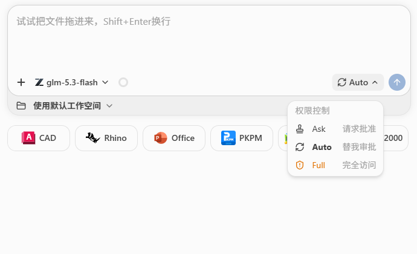
<br>
<sub>▲ 三级权限控制模式：Ask / Auto / Full</sub>
</div>

---

## 8. 二次开发

**支持用户自定义工具供大模型调用。** 编写完成后，自定义工具将展示在 **工具管理 → 用户自定义** 页面下，可在「插件 & 脚本」中被直接调用，无需 import。

工具代码存放于下图所示路径：

<div align="center">
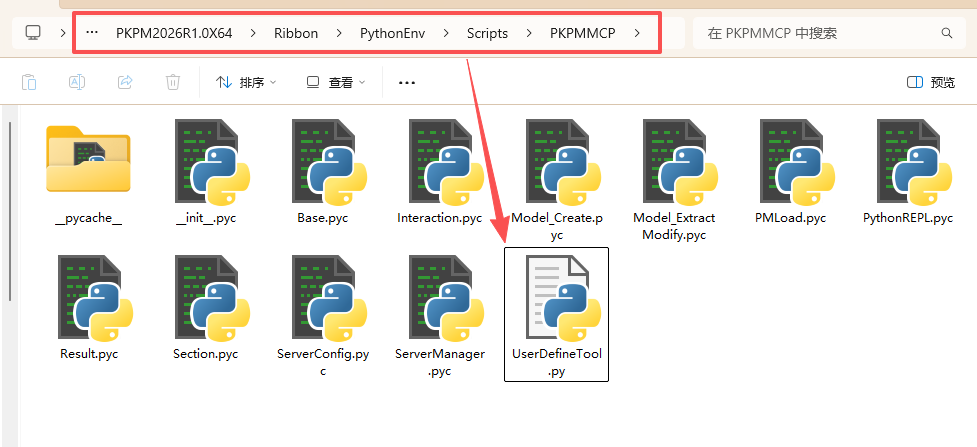
<br>
<sub>▲ 用户自定义工具的存放路径</sub>
</div>

打开 `UserDefineTool.py`，编写 MCP 工具，示例代码如下：

```python
from PKPMMCP.Base import *
__Tag = ToolAnnotations(title = "用户自定义") 

#示例代码
@mcp.tool(annotations=__Tag)
def add(a, b) -> bool:
    """ 加法运算器 """   
    return a + b
```

**二次开发环境配置流程如下：**

1. 使用 VSCode 打开 `PKPM2027RXXX > Ribbon > PythonEnv` 文件夹，并选择 PKPM Python 环境作为 VSCode 的解释器：

<div align="center">
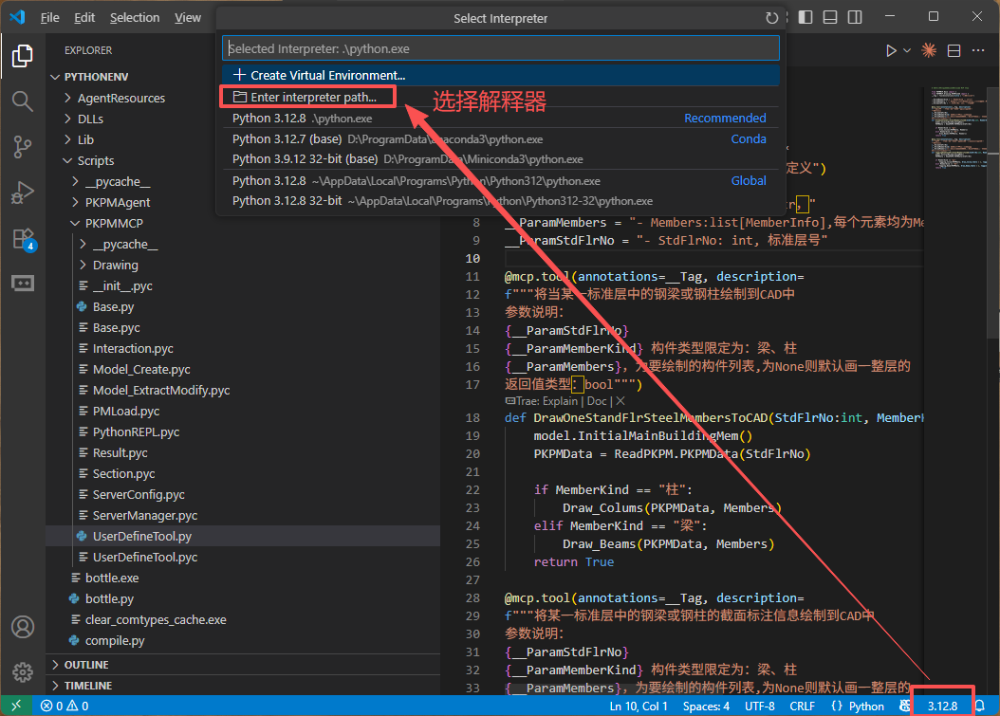
<br>
<sub>▲ 第 1 步：在 VSCode 中选择解释器</sub>
</div>

<div align="center">
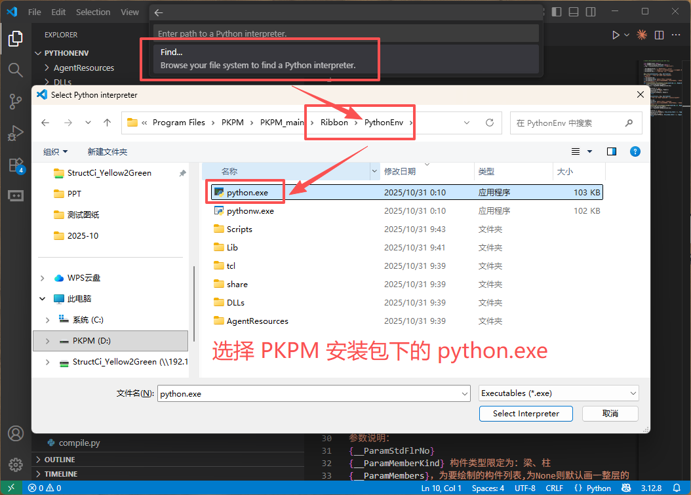
<br>
<sub>▲ 第 1 步（续）：选择 PKPM Python 环境作为解释器</sub>
</div>

2. 开发时可以使用 `Base.py` 文件提供的基础类和工具：

<div align="center">
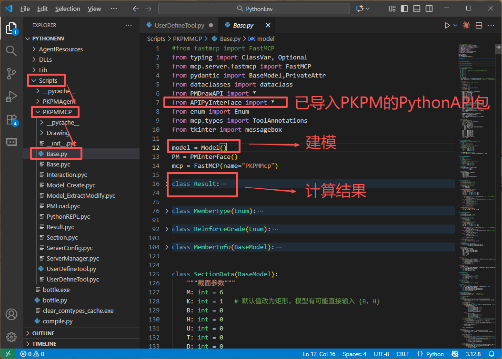
<br>
<sub>▲ 第 2 步：Base.py 提供的基础类与工具</sub>
</div>

3. 打开 `UserDefineTool.py`，编写自己的 MCP 工具，可以直接使用 PKPM 的 Python API：

<div align="center">

<br>
<sub>▲ 第 3 步：在 UserDefineTool.py 中编写自定义工具</sub>
</div>

---

<a id="交流群"></a>

## 9. 加入交流群

扫码加入 **PKPM Agent 工程设计智能体** 用户交流群，反馈问题、分享经验、获取最新动态：

<div align="center">

<br>
<sub>▲ PKPM Agent 用户交流群</sub>
</div>
