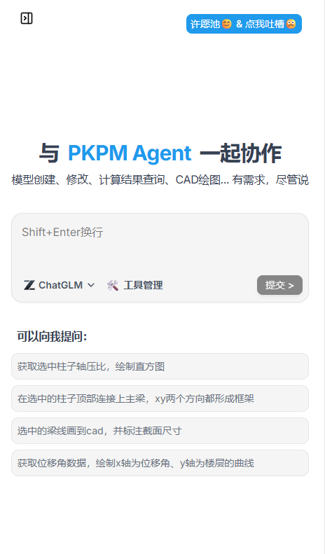

# PKPMAgent 设计智能体

免责声明

PKPM系统在开发阶段经过了严格测试，自1988年开发以来，国内外数以万计的工程应用证明了其适用性和正确性。
但用户必须清楚，在程序的准确性或可靠性上开发者未做任何直接或暗示性的担保，使用者必须了解程序的假定并必须独立地核查结果。
本智能体系为辅助专业工作设计，用户应确保自身具备相应专业资质及能力，仅可在自身专业领域范围内合理使用本智能体，用户承诺严格遵守国家法律法规、行业规范及公序良俗，不得超出专业范畴滥用。
用户可根据自身实际需求，自主选择并使用第三方提供的大语言模型服务，本软件对此不做强制限制或指定。
因使用大语言模型能力产生的所有费用（包括但不限于服务订阅费、调用费等），均由用户直接向该大语言模型的能力提供方支付，本软件不参与相关费用的收取、结算或分成，亦与上述费用无任何关联。
本软件不对用户所选择的大语言模型的性能、准确性、安全性、合法性及适用性等任何方面作出任何形式的担保、承诺或暗示，相关使用风险及责任由用户自行承担。
本免责声明作为智能体用户操作手册的重要组成部分，用户使用本智能体即视为已阅读、理解并同意本声明全部内容。
