# PKPM Agent 用户手册
## 1. 基本信息
PKPM 结构设计智能体是一款基于大语言模型的设计辅助工具。通过自然语言交互的方式，可以实现：

- 🏗️ **结构模型创建与修改**
- 📊 **荷载自动布置**
- 📈 **计算结果查询与可视化**
- 📐 **CAD 自动绘图**

**🌠界面**

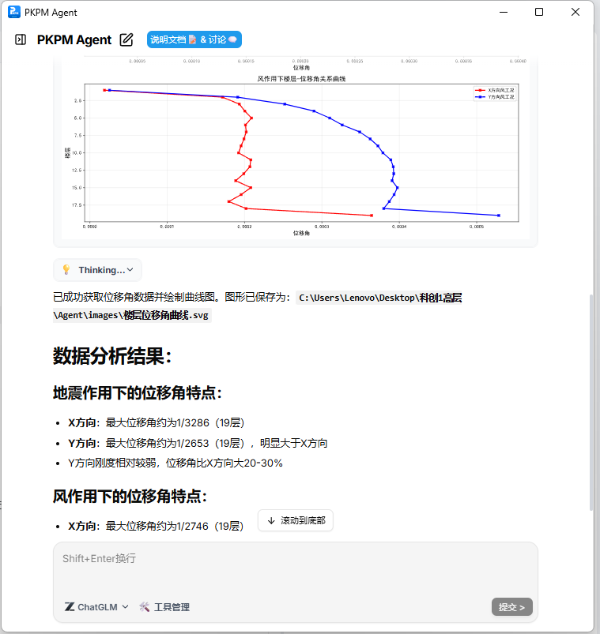

## 2. 基本配置(第一次使用必读)

### 2.1 环境
- 💻 **需要安装：PKPM2026R1.0-64及以上，AutoCAD 2014 及以上(绘图)**
- 🌐 **需连接网络(用于大模型调用)**

### 2.2 启动位置
打开 PKPM 软件，在轴网菜单栏中点击 **⌈PKPM Agent 尝鲜版⌋**，即可打开Agent对话框，支持页面缩放。

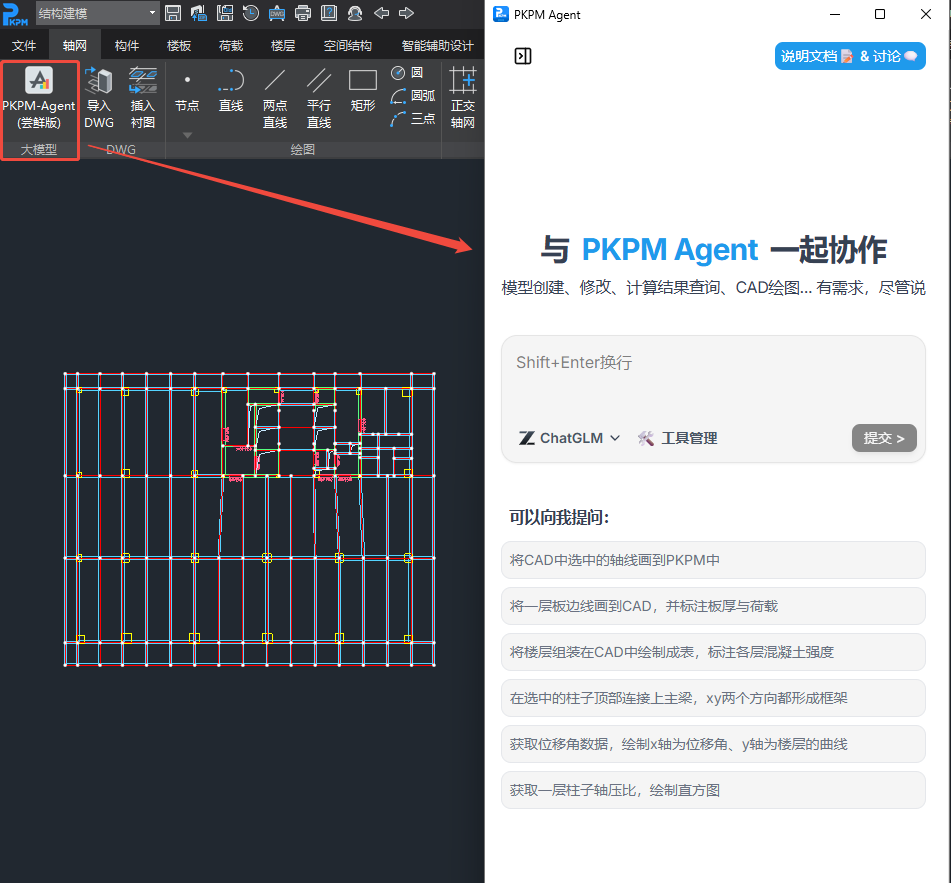

### 2.3 大模型设置
- 在 Agent 面板中点击 "管理" 按钮，从下拉菜单中选择要使用模型：
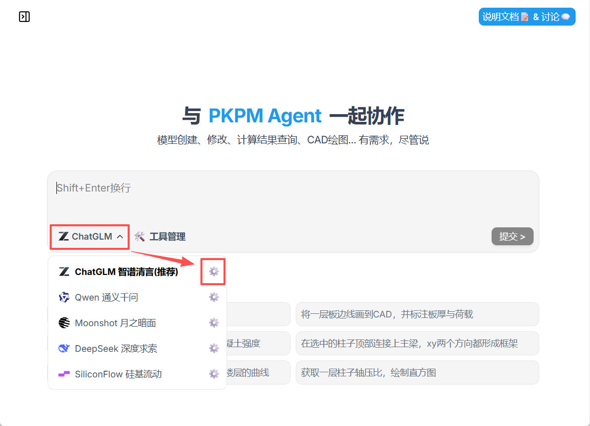

- 然后再点击小齿轮，填入模型服务商的 APIKey：
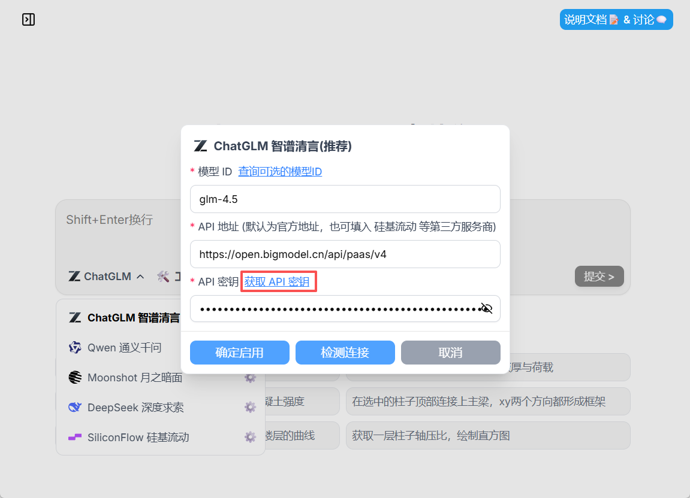

- 可以点击 **获取 API 密钥** 直接跳转到对应网页。
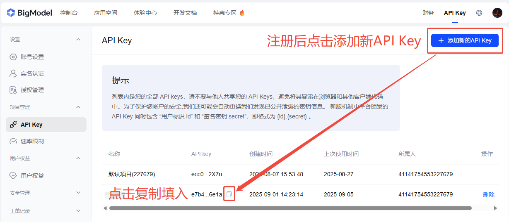

我们测试下来感觉质谱清言的glm-4.5是国内性能最强大的模型，也推荐您使用。
点击注册即可获取质谱官方送出的20元使用额度。

## 3. 功能介绍

### 3.1 工具管理

**系统目前内置了近 100 种工具，涵盖建模、截面编辑、荷载添加、构件结果、指标结果、CAD绘制等常用功能**

- 点击**工具管理**，可以查看Agent目前掌握的所有工具。
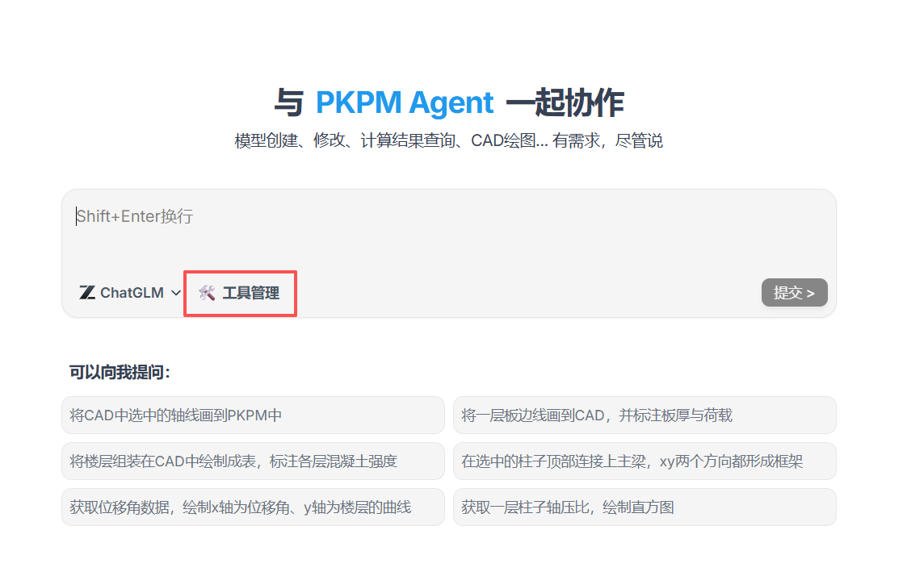

- 可以控制是否启用相关工具组，**只启用必要的工具组可以提高效率与准确性，大幅降低Token消耗。**
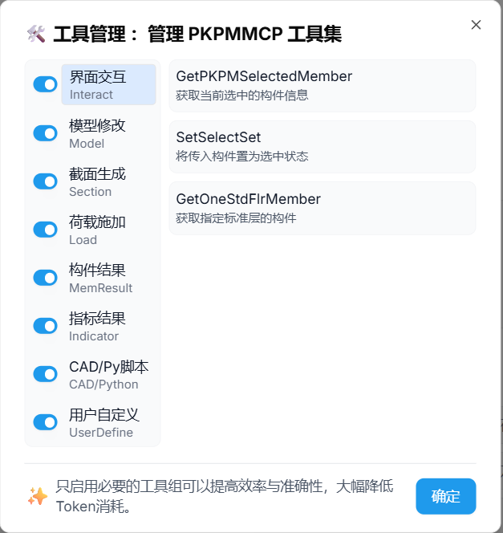

**注意** 关闭工具组后，Agent就会丧失响应的能力，如果发现模型未能完成任务，可以确认工具组是否已开启。

## 4. 案例
### 4.1 建模
- 提示词：**在选中的柱子顶部连接上主梁，xy 两个方向都形成框架**
- 通过自然语言指令让智能体自动操纵 PKPM 软件，完成模型构件创建、连接关系调整、参数修改等任务，支持梁柱、标准层等操作。

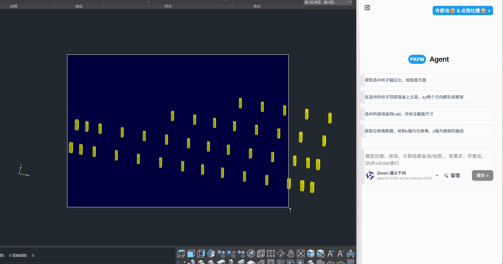

### 4.2 荷载布置
- 提示词：**粘贴提资后，要求施加荷载**
- 支持读取 Excel 格式的上游提资数据（如恒载、活载数值及坐标），自动完成楼层、节点的荷载布置，减少手动输入错误。

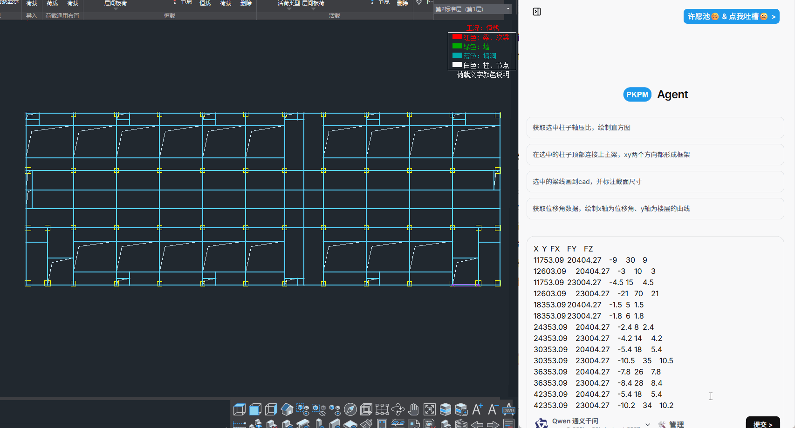

## 4.3 查询计算结果
- 提示词：**获取选中柱子的轴压比，绘制直方图**
- 通过自然语言指令查询结构计算结果（如轴压比、位移角等），并自动生成直方图、曲线等可视化图表，无需手动导出数据后二次处理。

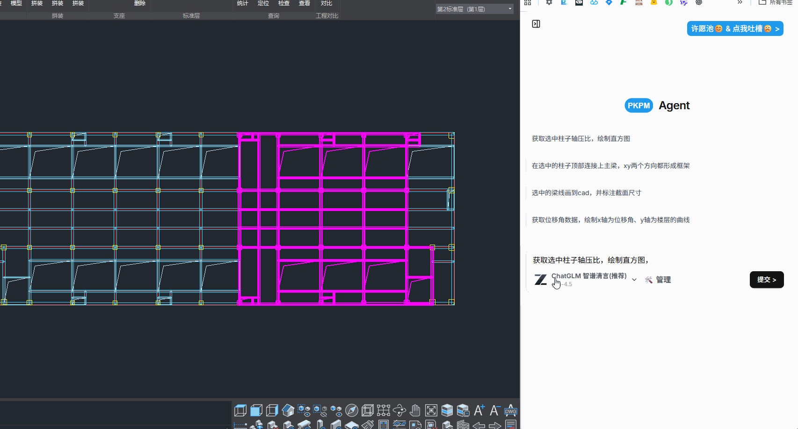

### 4.4 操纵 CAD 自动绘图
- 提示词：**选中梁线画到CAD，标注截面尺寸**
- 实现 PKPM 与 CAD 的数据双向流转，通过指令将 PKPM 中的构件（如梁、柱）自动导出至 CAD 并完成截面尺寸标注，减少手动绘图工作量。

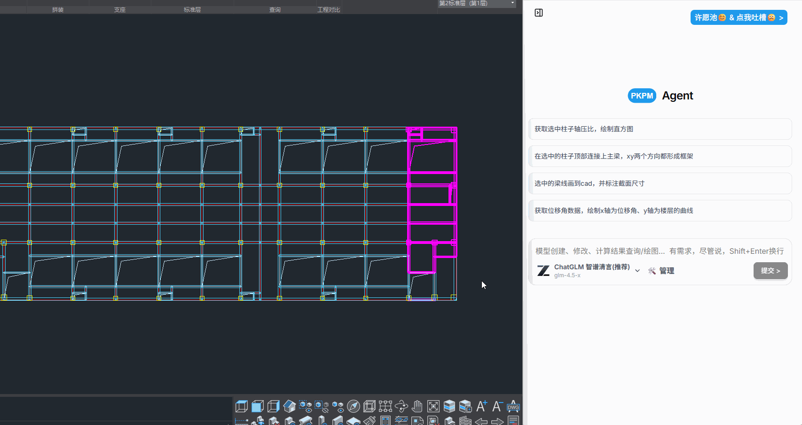

