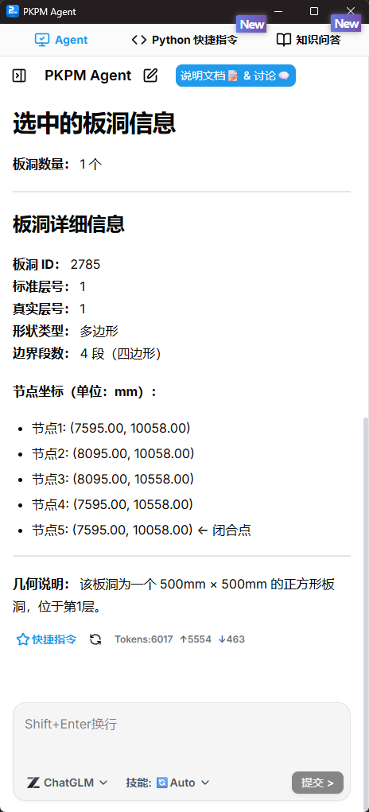
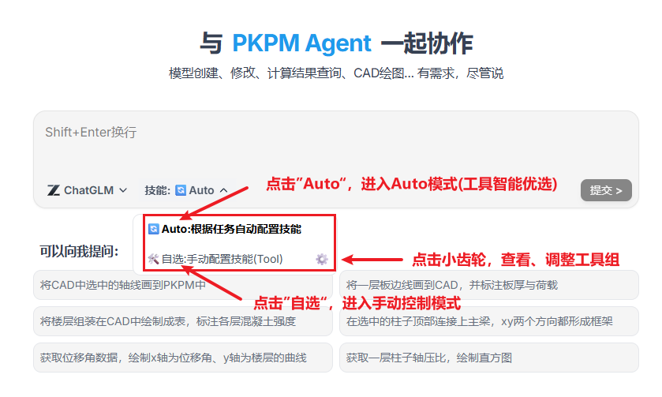
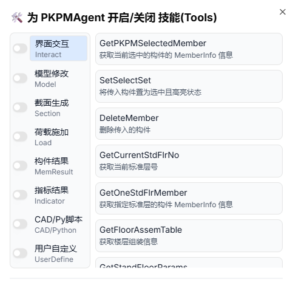
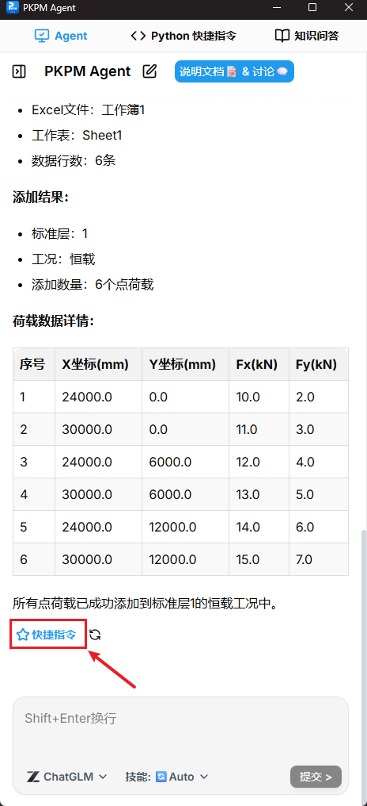
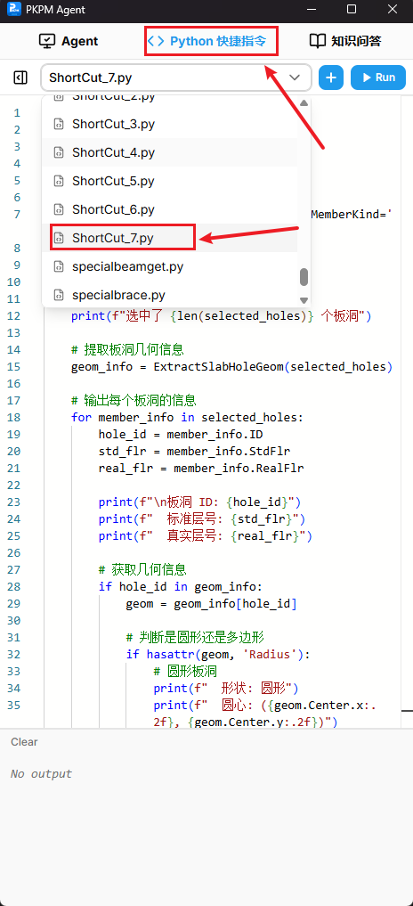
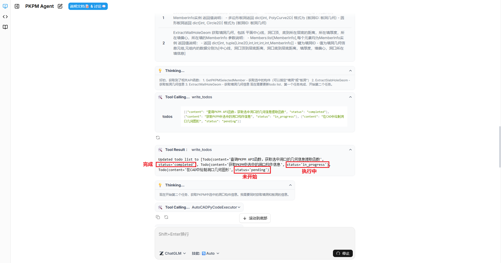
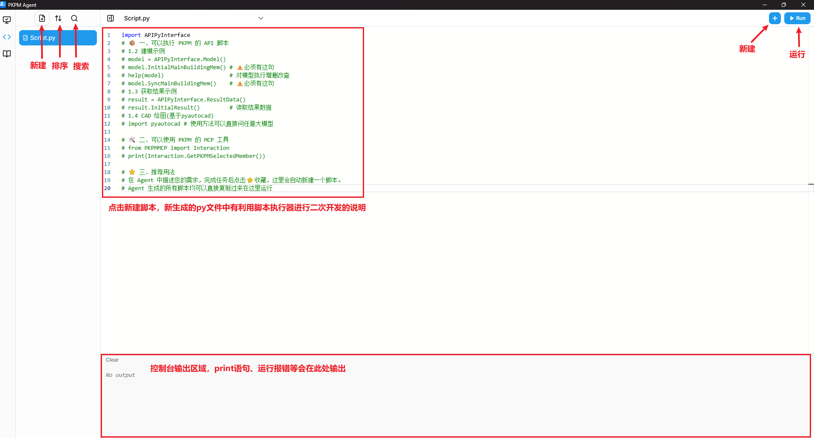
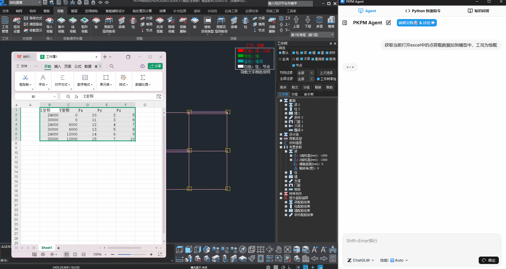
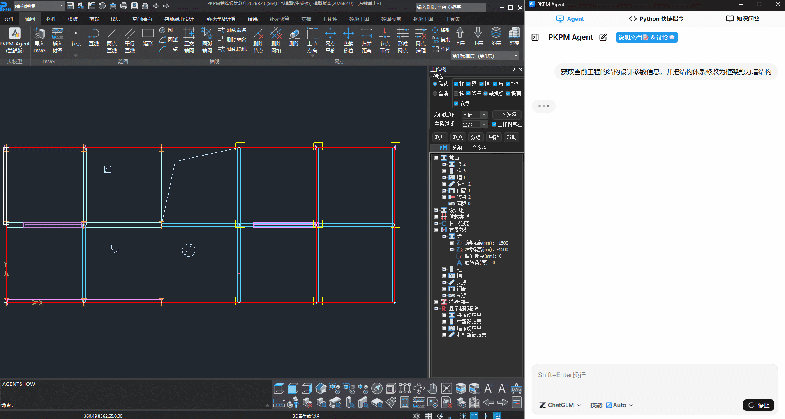
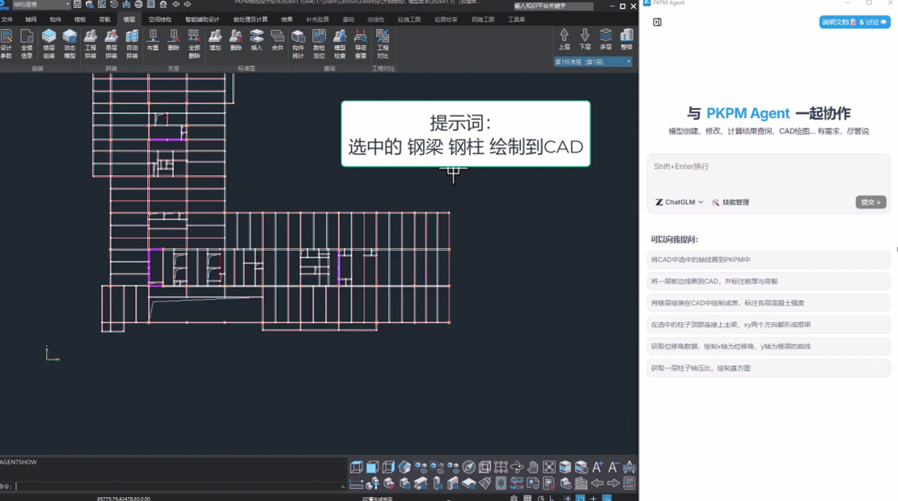

<div align="center">

# PKPM Agent 用户手册

</div>

[**😊许愿池 & ☹️点我吐槽**](https://gitee.com/pkpmgh/PKPMAgentRelease/issues/ICWL5R)

## 1. 基本信息

**✨ PKPM Agent 设计智能体**

拥有基于大语言模型的设计辅助工具PKPM-Agent、Python快捷指令执行、知识问答等三大功能
### 1.1 PKPM-Agent
- 🏗️ **结构模型创建与修改**<sup style="background:#f3f4f6;color:#4b5563;padding:1px 6px;border-radius:10px;font-size:0.55em;">弧形支持New</sup>
- 📊 **荷载自动布置**
- ⚙️ **参数获取与修改**<sup style="background:#f3f4f6;color:#4b5563;padding:1px 6px;border-radius:10px;font-size:0.5em;">New</sup>
- 📈 **计算结果查询与可视化**
- 📐 **CAD 自动绘图**<sup style="background:#f3f4f6;color:#4b5563;padding:1px 6px;border-radius:10px;font-size:0.55em;">钢布置图New</sup>
- 📋 **EXCEL 表格数据读取与修改**<sup style="background:#f3f4f6;color:#4b5563;padding:1px 6px;border-radius:10px;font-size:0.5em;">New</sup>

### 1.2 PKPM-Python快捷指令<sup style="background:linear-gradient(90deg,#667eea,#764ba2);color:white;padding:2px 8px;border-radius:10px;font-size:0.75em;">New</sup>
- ⚡ **支持即时运行PKPM二次开发脚本，无需复杂的环境配置**
- 💎 **支持运行收藏自PKPM-Agent的快捷指令，复用AI编写的精华**

### 1.3 知识问答-PKPM结构先声<sup style="background:linear-gradient(90deg,#667eea,#764ba2);color:white;padding:2px 8px;border-radius:10px;font-size:0.75em;">New</sup>
- 📚 **通晓技术干货和结构产品最新资讯**
- 💡 **提供全网最准确的 PKPM 软件问题解答**
- 🧠 **凝结PKPM的技术积累和思考**

**🌠 使用界面**
<div align="center">
<table>
<tr>
<td></td>
<td></td>
<td></td>
</tr>
</table>
</div>

## 2. 基本配置(用前必读)

### 2.1 环境
- 💻 **需要安装：PKPM2026R2.0-64 及以上，AutoCAD 2014 及以上(绘图)**
- 🌐 **需连接网络(用于大模型调用)**

### 2.2 启动位置
打开 PKPM 软件，在 **轴网** 菜单栏中点击 **⌈PKPM Agent 尝鲜版⌋**，即可打开Agent对话框，支持页面缩放。


### 2.3 大模型设置

- 在 Agent 面板中点击 "管理" 按钮，从下拉菜单中选择要使用模型：


- 然后再点击小齿轮，填入模型服务商的 APIKey：


- 可以点击 **获取 API 密钥** 直接跳转到对应网页。


我们测试下来感觉 **质谱清言glm-5** 是国内性能最强大的模型，也推荐您使用。

**🎁 点击注册即可获取质谱官方送出的20元使用额度。**

## 3. 功能介绍

### 3.1 PKPM Agent 设计智能体

**3.1.1 工具管理（支持智能优选）**

**🛠️ Agent当前当前内置了近 100 种工具** 
涵盖建模、截面编辑、荷载添加、参数获取与修改、构件结果、指标结果、CAD绘制、EXCEL表格数据读取与修改等常用功能

**🔵 Auto模式**<sup style="background:linear-gradient(90deg,#667eea,#764ba2);color:white;padding:2px 8px;border-radius:10px;font-size:0.75em;">New</sup> 工具智能优选

- **功能特性**：Auto模式下，Agent会根据任务自动配置工具，用户无需手动控制工具组的开关
- **操作步骤**：点击**技能**，点击"Auto",进入Auto模式(工具智能优选)

**⚙️手动模式** 自定义工具组开关

- **功能特性**：手动控制工具组的开关，在手动打开工具组无法完成任务时，会在本次任务自动执行为Auto模式
- **操作步骤**：点击**技能**，点击"自选",进入工具手动控制模式。点击"小齿轮"，打开手动调整工具组界面，用户可以在工具组界面内查看PKPM Agent支持工具的详细情况,控制工具组的开关。


<div align="center">
<table>
<tr>
<td></td>
<td></td>
</tr>
</table>
</div>

**3.1.2 快捷指令收藏**<sup style="background:#f3f4f6;color:#4b5563;padding:1px 6px;border-radius:10px;font-size:0.6em;">New</sup>

- **功能特性**：在使用Agent操作PKPM结构软件的过程中，AI会编写操作PKPM代码，对于可复用性程度高、用户个性化程度高、AI单次思考时间长的脚本，我们可以收藏至 Python 快捷指令，参数修改一键重播，让 Agent 开发您的专属功能

- **操作步骤**：Agent完成任务后，对话结尾会出现"快捷指令"按钮，点击可收藏入"Python快捷指令"
切换至"Python快捷指令"界面,以"ShortCut_"开头的py文件就是您收藏的内容，点击运行按钮即可重播

<div align="center">
<table>
<tr>
<td></td>
<td></td>
</tr>
</table>
</div>

**3.1.3 ToDoList 长步骤任务AI自动规划**<sup style="background:#f3f4f6;color:#4b5563;padding:1px 6px;border-radius:10px;font-size:0.6em;">New</sup>

- **功能特性**：PKPM-Agent对于长步骤、复杂任务，将自动进行任务规划，生成ToDoList，并按照ToDoList逐步执行至任务完成，执行过程中会自动更新任务状态，用户可查看ToDoList中的状态信息监控本轮任务的进度
- **操作步骤**：此功能由PKPM-Agent自动选择，无需手动操作



### 3.2 PKPM-Python快捷指令(脚本执行器)<sup style="background:linear-gradient(90deg,#667eea,#764ba2);color:white;padding:2px 8px;border-radius:10px;font-size:0.75em;">New</sup>

- **功能特性**：无需复杂环境配置，运行脚本可以即时生效
- **操作步骤**：参见下图，在Python快捷指令(脚本执行器)中您可以完成"新建脚本"、"运行脚本"、"排序脚本目录"、"搜索脚本"、"控制台输出"等，操作逻辑和一般IDE相似。新建脚本会有二次开发的说明文档，请遵照此说明进行相关代码的编写




### 3.3 知识问答-PKPM结构先声<sup style="background:linear-gradient(90deg,#667eea,#764ba2);color:white;padding:2px 8px;border-radius:10px;font-size:0.75em;">New</sup>

与结构先声公众号共用同一后台，通晓技术干货和结构产品最新资讯，提供全网最准确的 PKPM 软件问题解答
信息源自50本用户手册、9本关键规范


### 3.4 二次开发

**我们支持用户自定义工具供大模型调用，编写完成后，将会展示在 工具管理-> 用户自定义 页面下**

支持在Python快捷指令中调用用户自定义的工具，无需import


打开 UserDefineTool.py，编写MCP工具，示例代码如下：
```python
from PKPMMCP.Base import *
__Tag = ToolAnnotations(title = "用户自定义") 

#示例代码
@mcp.tool(annotations=__Tag)
def add(a, b) -> bool:
    """ 加法运算器 """   
    return a + b
```
**二次开发环境配置流程如下：**
- 开启 VSCode 打开 PKPM2026RXXX > Ribbon > PythonEnv 文件夹
- 选择PKPM python 环境作为 VSCode 的解释器


- 可以使用 Base.py 文件提供的基础类和工具

- 开启 UserDefineTool.py，编写自己的MCP工具，可以直接使用 PKPM 的 Python API


## 4. 案例
### 4.1 建模
- 提示词：**在选中的柱子顶部连接上主梁，xy 两个方向都形成框架**
- 通过自然语言指令让智能体自动操纵 PKPM 软件，完成模型构件创建、连接关系调整、参数修改等任务，支持梁柱、标准层等操作。


### 4.2 荷载布置
- 提示词：**读取Excel荷载数据，要求施加荷载**
- 支持读取 Excel 格式的上游提资数据（如恒载、活载数值及坐标），自动完成楼层、节点的荷载布置，减少手动输入错误。




### 4.3 参数读取与修改
- 提示词：**获取当前工程的结构设计参数信息，并把结构体系修改为框架剪力墙结构**
- 通过自然语言指令查询或修改结构设计参数（如结构体系、抗震等级）。



### 4.4 查询计算结果
- 提示词：**获取选中柱子的轴压比，绘制直方图**
- 通过自然语言指令查询结构计算结果（如轴压比、位移角等），并自动生成直方图、曲线等可视化图表，无需手动导出数据后二次处理。


### 4.5 操纵 CAD 自动绘图
- 提示词：**选中梁线画到CAD，标注截面尺寸**
- 实现 PKPM 与 CAD 的数据双向流转，通过指令将 PKPM 中的构件（如梁、柱）自动导出至 CAD 并完成截面尺寸标注，减少手动绘图工作量。


### 4.6 操纵 CAD 自动绘钢结构平面布置图
- 提示词：**所选钢梁钢柱画到cad里，当前层所有钢梁钢柱画到cad里，给所选钢梁标注上截面**
- 实现 PKPM 与 CAD 的数据双向流转，通过自然语言和强化的工具能力，绘制的钢结构平面布置图更具实际价值。



## 5. 技术架构

### 5.1 技术原理与系统特点
PKPM Agent 采用 **LangChain 框架**开发，集成了工程设计领域的专业能力：

- **MCP（Model Context Protocol）工具接口**：暴露专业软件的能力
- **工具管理系统**：支持 Agent 自行发现探索工具，优化 Token 消耗与准确性
- **二次开发接口**：开放用户自定义工具扩展（Python 脚本）

## 6. 附表-PKPMAgent工具介绍

### PKPMAgent 工具列表
下面的表格，详细列举了当前PKPMAgent能够操作PKPM结构设计软件所进行的任务，您可以在与大模型对话过程中，利用下述工具和Python的原生能力完成您的个性化功能开发

| 序号 | 工具名 | 工具描述 |
|------|--------|-------------|
| 1 | Generate_SectionData_Rectangle | 生成矩形截面数据 |
| 2 | Generate_SectionData_ISection | 生成工字形截面数据 |
| 3 | Generate_SectionData_BoxSection | 生成箱型截面数据 |
| 4 | Generate_SectionData_ChannelSection | 生成槽型截面数据 |
| 5 | Generate_SectionData_TubeSection | 生成圆管型截面数据 |
| 6 | Generate_SectionData_TwoBathChannelSection | 生成双槽钢截面数据 |
| 7 | GetSectProperty | 截面特性计算工具，可以计算出面积、惯性矩等信息 |
| 8 | AddBarSectionToModel | 添加杆件截面到模型截面列表 |
| 9 | ExtractColumnsGeometryProperty | 提取柱的中心线、截面、杆件截面局部坐标系下X轴、Y轴偏移量、旋转角度 |
| 10 | ModifyColumnsGeometryProperty | 修改柱的中心线、截面、杆件截面局部坐标系下X轴、Y轴偏移量、旋转角度 |
| 11 | ExtractBeamsGeometryProperty | 提取梁中心线、截面、截面相对于中心线偏移量 |
| 12 | ModifyBeamsGeometryProperty | 修改梁中心线、截面、截面相对于中心线偏移量 |
| 13 | ExtractBracesGeometryProperty | 提取斜杆中心线、截面、旋转角度 |
| 14 | ModifyBracesGeometryProperty | 修改斜杆中心线、截面、旋转角度 |
| 15 | ExtractWallsGeometryProperty | 提取墙中心线、厚度、墙相对于中心线偏移量 |
| 16 | ModifyWallsGeometryProperty | 修改墙中心线、厚度、墙相对于中心线偏移量 |
| 17 | ExtractGridsGeometryProperty | 提取网格线几何 |
| 18 | ModifyGridsGeometryProperty | 修改网格线几何 |
| 19 | ExtractColumnSpecialProperty | 提取柱的特殊属性信息,包括:混凝土强度等级, 钢号, 抗震等级, 构造措施抗震等级, 宽厚比等级, 是否角柱, 是否门式钢柱, 是否转换柱, 是否水平转换柱, X方向剪力系数, Y方向剪力系数 |
| 20 | ModifyColumnSpecialProperty | 修改柱的特殊属性信息，可修改的参数包括 混凝土强度等级, 钢号, 抗震等级, 构造措施抗震等级, 宽厚比等级, 是否角柱, 是否门式钢柱, 是否转换柱, 是否水平转换柱, X方向剪力系数, Y方向剪力系数 |
| 21 | ExtractBeamSpecialProperty | 提取梁的特殊属性信息,包括:混凝土强度等级, 钢号, 抗震等级, 构造措施抗震等级,是否调幅梁,是否连梁,是否转换梁,扭矩折减系数,调幅系数,风荷载连梁刚度折减系数 |
| 22 | ModifyBeamSpecialProperty | 修改梁的特殊属性信息，可修改的参数包括 混凝土强度等级, 钢号, 抗震等级, 构造措施抗震等级,是否调幅梁,是否连梁,是否转换梁,扭矩折减系数,调幅系数,风荷载连梁刚度折减系数 |
| 23 | ExtractBraceSpecialProperty | 提取支撑的特殊属性信息,包括:混凝土强度等级, 钢号, 抗震等级, 构造措施抗震等级,宽厚比等级,是否水平转换支撑,是否单拉杆,是否塑性耗能构件 |
| 24 | ModifyBraceSpecialProperty | 修改支撑的特殊属性信息，可修改的参数包括 混凝土强度等级, 钢号, 抗震等级, 构造措施抗震等级,宽厚比等级,是否水平转换支撑,是否单拉杆,是否塑性耗能构件 |
| 25 | ExtractWallSpecialProperty | 提取墙的特殊属性信息,包括:混凝土强度等级, 抗震等级, 构造措施抗震等级,墙类型,地震连梁刚度折减系数,风荷载连梁刚度折减系数 |
| 26 | ModifyWallSpecialProperty | 修改墙的特殊属性信息，可修改的参数包括 混凝土强度等级, 抗震等级, 构造措施抗震等级,墙类型,地震连梁刚度折减系数,风荷载连梁刚度折减系数 |
| 27 | ExtractNodeBasePoint | 提取节点基点坐标 |
| 28 | ModifyNodeBasePoint | 修改节点的基点坐标 |
| 29 | ExtractSlabProperty | 获取板属性，包括 厚度、降板值、恒载值、活载值 |
| 30 | ExtractSlabEdgeCurve | 提取板边界线 |
| 31 | ExtractSlabHoleGeom | 获取板洞几何信息 |
| 32 | ExtractWallHoleGeom | 获取墙洞几何，包括 平面中心线，洞口顶、底到所在层底的距离，所在墙厚度，所在墙偏心，所在墙的MemberInfo |
| 33 | ModifySlabProperty | 修改板厚 |
| 34 | ModifyFloorAssemTable | 修改楼层组装 |
| 35 | CreateOrModifyStandFloor | 修改或新建标准层,包含混凝土强度、钢筋等级、板厚等标准层参数 |
| 36 | AddBeamsBy3DCurves_WithAutoStdFlrDetection | 通过三维中心线(Line3D\|Arc3D)新建梁，函数内部会依据楼层标高自动识别所属标准层。 |
| 37 | AddBeamsBy2DCurves_ToSpecifiedStdFlr | 通过二维中心线(Line2D\|Arc2D)，在指定的标准层顶部，新建梁。 |
| 38 | AddWallsBy3DCurves_WithAutoStdFlrDetection | 通过三维墙顶中心线(Line3D\|Arc3D)新建墙，函数内部会依据楼层标高自动识别所属标准层。 |
| 39 | AddWallsBy2DCurves_ToSpecifiedStdFlr | 通过二维中心线(Line2D\|Arc2D)，在指定的标准层顶部，新建墙。 |
| 40 | AddColumnsBy3DLines_WithAutoStdFlrDetection | 通过三维中心线(Line3D)新建柱，函数内部会依据楼层标高自动识别所属标准层。 |
| 41 | AddColumnsByPoint2D_ToSpecifiedStdFlr | 通过二维中心点(Point2D)在指定的标准层，新建柱。生成的柱构件，其起点位于该层的层底标高，终点位于该层的层顶标高。 |
| 42 | AddBracesBy3DLines_WithAutoStdFlrDetection | 通过三维中心线(Line3D)新建斜杆，函数内部会依据楼层标高自动识别所属标准层。 |
| 43 | AddBracesBy2DLines_ToSpecifiedStdFlr | 通过二维中心线(Line2D)，在指定的标准层顶部，新建斜杆(此时为水平支撑)。 |
| 44 | AddNodesByPoint2D_ToSpecifiedStdFlr | 通过Point2D在指定的标准层，新建节点。生成的节点会位于层顶 |
| 45 | AddGridsBy2DCurves_ToSpecifiedStdFlr | 通过二维线(Line2D\|Arc2D)，在指定的标准层，新建网格线(轴线)。 |
| 46 | GenerateOneStdFlrSlabs | 某标准层生成所有楼板，返回本层全部楼板 |
| 47 | AddRectangleSlabHolesToOneStdFlr | 添加矩形板洞到某标准层 |
| 48 | AddCircularSlabHolesToOneStdFlr | 添加圆形板洞到某标准层 |
| 49 | AddWallHolesToOneStdFlr | 添加墙洞到某标准层 |
| 50 | AddPointLoadToOneStandFloor | 施加点荷载到某一标准层 |
| 51 | AddLineLoadToOneStandFloor | 施加线荷载到某一标准层 |
| 52 | AddPolygonLoadToOneStandFloor | 施加多边形荷载到某一标准层 |
| 53 | AddUserLoadCase | 添加自定义工况 |
| 54 | DelUserLoadCase | 删除自定义工况 |
| 55 | GetAllLoadCaseName | 获取全部工况名称列表 |
| 56 | ModifySlabLoad | 修改某一标准层板荷载 |
| 57 | GetPKPMSelectedMember | 获取当前选中的构件的 MemberInfo 信息 |
| 58 | SetSelectSet | 将传入构件置为选中且高亮状态 |
| 59 | DeleteMember | 删除传入的构件 |
| 60 | GetCurrentStdFlrNo | 获取当前标准层号 |
| 61 | GetOneStdFlrMember | 获取指定标准层的构件 MemberInfo 信息 |
| 62 | GetFloorAssemTable | 获取楼层组装信息 |
| 63 | GetStandFloorParams | 获取标准层参数 |
| 64 | GetNodeDisp | 获取"节点"的位移信息,调用此函数前先调用GetAllLoadCaseName函数获取已经计算的全部工况 |
| 65 | GetForce | 获取"梁"或"斜杆"或"柱"或"连梁"或"墙"的单工况内力,起点为 P0，终点为 P1,调用此函数前先调用GetAllLoadCaseName函数获取已经计算的全部工况 |
| 66 | GetBeamDesignForce | 获取梁的设计内力,起点为 P0，终点为 P1 |
| 67 | GetColumnEnvelopeInternalForces | 获取柱底的包络内力 |
| 68 | GetExceedInfo | 获取"梁"或"斜杆"或"柱"或"连梁"或"墙"的超限信息 |
| 69 | GetBeamReinforcement | 获取梁的配筋信息,起点为P0，终点为P1 |
| 70 | GetBeamShearCompressionRatio | 获取"梁"或"连梁"的剪压比,起点为P0，终点为P1 |
| 71 | GetBeamStressRatios | 获取梁的应力比,起点为P0，终点为P1 |
| 72 | GetMaterialUsages | 获取"梁"、"斜杆"、"柱"、"连梁"或"墙"的材料用量 |
| 73 | GetAxialCompressionRatio | 获取"斜杆"、"柱"或"墙"的轴压比 |
| 74 | GetBraceReinforcement | 获取斜撑的配筋信息 |
| 75 | GetColumnOrBraceShearCompressionRatio | 获取"斜杆"或"柱"的剪压比 |
| 76 | GetColumnOrBraceStressRatios | 获取"斜杆"或"柱"的应力比 |
| 77 | GetColumnReinforcement | 获取柱的配筋信息 |
| 78 | GetWallColumnShearCompressionRatio | 获取墙的剪压比 |
| 79 | GetStoryDriftInfo | 获取位移角相关计算结果(地震、风) |
| 80 | GetDisplacementRatio | 获取位移比相关计算结果(规定水平力工况) |
| 81 | GetStiffWeightRatioFrame | 获取结构刚重比计算结果 |
| 82 | GetStoreyStiffRatioOverBuilding | 获取层间侧移刚度比计算结果 |
| 83 | GetModalPeriodResult | 获取结构周期振型相关计算结果 |
| 84 | GetShearWeightRatio | 获取地震作用下结构剪重比计算结果 |
| 85 | GetInterStoryShearStrengthRatio | 获取楼层抗剪承载力之比计算结果 |
| 86 | GetKeyIndicatorsResult | 获取结构规范要求的关键指标的汇总信息，包括：最大质量比、最小刚度比、最小受剪承载力比值、周期振型、剪重比、最大地震位移角、最大风位移角、最大位移比、最大层间位移比、最小刚重比 |
| 87 | PythonExecutor | 执行Python脚本，并获取输出结果。 |
| 88 | FigureCreator | 使用 matplotlib 进行可视化绘图任务，返回svg格式的图片路径。 |
| 89 | OfficeWpsOperator | 执行Python代码以操纵EXCEL或WPS完成提取表格信息、编写修改表格等任务。 |
| 90 | AutoCADPyCodeExecutor | 执行Python代码以操纵AutoCAD完成绘图、改图、提取图素信息等任务。 |
| 91 | DrawOneStandFlrSteelMembersToCAD | 将当某一标准层中的钢梁或钢柱绘制到CAD中 |
| 92 | TaggingOneStandFlrSteelMembersToCAD | 将某一标准层中的钢梁或钢柱的截面标注信息绘制到CAD中 |


