<div align="center">

# PKPM Agent 2.5.2 用户手册

**工程设计智能体 · 从查阅资料到交付成果**

</div>

<div align="center">

[**⬇️ 立即下载 PKPM Agent 2.5.2**](https://update.pkpm.cn/PKPM2010/Soft/Agent/PKPMAgent_Setup_2.5.2.exe) &nbsp;·&nbsp; [**🚀 本版亮点**](#252-值得关注的变化) &nbsp;·&nbsp; [**📋 历史更新说明**](CHANGELOG.md) &nbsp;·&nbsp; [**😊许愿池 & ☹️点我吐槽**](https://gitee.com/pkpmgh/PKPMAgentRelease/issues/ICWL5R) &nbsp;·&nbsp; [**💬 加入交流群**](#交流群)

</div>

---

## 1. 产品简介

**把工程需求说清楚，让智能体接着做。**

PKPM Agent 将资料查阅、专业软件操作和成果整理串联在同一段对话中。你可以让它查找规范条文、批量调整模型、提取分析结果，再把数据整理成计算书、表格或汇报材料；已经验证过的流程，还可以做成插件，留给下一个项目使用。

<div align="center">
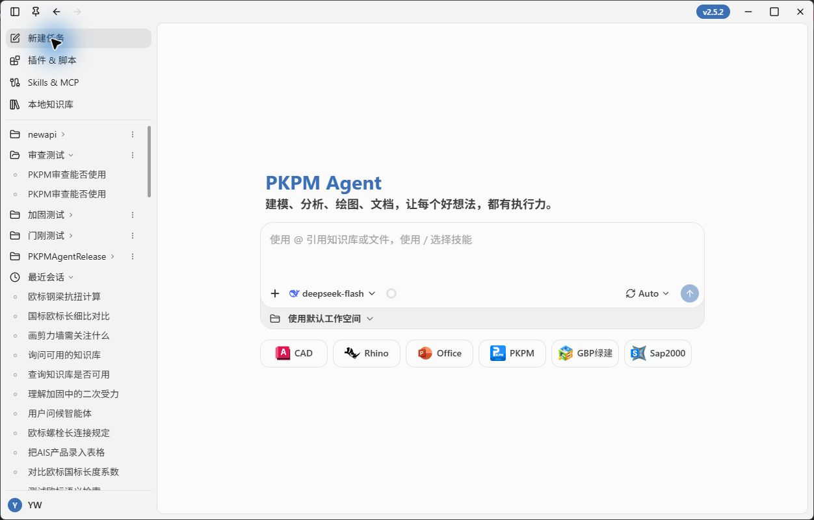
<br>
<sub>▲ PKPM Agent 主界面：左侧为导航与按工作空间分组的会话，中间为对话区</sub>
</div>

| 你要完成的工作 | PKPM Agent 可以怎样协助 |
| --- | --- |
| **查资料，核对依据** | 将规范、图集、软件手册和项目资料放入本地知识库，通过对话检索、解释与对比，点击回答中的出处回看原文 |
| **操作软件，推进设计** | 在 PKPM 及多款建模、分析、绘图软件中执行建模、改模、计算与结果提取，支持施工图识别校审和绿色低碳分析 |
| **整理数据，交付成果** | 把模型与计算结果整理为 Word、Excel、PPT、PDF，也可沿用已有模板编辑、排版或翻译 |
| **沉淀方法，重复使用** | 将成功对话或脚本做成带参数表单的插件，填入新项目的参数即可运行，常用方法也可保存为技能 |

### 2.5.2 值得关注的变化

- **让手边资料成为可追溯的知识库**：支持导入规范、图集与项目文件，按关键词或问题含义查找资料；回答中的出处可打开原文预览，PDF 支持定位页码与缩放。知识库还可放在网络共享目录，供同事复用。
- **PPT 从内容组织到视觉交付全面升级**：内置 **24 套设计体系与 7 类场景指南**，覆盖工程方案、工作汇报、学术答辩等用途；从逐页叙事、图表和配色，到模板沿用、版面检查与出图复核，形成完整制作流程。还可按参考风格设计、美化已有页面，或将图片、PDF 页面复刻为可编辑演示文稿。
- **Word 与 Excel 更贴近实际工作**：Word 可沿用原文档的样式、页眉页脚和编号，处理合并表格、三线表、公式、修订与整篇翻译；Excel 直接在目标工作簿中填写数据、公式与格式，修改过程在应用中可见，计算结果随输入变化而更新。
- **把重复工作做成自己的工程工具**：插件支持按选项显示相关参数，例如选择不同截面后只填写对应尺寸；通过「自定义界面」拖动参数和分组、调整宽度、修改说明文字，让工具更贴合自己的使用习惯。
- **从 AutoCAD 扩展到国产 CAD**：支持 AutoCAD、浩辰 CAD 和中望 CAD 的绘图、改图与信息提取。多款 CAD 同时运行时，可先明确目标产品，再继续操作。
- **项目文件就在对话旁**：工作空间面板可浏览文件、预览文本和图片、全屏查看成果；文件可拖入输入框或通过 `@` 引用，继续用于下一步任务。
- **长任务更容易接着做**：执行过程可折叠，完成后突出呈现成果；上下文用量可查看，接近上限时可手动压缩会话，完整消息仍保留。每轮回答还可查看本轮 Token 消耗，便于了解不同任务的用量。
- **工程能力进一步延伸**：覆盖 PKPM 图纸审查、STS 钢结构、JCCAD 基础（Beta），以及 Abaqus、Tekla Structures、SAUSG（Beta）、BIMBase 参数化组件和 PKPM 绿色低碳系列软件。
- **日常使用更顺手**：浅色、深色与跟随系统三种外观，窗口置顶、前进后退和窄窗口侧栏适配；启动、安装进度、连接与错误提示也同步优化。

下文介绍当前 2.5.2 的使用方式；各专业功能需安装对应软件，并具备相应授权。

**快速查阅**：[快速开始](#3-快速开始) · [插件与脚本](#插件与脚本) · [本地知识库](#53-本地知识库) · [Word / Excel / PPT / PDF](#文档与报告) · [会话与任务管理](#7-会话与任务管理)

---

## 2. 核心技术：从工程意图到可执行成果

工程任务往往同时涉及专业规则、软件接口、批量数据和成果文件。PKPM Agent 基于 **LangChain / LangGraph 深度定制工程执行框架**，围绕这些环节构建了自研的接口适配、技能管理、插件和任务执行机制。

### CodeReAct：以代码串起推理与行动

采用 **CodeReAct（推理—代码执行—反馈）** 的设计：智能体先读取相关专业指导、检索所需接口，再编写代码完成操作，并根据软件返回结果继续推进。循环、条件判断、数据处理和跨软件调用可以在一段脚本中组织起来，适用于批量修改构件、筛选计算结果、汇总报表等工程任务。中间数据留在会话的执行环境中，后续步骤可直接接着使用。

### 自研 MCP 编程调用适配器：让工程接口参与程序运算

基于标准 MCP 协议，自研 **PTC（Programmatic Tool Calling，编程式工具调用）适配器**，将服务提供的工具与数据结构映射为 Python 可调用接口。智能体可先按类别检索接口，再在代码中组合调用、处理返回数据，只将需要解释的关键结果带回对话。适配器支持同步与异步调用、超时和中断处理，为耗时计算与多步骤软件联动提供执行支撑。

### 专业技能与插件体系：把经验转化为可执行资产

**Skills** 将软件操作方法、参数约定和参考资料组织成可按需读取的专业指导；**插件**进一步将已验证的流程封装为参数表单与执行脚本。用户既可让 Agent 修改业务逻辑，也可自己调整表单布局。从一次对话到一件常用工具，建模方法、检查规则和数据处理流程都能持续积累与复用。

### 可追溯知识与上下文管理：兼顾依据与任务延续

知识库结合关键词与语义检索，保留资料章节和原文件页码，使回答能够连接到可核对的原文。长会话则通过**结构化摘要、近期消息和历史归档**管理模型上下文；压缩时保留完整消息，并保留已读取的技能指导，支持继续执行和回查历史细节。

### 独立执行与分级审批：让复杂任务可中断、可恢复

每个会话拥有独立的代码执行进程，变量和软件连接可跨步骤复用，脚本进程异常时可重新建立执行环境；停止操作会先尝试中断执行，必要时重建进程。配合 Ask / Auto / Full 三档审批方式，用户可按任务熟悉程度选择介入方式，详见[权限控制](#73-权限控制)。

---

## 3. 快速开始

### 3.1 环境要求

- 💻 **按需安装对应软件**（使用对应功能时需安装并可正常启动）：
  - PKPM 2027R1.0-64 及以上（含 STS、JCCAD、图纸审查、绿色低碳等模块）
  - AutoCAD（建议 2018 及以上）/ 浩辰 CAD / 中望 CAD，需支持 COM 自动化接口
  - SAP2000 / ETABS / STAAD.Pro / Rhino
  - Abaqus 2024 / 2025 / 2026、Tekla Structures 2020 ~ 2026、SAUSG
  - BIMBase / PlantS
  - Microsoft Office / WPS Office（用于表格实时操作、文档排版检查及成果预览）
- 🌐 **需连接网络**，用于大模型调用，以及按需使用的资料解析、语义检索等服务。
- 🔑 **授权按功能开放**：登录账号或使用锁码授权后，按已开通的产品使用相应能力；标注「需授权」的技能或接口需先开通对应产品。

### 3.2 登录

启动软件后进入登录界面，支持 **账号 / 验证码 / 微信** 三种登录方式；登录与授权检查已并入启动动画，登录后直接进入主界面。

- **账号登录**：可使用手机号 + 密码登录，或点击 **注册账号** 创建账号；首次使用需完成相应授权申请。
- **邀请码**：在登录时填写邀请码可获取额外赠送额度（选填）。
- **锁码授权**：点击 **使用锁码授权**，在弹出的 PKPM 授权工具中完成本机授权；具备有效锁码授权时，可通过 **跳过登录** 进入。

<div align="center">
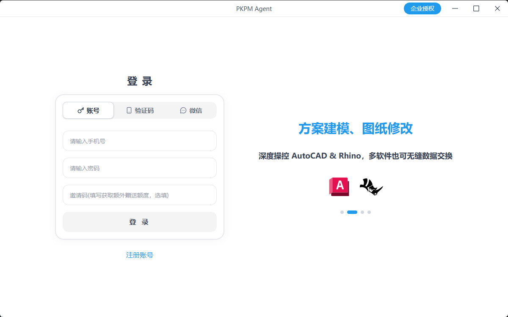
<br>
<sub>▲ 登录界面：支持账号 / 验证码 / 微信登录，下方为注册账号与锁码授权入口</sub>
</div>

### 3.3 主界面

登录后进入主界面（见第 1 节配图）：

- **顶栏**：从左到右依次为收起 / 展开侧栏、**窗口置顶**、**后退 / 前进**（在会话与各页面之间切换），右侧显示当前版本号。
- **左侧导航**：**新建任务 / 插件 & 脚本 / Skills & MCP / 本地知识库**，下方是按工作空间分组的历史会话与最近会话。窄窗口下侧栏可自动收起。
- **中间对话区**：输入需求，`Shift + Enter` 换行。已有会话顶部可按工作空间分组切换聊天，右上角可打开**任务产物**面板。
- **文件与资料引用**：输入 `@` 选择知识库或工作目录文件，输入 `/` 选择技能；也可将文件或整个文件夹拖入输入框。可拖入不代表所有文件都能直接预览，专业文件需配合相应软件或技能处理。

对话框下方可以：

- 点「**+**」添加文件、图片，或选择 **Skills 技能与知识库**；
- 切换**大模型**，模型列表显示各模型的**积分消耗速度倍率**与是否支持图片输入，具体可选模型以当前菜单为准；
- 查看**上下文用量指示**（模型名右侧的圆环，悬停显示已用百分比，点击可查看明细和压缩会话）；
- 切换 **权限模式**（Ask / Auto / Full）；
- 选择会话所属的 **工作空间**。

新建任务页面下方是 CAD / Rhino / Office / PKPM / GBP绿建 / Sap2000 六个快捷提问入口。

<div align="center">
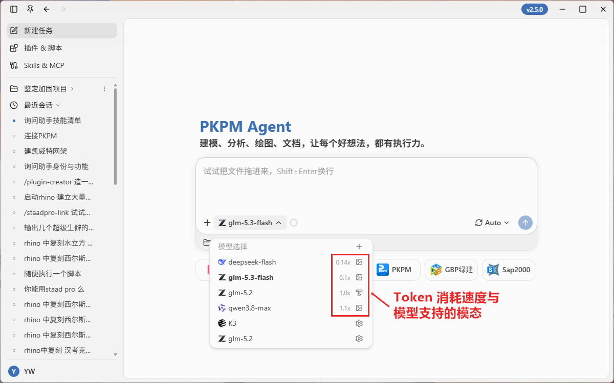
<br>
<sub>▲ 模型列表：查看积分消耗速度倍率与图片输入能力，实际可选模型以菜单为准</sub>
</div>

显式选择的工作空间会将相关会话分组展示，点击组名可展开或收起，右侧「⋮」可新建任务、打开文件夹、重命名或删除该组会话。未显式选择工作空间的任务会自动创建工作目录，通常显示在「最近会话」中：

<div align="center">
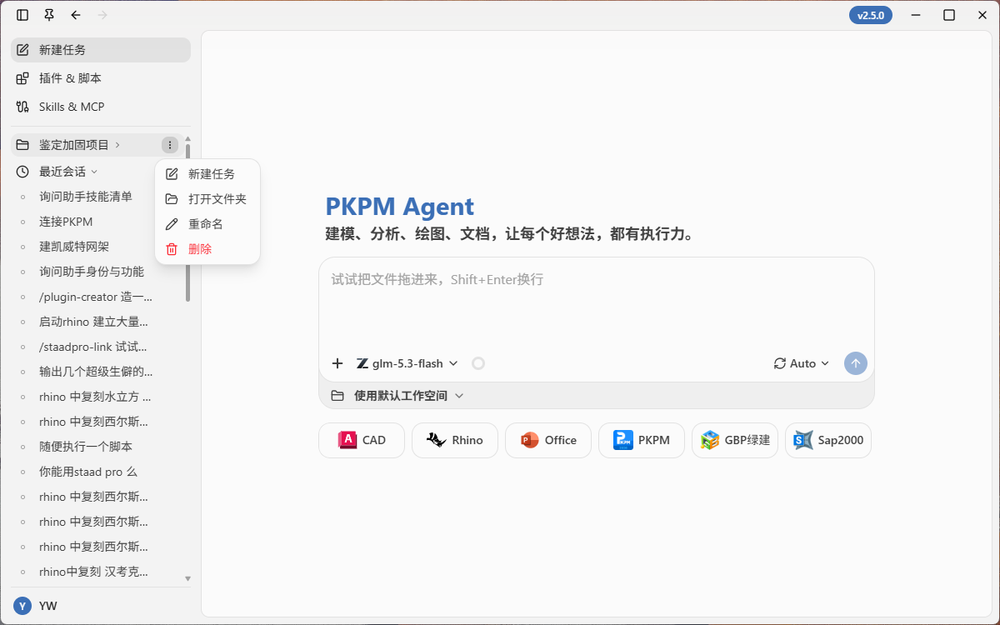
<br>
<sub>▲ 项目会话按工作空间分组展示，默认任务显示在「最近会话」中</sub>
</div>

**选择模型**：构力科技提供内置模型服务，可在菜单中选用 GLM、Kimi、Qwen、DeepSeek 等模型，无需自行填写 API Key。也可点击模型菜单中的「+」添加自定义第三方模型：选择服务商，填写模型 ID、API 地址与密钥，检测连接通过后启用，支持按量计费与 Coding Plan 接入方式。

<div align="center">
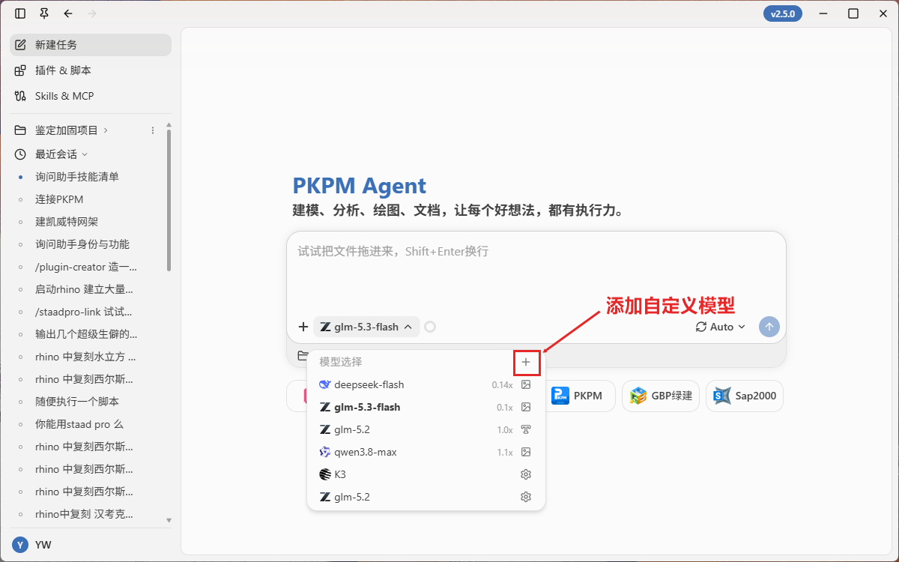
<br>
<sub>▲ 在模型选择菜单中点击「+」添加自定义第三方模型</sub>
</div>

<div align="center">
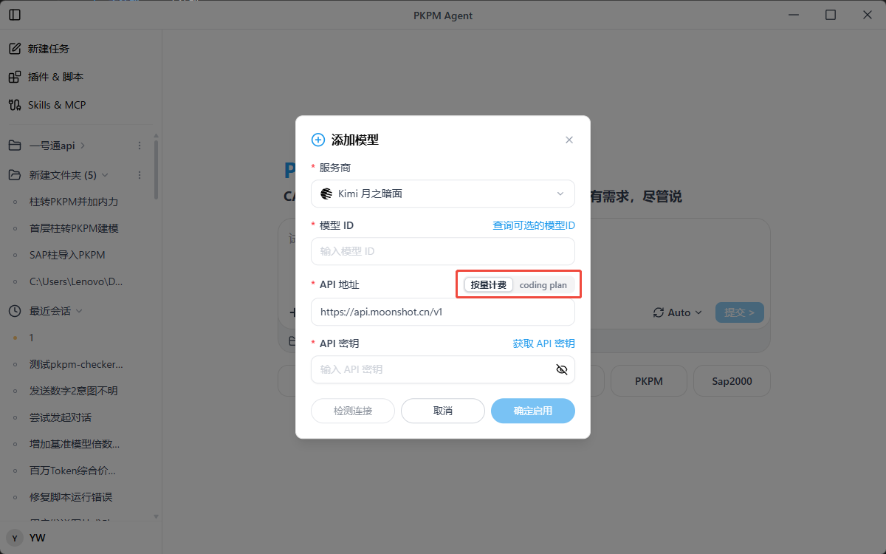
<br>
<sub>▲ 填写服务商、模型 ID 与 API 密钥，检测连接后启用</sub>
</div>

开始任务时，尽量说清目标软件、文件或模型、单位、需要改动的范围和期望产物。例如：

> 从「项目规范」知识库中查找梁柱节点的相关条文，列出适用条件并标注出处。
>
> 将当前模型中指定楼层的梁按截面分组统计，输出带单位的 Excel 汇总表。
>
> 按我提供的公司模板，将这份项目报告整理成 12 页方案汇报 PPT，保留 Logo、主题色和页脚。

### 3.4 快捷提问

点击对话框下方的快捷入口，会展开该软件的示例任务。点击示例只把内容填入输入框、不会直接发送，可以改好参数再发：

<div align="center">
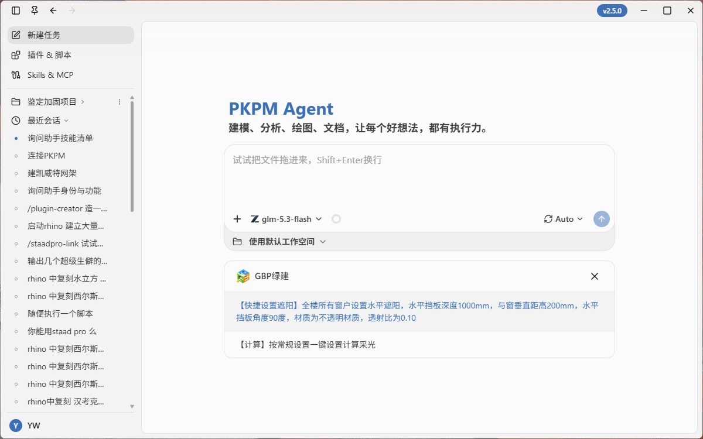
<br>
<sub>▲ 点击「GBP绿建」展开绿建示例，点击示例后内容填入输入框</sub>
</div>

### 3.5 账号、外观与设置

点击左下角用户头像，可打开 **余额 & 邀请码、语言（中 / 英）、外观、产品说明、检查更新、退出登录** 等菜单项。**外观** 下可选 **浅色模式 / 深色模式 / 跟随系统**。

<div align="center">
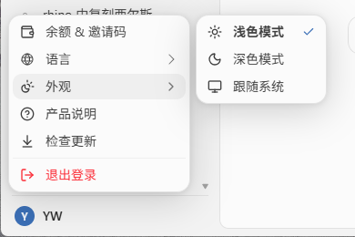
<br>
<sub>▲ 用户头像菜单：外观下可切换浅色 / 深色 / 跟随系统</sub>
</div>

<div align="center">
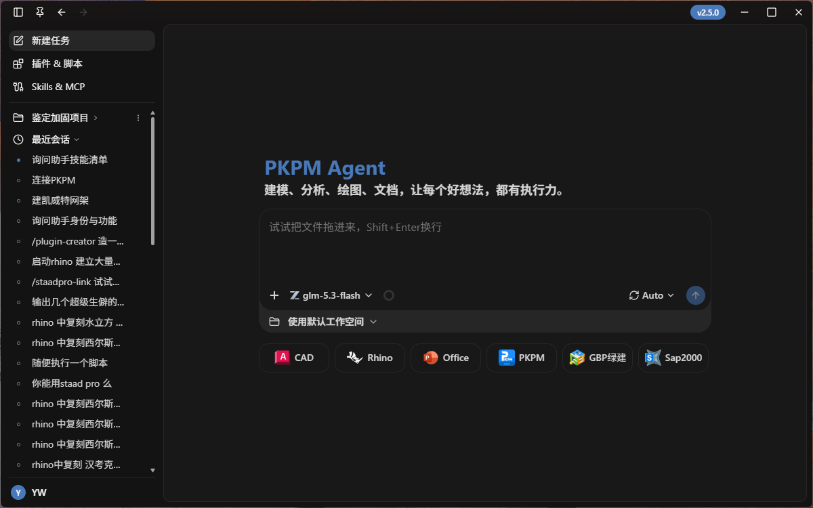
<br>
<sub>▲ 深色模式下的主界面</sub>
</div>

---

<a id="插件与脚本"></a>

## 4. 插件 & 脚本系统

**把一次成功的任务，留成下一次可直接使用的工具。** 在一轮回答末尾点击 **插件 & 脚本**，可将任务制作成插件，或将执行过程中生成的脚本保存到脚本库：

- **插件**：Agent 将流程提炼为带**参数表单**的工具，跨度、截面、材料等作为可填写参数；以后填入参数点击 **运行**，即可按同一逻辑执行。支持「恢复默认参数」，运行后的参数也会记住，方便下次使用。
- **脚本**：收藏本次任务生成的 Python 脚本，可随时查看、编辑、运行。
- **Agent 协同**：插件与脚本既可从对话中创建，也可从左侧页面新建；「让 Agent 修改」用于继续调整，运行失败时还可将参数和错误信息交给 Agent 修复。
- 适用于重复性模型检查、标准化建模流程、批量处理等场景。

<div align="center">
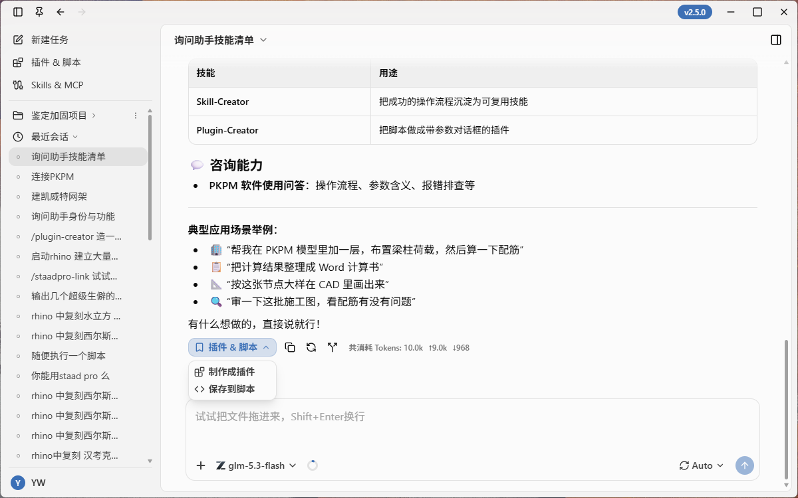
<br>
<sub>▲ 在一轮回答末尾，将本次任务制作成插件或保存到脚本</sub>
</div>

插件会生成参数表单，填入参数、点击「运行」即可重复执行任务（旧版演示中的按钮为 RUN）：

<div align="center">
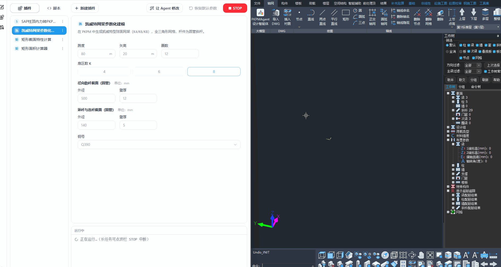
<br>
<sub>▲ 插件填入参数后一键执行</sub>
</div>

参数表单支持数值、文本、开关、下拉选项、目录和**文件**等类型；目录和文件类型的参数旁有「**浏览…**」按钮，可直接在弹出的对话框里选择，不用再手动粘贴路径：

<div align="center">
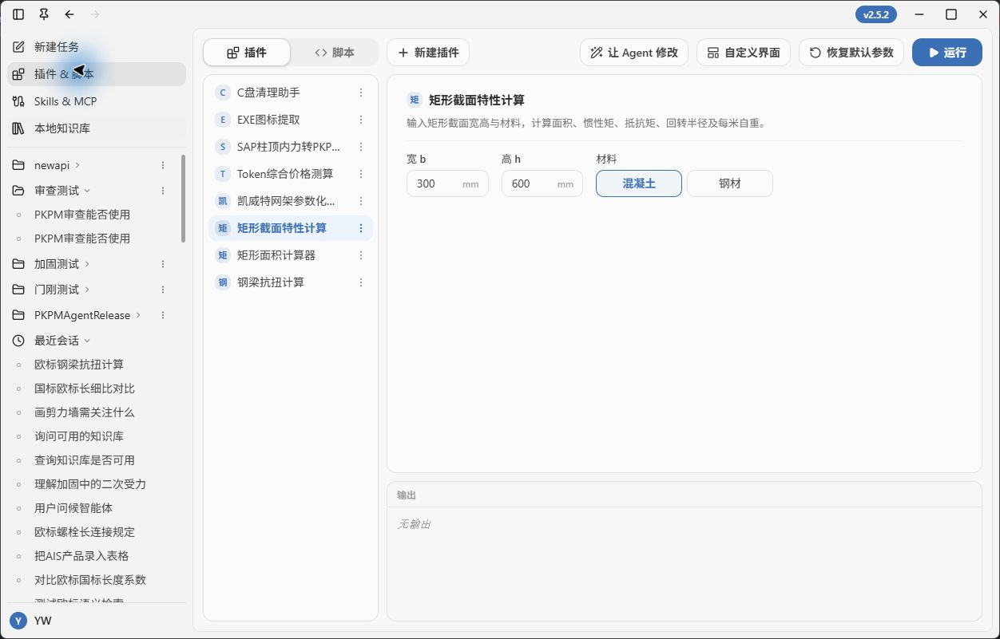
<br>
<sub>▲ 插件页面：参数表单上方可「让 Agent 修改」「自定义界面」「恢复默认参数」或「运行」</sub>
</div>

### 动态参数：按当前选择填写

插件可根据参数选择显示相关输入项，例如选择矩形截面时填写宽、高，选择圆形截面时填写直径。需要这样的表单时，可以直接让 Agent 配置显示条件。隐藏参数保留之前的取值，但不参与本次输入校验和参数传递；分组也可折叠，减少表单占用。

修改参数后，界面会提示**需要重新运行**，并注明下方仍是上一次结果，便于区分不同方案的计算输出。

### 自定义界面：把工具调整成自己顺手的样子

选中插件后点击 **自定义界面**，可在当前表单上完成调整：

- 按住标题拖动参数或分组，改变顺序与位置；拖动左右边缘调整宽度。
- 点击标签、标题或说明文字直接修改文案。
- 使用撤销、重做查看不同排布，满意后点击**保存**，或点击**取消**放弃本次编辑。

界面编辑用于调整文案和布局；需要新增参数、修改算法或改变显示条件时，使用「让 Agent 修改」。

<div align="center">
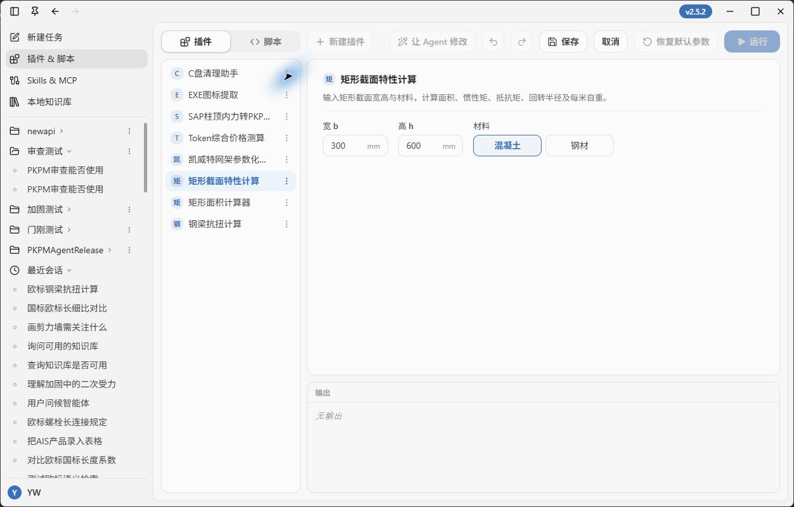
<br>
<sub>▲ 在插件表单上调整布局与文字，编辑完成后保存或取消</sub>
</div>

脚本既可从对话中收藏，也可由 Agent 直接创建、修改与修复：

<div align="center">
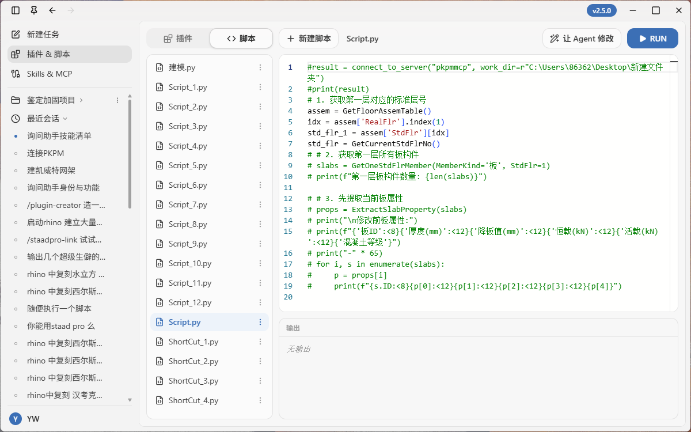
<br>
<sub>▲ 脚本页面：查看、编辑、运行脚本，或交给 Agent 修改</sub>
</div>

**🧩 插件分享**：本仓库 [**Plugins 目录**](Plugins/) 收录官方与社区制作的现成插件，可直接下载使用——首批提供 **球面网壳 6 种类型建模（JGJ 7-2010）** 的 PKPM 建模插件与 SAP2000 建模插件（内含免安装的独立 EXE 程序），详见[插件分享说明](Plugins/README.md)。

---

## 5. 技能、软件连接与本地知识库

### 5.1 Skills 技能

**将经验、方法转化为 skills，相似任务轻松复用。** 系统内置多套专业技能，按用途分为建筑设计、结构设计、通用办公和其他四组。点击左侧 **Skills & MCP**，可查看并管理所有技能。

| 分组 | 技能 | 能力 |
| --- | --- | --- |
| 建筑设计 | `AutoCAD-Link` | 操控 AutoCAD、浩辰 CAD、中望 CAD 完成绘图、改图、图纸信息提取 |
| 建筑设计 | `Rhino-Link` | 操控 Rhino 完成建模、绘图、曲面、网格等 3D 建模任务 |
| 建筑设计 | `bimbase-parametric-component` | 用 pyp3d 编写 BIMBase 参数化建模脚本，并在 BIMBase 中执行 |
| 建筑设计 | `GBP-Link` | 连接 PKPM 绿色低碳系列软件，完成建模、节能、风环境、采光、碳排放等计算 |
| 结构设计 | `PKPM-Link` | 连接 PKPM，完成建模、荷载布置、楼层组装、计算与结果提取 |
| 结构设计 | `pkpm-checker` | PKPM 图纸审查：识别校审 DWG 施工图，结果可标注回 CAD、导出 Word 报告 |
| 结构设计 | `SAP2000-Link` | 操控 SAP2000 进行建模、分析与结果提取 |
| 结构设计 | `ETABS-Link` | 操控 ETABS 进行建模、分析与结果提取 |
| 结构设计 | `STAADPro-Link` | 操控 STAAD.Pro 进行建模、计算与结果读取 |
| 结构设计 | `Abaqus-Link` | 操作 Abaqus 完成建模、修改、网格、分析设置、作业提交和结果提取 |
| 结构设计 | `Tekla-Link` | 控制正在运行的 Tekla Structures，完成模型读取、创建、修改与节点组件操作 |
| 结构设计 | `SSG-Link`（Beta） | 连接 SAUSG，完成模型查看、修改、查询 |
| 结构设计 | `PlantS-Link` | 连接 PlantS（BIMBase），完成工厂结构模型的梁、柱、支撑等构件操作 |
| 通用办公 | `Word-Link` / `Excel-Link` / `PPT-Link` | 文档与表格编辑、模板复用、整篇翻译，以及按场景设计、检查和交付 PPT |
| 通用办公 | `PDF-Link` | PDF 内容与表格提取、合并拆分、生成报告与填写表单 |
| 其他 | `plugin-creator` / `skill-creator` | 把一次成功的对话做成插件，或沉淀为新技能 |

> **按需启用**：关闭技能后，Agent 不再自动使用该技能的专业指导。可只开启常用技能，让任务匹配更集中。标注「Beta」的技能默认关闭，需要时手动开启；标注「需授权」的项目需先开通对应产品。

<div align="center">
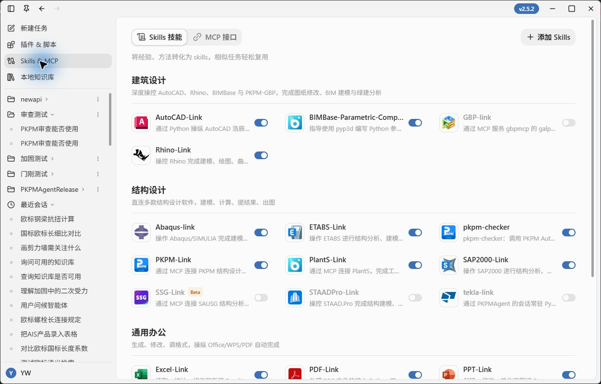
<br>
<sub>▲ Skills 技能管理界面：技能按用途分组，可启用 / 关闭技能，或添加第三方技能</sub>
</div>

点击任意技能卡片可打开详情弹窗，查看完整说明，并可直接「立即使用」：

<div align="center">
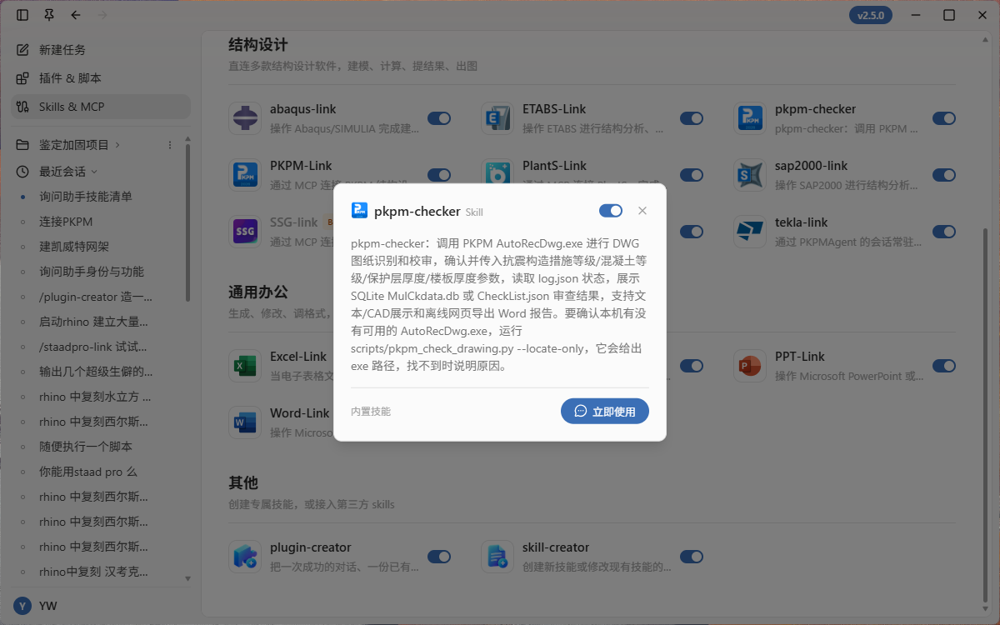
<br>
<sub>▲ 技能详情弹窗</sub>
</div>

除内置技能外，还支持**自定义技能**：把常用的工作流程沉淀为技能，重复使用。点击 **添加 Skills** 可接入第三方技能；在对话框输入「/」即可快速选用技能：

<div align="center">
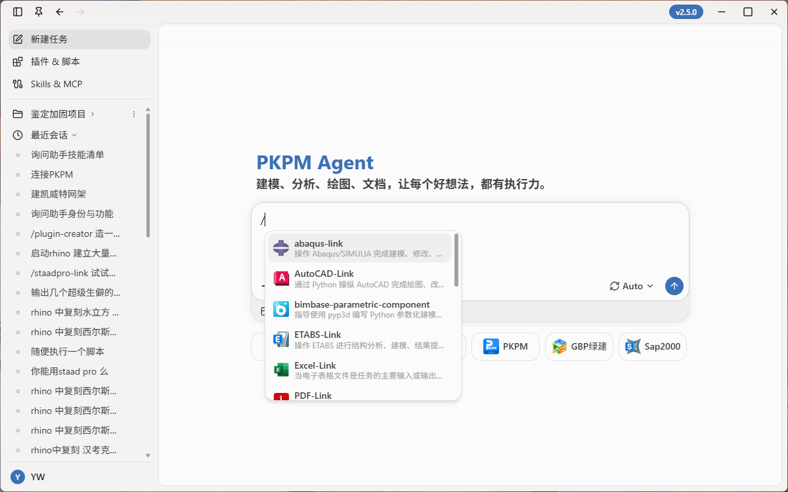
<br>
<sub>▲ 在对话框输入「/」快速选择技能</sub>
</div>

### 5.2 MCP 接口

**MCP 接口** 页列出了 Agent 可连接的各个软件服务，以中文名称和用途说明显示，可按需启停：

| 名称 | 用途 |
| --- | --- |
| PKPM | PKPM 三维主线模块，含鉴定加固功能 |
| PKPM STS | PKPM 二维钢结构模块 |
| PKPM JCCAD（Beta） | PKPM 基础模块 |
| SAUSG（Beta） | SAUSG 非线性动力弹塑性分析软件，含减震、隔震、加固等模块 |
| PlantS | 基于 BIMBase 的三维工厂结构设计系统 |
| BIMBase 参数化组件 | Python 组件建模指南，pyp3d 建模脚本的函数文档检索 |
| PKPM 绿色低碳 | PKPM 绿色低碳模块，含节能、风环境、采光、碳排放等计算 |

点击 **添加 MCP** 可接入更多外部工具，扩展 Agent 的能力边界。

<div align="center">
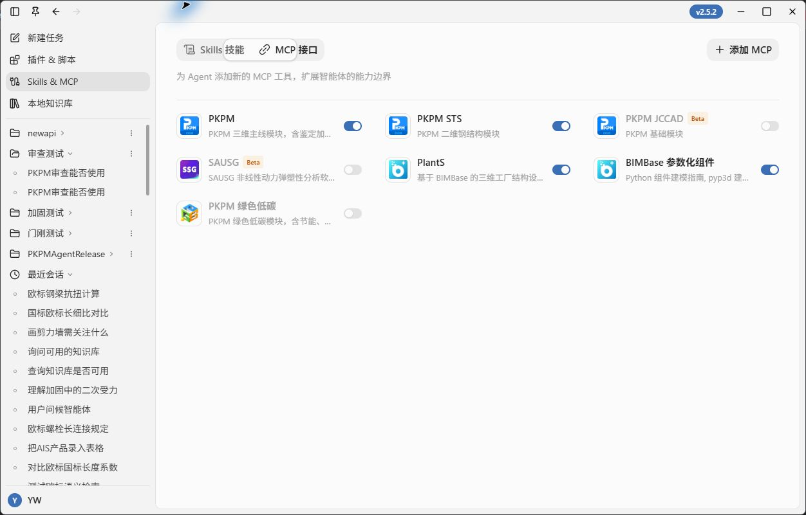
<br>
<sub>▲ MCP 接口页面：按用途启停连接，预览版标注「Beta」，授权状态单独显示</sub>
</div>

### 5.3 本地知识库

**让规范、图集和项目资料随问随查，回答有出处可核对。** 点击左侧 **本地知识库**，可按项目或资料类型建立不同知识库，导入文件并按文件夹整理。知识库用于保存和检索资料，提问仍在普通对话中进行。

<div align="center">
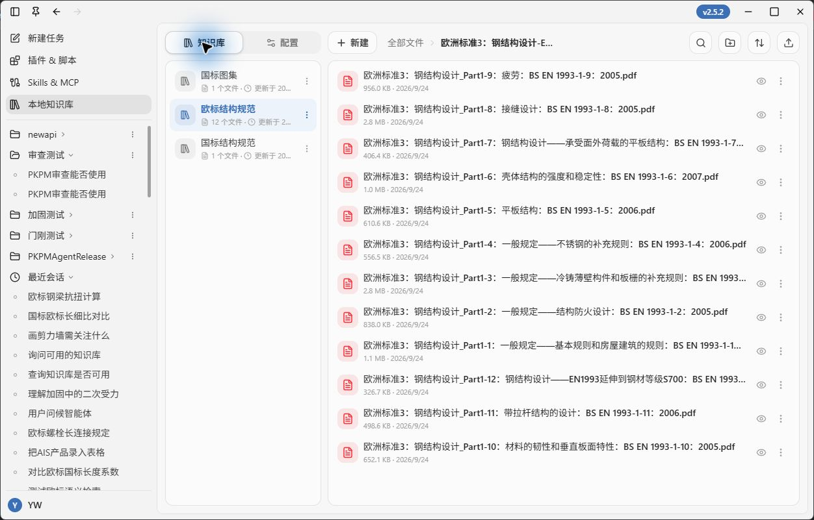
<br>
<sub>▲ 按知识库与文件夹管理资料，可搜索文件名和正文内容</sub>
</div>

**建立与使用知识库**：

1. 点击**新建**，为知识库命名，例如「项目规范」「软件手册」。
2. 上传文件或文件夹，等待解析完成；导入过程会显示处理阶段，PDF 解析可显示页数进度。失败文件可重试，导入任务也可取消。
3. 回到对话，输入 `@` 或点击「＋ → 知识库」选择资料，也可直接说出知识库名称和需求。
4. 查看回答中的出处，点击链接打开原文预览，核对条文上下文、表格和适用条件。

例如：「从『项目规范』中查找钢梁抗扭验算的条文，解释各项应力如何组合，并标注出处。」同一份资料可在不同会话中反复查询，无需每次重新上传。

**查找与核对**：知识库页面可按文件名和正文内容搜索；对话检索还可结合问题含义寻找相关章节。点击回答中的出处，会在独立窗口显示原文，便于与回答并排核对；PDF 可定位到相关页、翻页、缩放，也可在系统中打开原文件。

<div align="center">
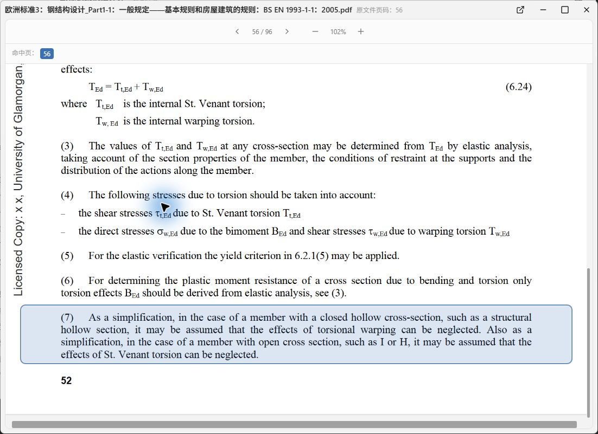
<br>
<sub>▲ 从回答中的出处打开原文，定位相关页并查看条文上下文</sub>
</div>

**解析与检索配置**：在知识库顶部点击 **配置**，可设置文档解析服务、OCR / 表格 / 公式识别，以及语义检索模型。

- **TXT、Markdown、CSV** 直接在本地解析。
- **PDF、Word、PPT、Excel、图片** 等资料通过配置的云端服务解析，使用前需填写并验证解析服务密钥；构力云解析服务当前显示「敬请期待」。
- **语义检索**可选内置向量模型、自定义兼容模型或关闭。语义服务暂不可用时，仍可使用关键词检索。

资料和解析结果保存在所选知识库目录；使用云端解析时文件会发送到解析服务，启用语义检索时相关文本片段和查询会发送到所选模型服务，可按资料使用要求选择配置。

**与同事共用资料**：知识库位置可切换到本地目录或网络共享文件夹。切换位置只改变当前使用的资料目录；需要搬动已有资料时使用**迁移**。从共享目录转到本地时，也可选择**复制**，保留同事仍在使用的共享资料。

<div align="center">
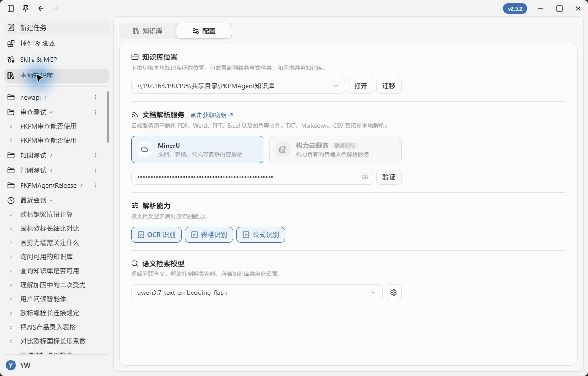
<br>
<sub>▲ 设置知识库位置、文档解析能力与语义检索模型</sub>
</div>

---

## 6. 主要功能

### 6.1 操控 PKPM

- **结构模型操作**：创建 / 修改 / 删除梁、柱、墙、板、支撑等构件；定义截面属性与材料等级；操作节点坐标、轴线网格、楼层标高；查询现有模型的几何与属性信息。
- **荷载与工况管理**：施加恒载、活载、风载、地震作用等荷载；定义荷载工况与组合系数；处理吊车、温度、支座沉降等特殊工况。
- **楼层与组装**：创建标准层、定义层高与复制关系、进行楼层组装；修改 / 读取结构总体控制参数（抗震等级、烈度、结构体系等）。
- **计算分析与结果提取**：自动调用 SATWE 计算；提取内力、位移、配筋、应力、周期、振型等结果；读取构件验算结果（轴压比、剪压比、层间位移角等）与计算书文本。
- **多模块联动**：除三维主线模块外，还可连接 **STS 钢结构** 与 **JCCAD 基础**（Beta）模块，在 MCP 接口页开启即可。
- **连接正在运行的 PKPM**：会一并记录其启动参数，计算完成后可按原模块重新打开。

<div align="center">
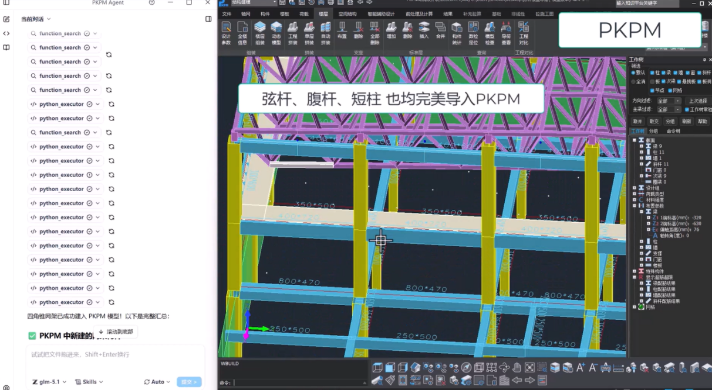
<br>
<sub>▲ 通过自然语言指令操控 PKPM 完成结构建模</sub>
</div>

建模完成后，可直接指令 Agent 启动计算并提取分析结果：

<div align="center">
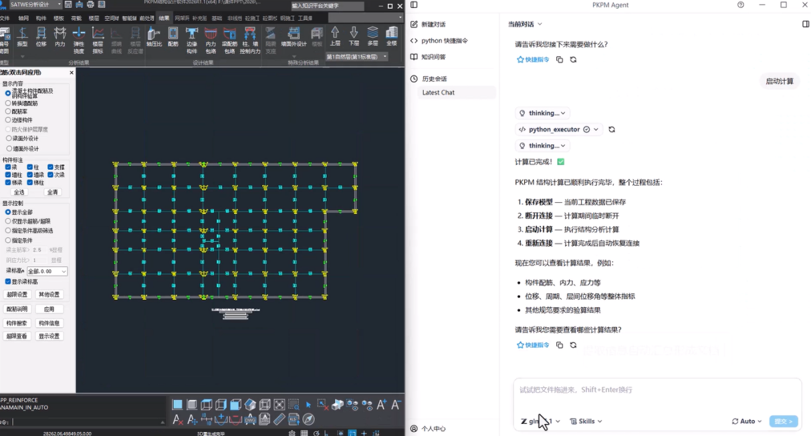
<br>
<sub>▲ 自动调用 SATWE 计算并提取结果</sub>
</div>

### 6.2 PKPM 图纸审查

通过 `pkpm-checker` 技能，对 DWG 施工图进行识别与校审：

- **识别校审**：把 DWG 施工图交给 Agent，确认抗震构造措施等级、混凝土等级、保护层厚度、楼板厚度等参数后自动识别并审查。
- **查看结果**：审查意见可在对话中以文本查看，也可标注回 AutoCAD 图纸中对应位置。
- **导出报告**：一键导出 Word 审查报告。

> **使用前提**：本机已安装 PKPM（图纸审查依赖 PKPM 自带的施工图识别程序）；查看标注需安装 AutoCAD。

### 6.3 操控 SAP2000

通过 `sap2000-link` 技能，使用 Python COM 接口操控 SAP2000：

- **结构建模**：框架、壳、实体、索、钩/隙单元；标准型钢与自定义截面；预应力、桥梁、变截面等特殊单元。
- **荷载与分析**：集中力、分布力、温度、支座沉降、车辆荷载等；线性/非线性静力、模态、反应谱、时程、屈曲、Pushover 等分析类型。
- **结果提取**：节点位移、单元内力、支座反力、模态信息、屈曲系数；钢构件应力比、混凝土配筋结果。
- **典型用途**：处理空间桁架、大跨结构、桥梁等复杂空间结构的补充分析。

<div align="center">
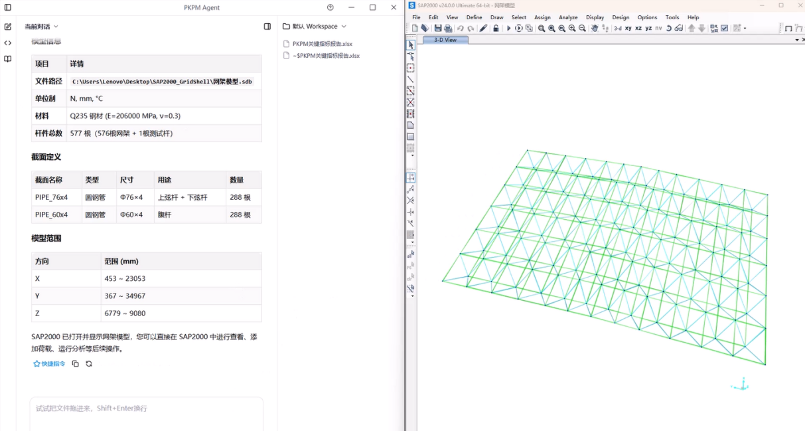
<br>
<sub>▲ 操控 SAP2000 完成建模与分析</sub>
</div>

### 6.4 操控 ETABS

通过 `ETABS-Link` 技能，使用 Python COM 接口操控 ETABS：

- **结构建模**：点、线、面、实体单元；框架/板/墙截面与材料；楼层标高、轴网、刚性隔板；支座约束、弹簧、阻尼器、隔震/耗能装置等。
- **荷载与工况**：恒载、活载、风载、地震、温度等荷载；多种荷载模式；静力、反应谱、时程、Pushover 等分析工况及组合。
- **分析与结果**：自动运行计算、检查模型完整性；提取内力、位移、层间位移角、模态、反力、应力及设计结果。
- **数据联动**：将模型数据或结果导出到 Excel / Word / PPT，自动生成分析报告或对比表格。

### 6.5 操控 STAAD.Pro

通过 `staadpro-link` 技能，可让智能体直接在 STAAD.Pro 中完成结构建模、计算分析并读取结果：

- **结构建模**：创建节点、杆件、板单元；定义截面属性与材料；布置支座约束。
- **荷载与参数**：施加恒载、活载、风载等荷载；定义荷载工况与组合；设置地震参数。
- **计算与结果**：自动执行分析计算，提取节点位移、构件内力、支座反力等结果。

### 6.6 操控 Abaqus

通过 `abaqus-link` 技能操控 Abaqus / SIMULIA，从建模到看结果全流程可用：

- **建模与修改**：几何、材料、装配、分析步、边界条件、载荷、网格划分与分析设置。
- **提交与结果**：提交作业、查询计算状态、提取并判定结果。
- **按版本匹配 API**：内置 2024 / 2025 / 2026 各版本 API 文档，连接后按实际版本查询，脚本写法与所装版本一致。

启用该技能后，对话中提到 Abaqus、SIMULIA 或 `.cae` / `.inp` / `.odb` 文件时，Agent 可按需求选用相应操作指导。

### 6.7 操控 Tekla Structures

通过 `tekla-link` 技能，实时控制正在运行的 Tekla Structures：

- **自动识别版本**：连接后识别当前运行的 Tekla 版本，匹配 2020 ~ 2026 对应的 Open API。
- **模型操作**：读取当前模型，创建与修改构件，操作节点组件，完成批量化的工程自动化任务。

### 6.8 操控 SAUSG（Beta）

通过 `SSG-link` 技能连接 SAUSG 非线性动力弹塑性分析软件，可对模型进行查看、修改与查询，涉及梁、柱、墙、板等构件、楼层与性能目标。该功能仍在完善中，需在 Skills 与 MCP 接口页手动开启。

### 6.9 操控 Rhino

通过 `Rhino-Link` 技能，使用 Python COM 接口操控 Rhino（犀牛）：

- **几何创建**：NURBS 曲线与曲面（拉伸、旋转、放样、扫掠）、实体与网格布尔运算。
- **建筑与结构建模**：参数化生成建筑外形、幕墙分格、结构构件定位；批量生成梁、柱、支撑等三维实体。
- **编辑与出图**：平移/旋转/缩放/镜像/阵列、几何分析、图层管理、尺寸标注与视图控制。
- **联动应用**：将复杂曲面数据导出供 ETABS / SAP2000 / PKPM 分析，或基于结果生成优化后的建筑形体。

<div align="center">
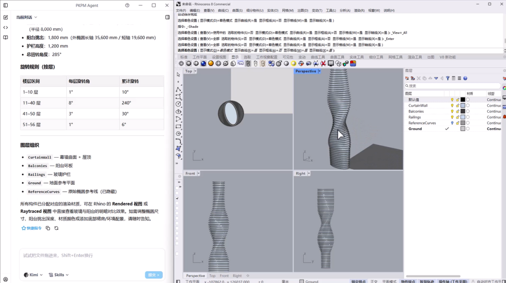
<br>
<sub>▲ 操控 Rhino 进行参数化建模</sub>
</div>

可结合不同软件的优势推进同一项目，例如从 Rhino 获取网架几何，再交给分析软件建模与计算：

<div align="center">
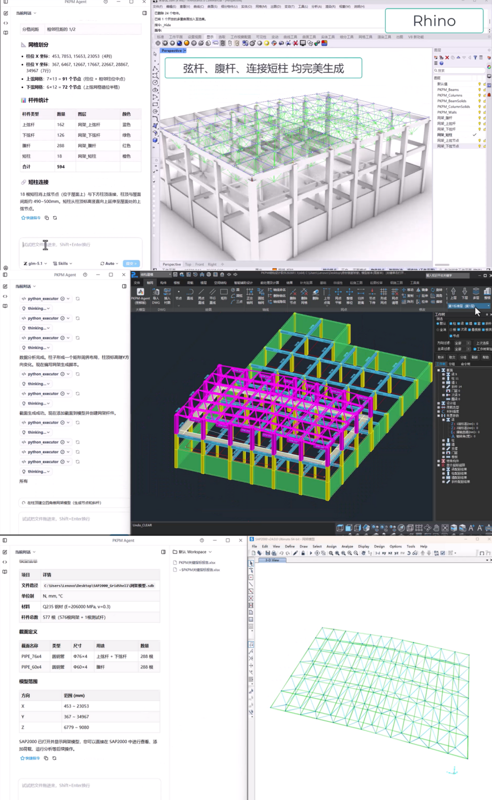
<br>
<sub>▲ 网架结构在多软件间流转：Rhino 造型 → 分析软件计算</sub>
</div>

### 6.10 操控 CAD（AutoCAD / 浩辰 CAD / 中望 CAD）

通过 `AutoCAD-Link` 技能连接 AutoCAD、浩辰 CAD（GstarCAD / GCAD）或中望 CAD（ZWCAD），完成绘图、改图与信息提取：

- **自动绘图**：根据数据或指令绘制轴线、梁线、柱截面、剪力墙轮廓、支撑等；添加文字、尺寸标注；插入标准节点详图、柱表、图框等图块。
- **智能改图**：批量移动/复制/旋转/缩放；按规则批量修改图层、颜色、线型；批量删除多余图元；统一文字与标注样式。
- **图纸信息提取**：一键提取图中文字、坐标、多段线顶点；按图层筛选；读取当前选中对象信息。
- **数据联动**：配合专业软件的模型数据与计算结果，完成模型转图、结果回注和底图建模等任务。
- **目标选择**：优先连接已运行的 CAD；多款产品同时运行时先选择目标。软件忙碌或暂不可连接时会提示处理方式，避免在未明确目标时重复启动。

> **使用前提**：已安装支持 COM 自动化接口的相应 CAD 产品，可正常启动，图纸文件未加密或写保护。AutoCAD 建议使用 2018 及以上版本。

<div align="center">
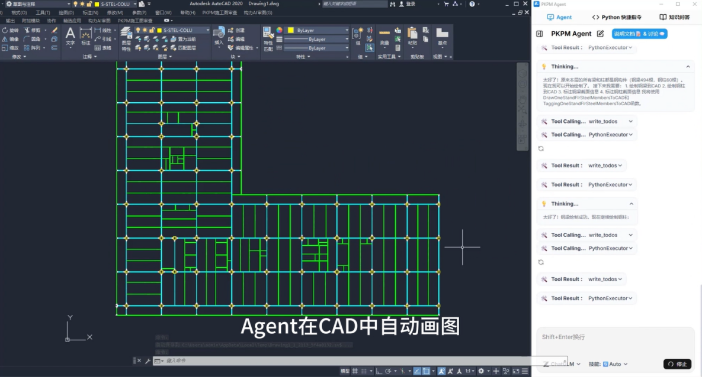
<br>
<sub>▲ PKPM Agent 操控 AutoCAD 自动绘图</sub>
</div>

### 6.11 BIMBase 与 PlantS

- **PlantS 工厂结构**：通过 `PlantS-Link` 技能连接 PlantS（基于 BIMBase 的三维工厂结构设计系统），完成梁、柱、支撑、截面、材料等构件的创建、查询与修改。
- **BIMBase 参数化组件**：通过 `bimbase-parametric-component` 技能，用自然语言描述几何形状，Agent 检索 pyp3d 建模函数并生成参数化建模脚本，可直接在 BIMBase 内嵌的 Python 环境中执行。

### 6.12 PKPM 绿色低碳 GBP

通过 `GBP-link` 技能连接 PKPM 绿色低碳系列软件：

- **建筑建模**：标准层、墙、幕墙、门窗、柱、屋顶、遮阳、房间等建模与楼层组装。
- **专业计算**：设置节能、室外风 / 室内风、空气质量、碳排放 / 碳评价、采光、热舒适、声环境等分析参数并启动计算，也可进行负荷预测。
- **快捷提问**：主界面「GBP绿建」入口内置了遮阳设置、采光计算等示例，点击即可填入。

当前技能侧重建筑方案设计阶段，可按任务使用相应专业模块。使用前确认配套软件与授权可用，并在 Skills 与 MCP 接口页检查启用状态。

<a id="文档与报告"></a>

### 6.13 文档与报告（Word / Excel / PPT / PDF）

将工程资料、计算数据与表达要求交给 Agent，可创建成果文件，也可继续编辑已有文件。2.5.2 对 Word、Excel、PPT 的制作流程进行了全面升级，分别面向**文档格式保留、表格计算正确性和演示文稿交付质量**。

#### PPT：从逐页叙事到版面复核

适用于项目方案、技术汇报、学术答辩、培训课件等材料，可从报告和大纲生成，也可编辑、美化或翻译已有演示文稿。

- **按用途组织内容**：7 类场景指南覆盖工程技术、分析决策、管理汇报、学术研究、教育培训、商业提案与品牌展示。先明确每页要说明什么，再安排结论标题、论据、图表与图片，让整套材料有连贯的叙述和阅读节奏。
- **24 套设计体系**：覆盖学术教学、咨询研究、宣传展示与工作汇报等风格；整套文稿统一字体、配色、字号层级和版面网格，图文页、数据页与章节页采用适合内容的版式。
- **沿用模板与参考风格**：保留公司模板的 Logo、母版、页脚和主题配色；支持替换示例页内容、按参考风格设计，或将图片与 PDF 页面复刻为 PPT。能用文字、图表和形状表达的内容尽量保留可编辑性。
- **复杂内容也能表达清楚**：支持可编辑图表、柱线组合图、表格、公式、流程与结构示意图；可从提供的 Word、PDF、原 PPT 中使用图片，也可使用工程数据绘制分析图。
- **交付前检查版面**：依据 PowerPoint / WPS 的实际排版检查文字超框、遮挡、重叠、越界和空占位符，再导出页面图复核并修正。还会核对文字改动、字体与待补材料，完成后打开成果文件。

描述需求时，可一并给出用途、受众、页数、模板与素材。例如：「用公司模板做 12 页结构方案汇报，重点比较三种方案的用钢量和施工难度，保留主题色与 Logo，数据用图表呈现。」

#### Word：在原文档上完成编辑与排版

- **报告与计算书**：创建技术报告、说明书和计算书，也可在企业模板上填入工程数据，保留样式、编号、分节和页眉页脚。
- **复杂排版**：调整字体、段落、页面、目录、页码、题注与交叉引用；处理合并表格、斜线表头、三线表、列宽、公式和图片。
- **翻译与审阅**：整篇翻译可另存新文件，核对遗漏并调整译文较长的表格；支持批注与修订。修改后可核对内容变化，并借助 Word / WPS 更新目录、检查页面和导出 PDF。

#### Excel：在正在使用的表格中完成计算

- **锁定目标工作簿**：连接用户打开的 Excel / WPS 表格，按指定文件修改数据与公式；打开多个文件时，也围绕目标工作簿操作，减少切错表的干扰。
- **公式驱动结果**：计算列优先写入公式，参数单独放在可修改的单元格中；后续改变输入时，结果由应用重新计算。
- **工程数据处理**：完成批量填表、筛选、分组汇总、比对、数据清洗、数据透视表与图表制作。交付前读回关键数据并检查公式错误。

#### PDF：读取、整理、生成与填表

提取文字、表格与图片，合并、拆分或整理报告页面，生成 PDF 报告，也可填写有交互字段或固定版面的 PDF 表单。扫描资料的文字识别可使用知识库中的 OCR 解析服务。

下面保留部分成果示例，实际输出可按你的模板和格式要求调整。

**生成 Excel** —— 配筋结果导出与数据报表制作：

<div align="center">
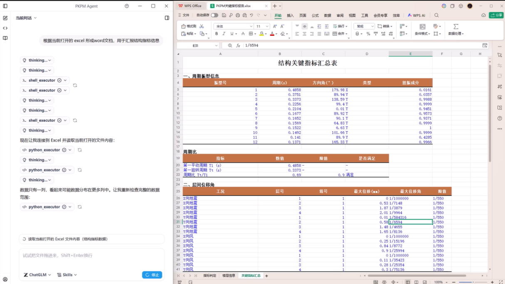
<br>
<sub>▲ 一键生成 Excel 数据报表</sub>
</div>

**生成 Word** —— 结构设计计算书与技术报告自动生成：

<div align="center">
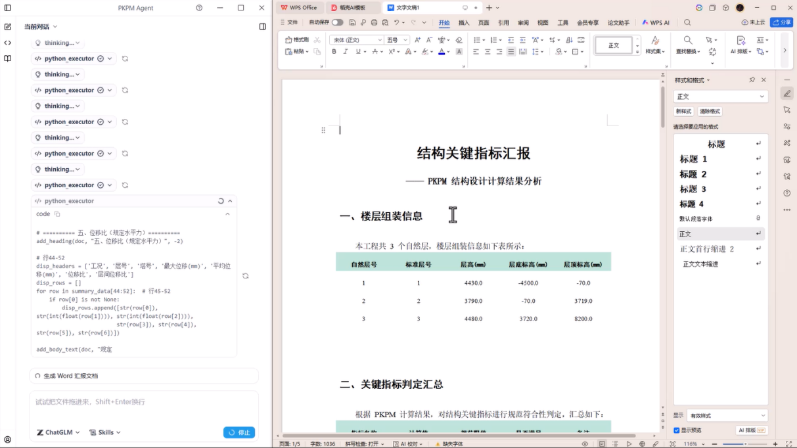
<br>
<sub>▲ 自动生成 Word 计算书</sub>
</div>

**生成 PPT** —— 项目汇报材料与技术演示文稿（既有任务示例）：

<div align="center">
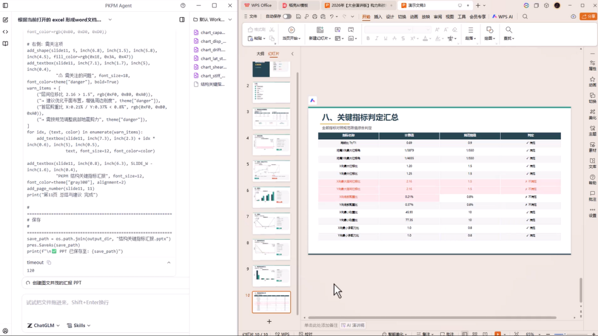
<br>
<sub>▲ 既有 PPT 任务示例；2.5.2 的设计体系与交付检查见上文</sub>
</div>

---

## 7. 会话与任务管理

### 7.1 交互体验

- **分步推进任务**：先明确对象和目标，再连接软件、查询接口与执行；可以在同一会话中继续补充要求、调整参数或解释结果。
- **需要决策时提问**：关键参数不明确或存在多种操作方案时，Agent 可通过选项向你确认，减少理解偏差。
- **成果与过程分开查看**：思考和工具操作收在「执行过程」中，可随时展开；任务完成后集中阅读回答与成果链接，避免长串执行信息打断阅读。
- **多会话并行**：最多可同时运行三个会话，任务在后台完成或出错时收到系统通知，点击通知可返回对应会话。

**对话分支**：用户消息和回答旁均可点击「从此处创建新聊天」。从用户消息创建时，该消息成为新会话的待编辑草稿；从回答创建时，保留截至该回答的历史，方便继续尝试不同方案。

分支拥有独立的对话记录，并自动添加编号区分，**工作目录沿用源会话**。已有模型和成果文件可继续使用，修改同一文件也会影响其他使用该目录的会话；需要保留不同方案时，应另存模型或成果文件。

<div align="center">
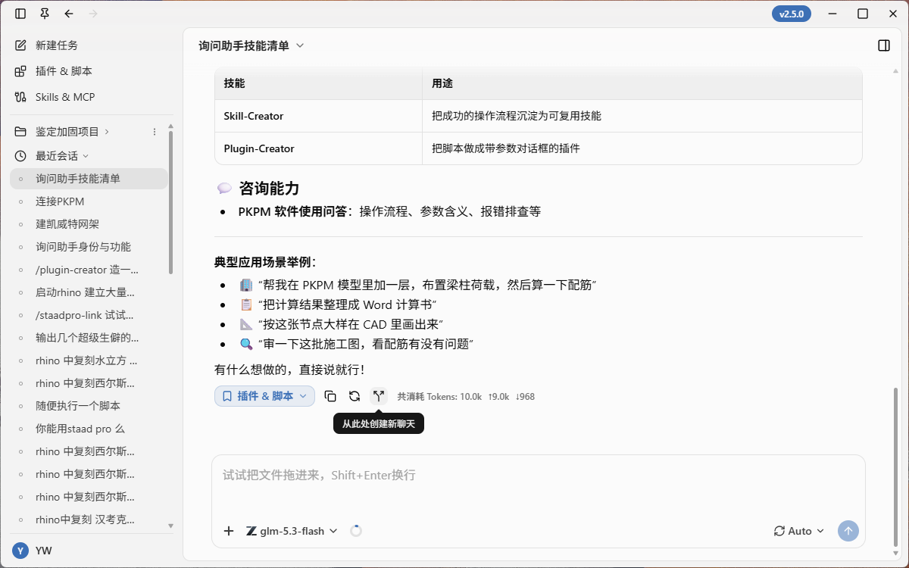
<br>
<sub>▲ 从消息创建新的对话分支，继续探索不同方案</sub>
</div>

**上下文用量与手动压缩**：点击模型名右侧的圆环，可查看上下文总用量，展开后查看系统工具、系统提示词、对话消息和空闲空间的占用明细。需要腾出空间时点击 **压缩会话**，也可从一轮回答末尾的操作栏进入。

压缩会用摘要替代发送给模型的较早消息，保留近期对话和任务要点；**完整消息仍保留**，同时在工作目录中生成可检索的历史记录。完成后显示本次压缩结果；当前没有足够旧消息时会提示无需压缩，失败时可按提示重试。

<div align="center">
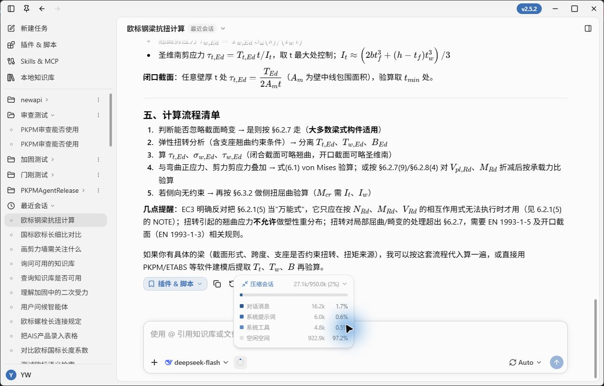
<br>
<sub>▲ 查看上下文用量，按需手动压缩会话</sub>
</div>

**本轮 Token 用量**：把鼠标移到一轮回答末尾的操作栏，可查看**从本轮用户提问开始，所有模型调用的合计消耗**（↑ 输入、↓ 输出）。输入用量包括每次实际发送的历史上下文，输出用量包括本轮模型生成的内容，因此会随任务步骤和会话长度变化；它与上下文圆环显示的当前占用是两个不同指标。

<div align="center">
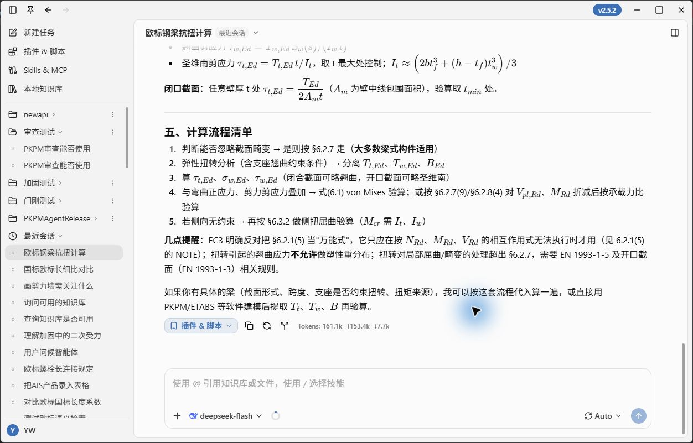
<br>
<sub>▲ 一轮回答末尾显示本轮模型调用的 Token 用量</sub>
</div>

### 7.2 工作空间与任务产物

工作空间是当前会话使用的项目目录。显式选择项目文件夹，可把相关任务集中管理；使用默认工作空间时，软件会为任务创建目录，按日期与任务标题命名，便于找到成果。

点击会话右上角的**任务产物**按钮，可查看工作空间中的文件：

- 浏览文件夹与文件，预览文本、代码、Markdown 和图片；其他格式可用系统默认应用打开。
- 切换全屏查看，便于阅读长文或检查生成的图像；图片支持放大查看。
- 将文件拖入对话框，或右键选择「添加到聊天」，继续修改、分析或整理成果；也可复制路径、打开文件及所在目录。

<div align="center">
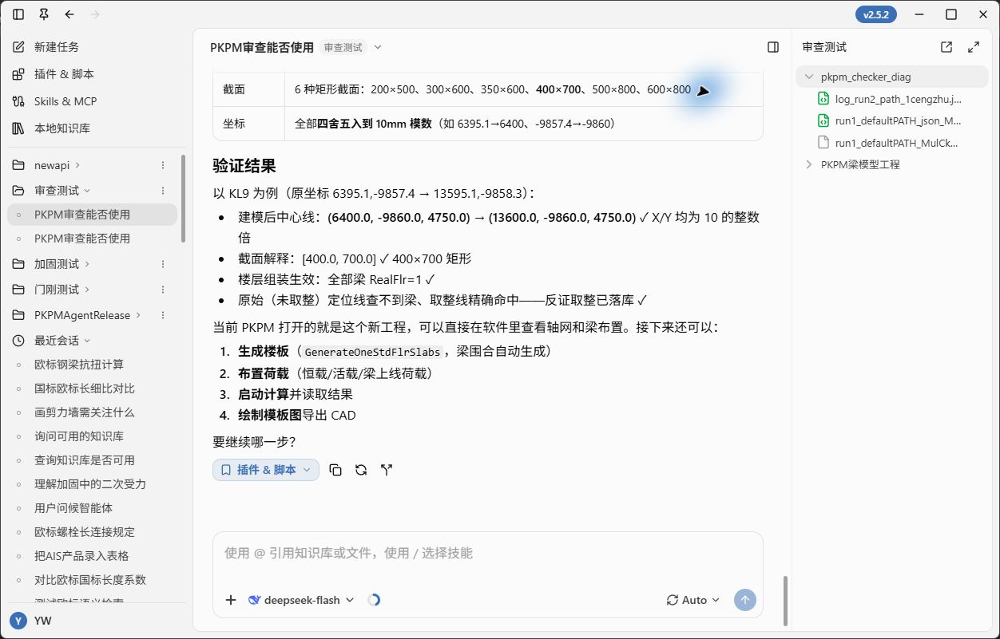
<br>
<sub>▲ 在对话旁查看项目文件与成果，继续用于后续任务</sub>
</div>

### 7.3 权限控制

在输入框下方选择 Ask / Auto / Full，决定代码与命令执行前如何审批：

- **请求批准（Ask）**：Python 脚本和命令执行前均请求批准，适合需要逐步检查操作的任务；审批时可允许本次、在当前会话中始终允许该工具，或拒绝执行。
- **替我审批（Auto）**：Python 脚本与通过内置检查的命令直接执行；被识别为可能有风险的命令请求批准，适合日常任务。
- **完全访问（Full）**：Python 脚本和命令不经过工具执行审批，适合目标与操作范围明确的任务。

权限模式控制执行前的审批方式；任务中需要你决定的专业参数或方案，仍可单独询问。涉及已有模型或成果文件时，建议先明确改动范围与是否另存。

<div align="center">
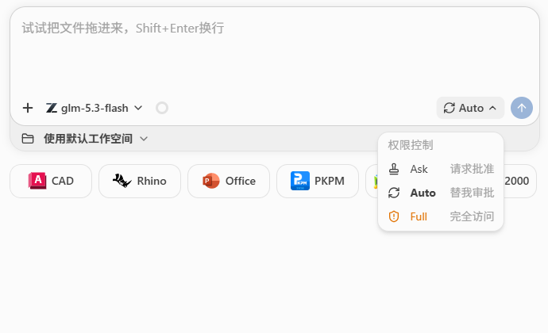
<br>
<sub>▲ 三级权限控制模式：Ask / Auto / Full</sub>
</div>

---

## 8. 二次开发

**将自己的工程方法扩展为可调用工具。** 熟悉 Python 的用户可在 PKPM 的 `UserDefineTool.py` 中编写 MCP 工具；连接相应 MCP 服务后，Agent 可检索并在执行脚本中调用这些接口。也可通过「添加 Skills」接入自己的操作指导，或通过「添加 MCP」连接外部工具服务。

工具代码存放于下图所示路径：

<div align="center">
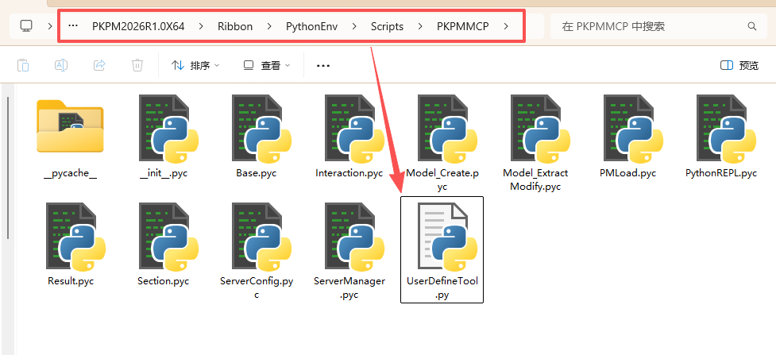
<br>
<sub>▲ 用户自定义工具的存放路径</sub>
</div>

打开 `UserDefineTool.py`，编写 MCP 工具，示例代码如下：

```python
from PKPMMCP.Base import *
__Tag = ToolAnnotations(title="用户自定义")

# 示例：加法工具
@mcp.tool(annotations=__Tag)
def add(a: float, b: float) -> float:
    """加法运算器。"""
    return a + b
```

**二次开发环境配置流程如下：**

1. 使用 VSCode 打开 `PKPM2027RXXX > Ribbon > PythonEnv` 文件夹，并选择 PKPM Python 环境作为 VSCode 的解释器：

<div align="center">
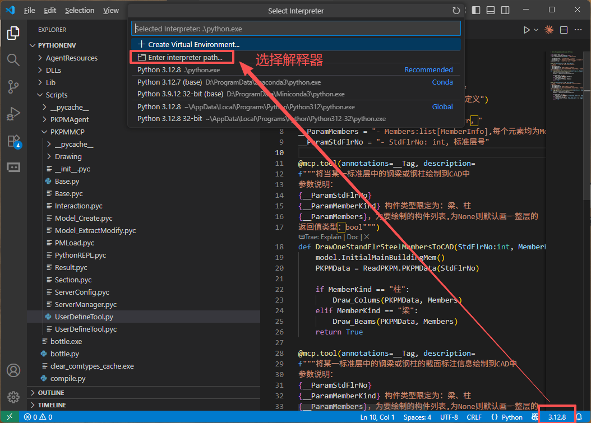
<br>
<sub>▲ 第 1 步：在 VSCode 中选择解释器</sub>
</div>

<div align="center">
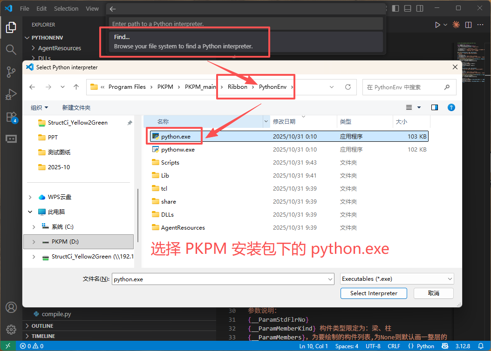
<br>
<sub>▲ 第 1 步（续）：选择 PKPM Python 环境作为解释器</sub>
</div>

2. 开发时可以使用 `Base.py` 文件提供的基础类和工具：

<div align="center">
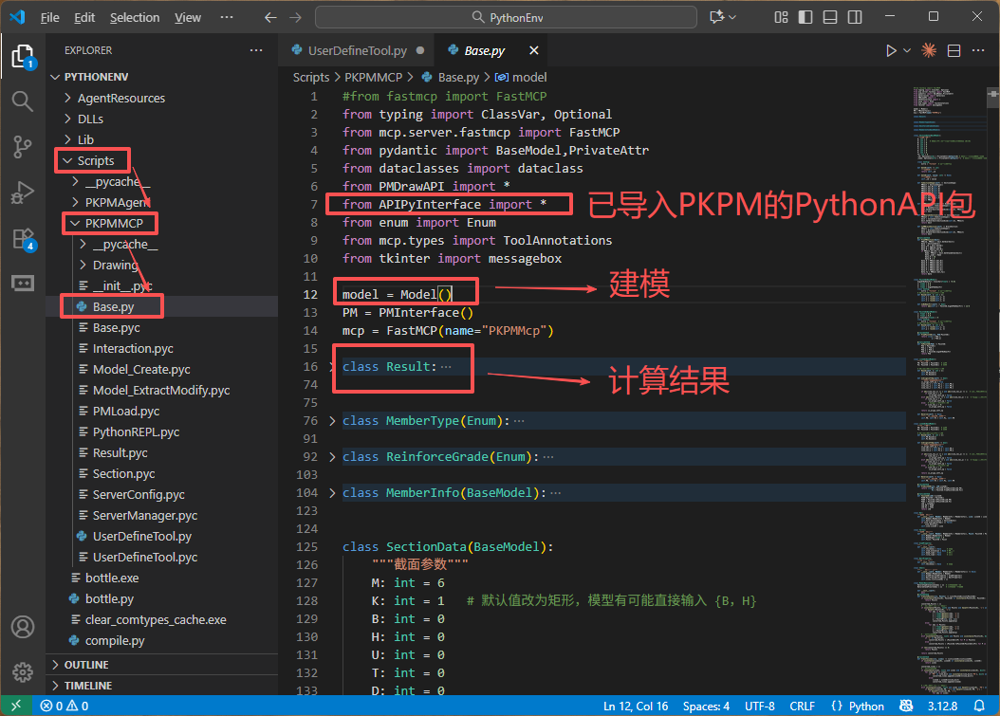
<br>
<sub>▲ 第 2 步：Base.py 提供的基础类与工具</sub>
</div>

3. 打开 `UserDefineTool.py`，编写自己的 MCP 工具，可以直接使用 PKPM 的 Python API：

<div align="center">
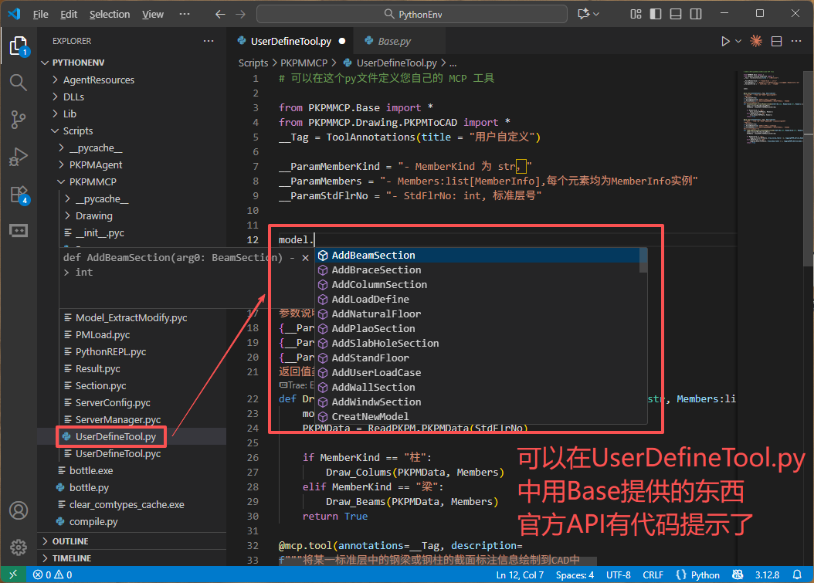
<br>
<sub>▲ 第 3 步：在 UserDefineTool.py 中编写自定义工具</sub>
</div>

---

<a id="交流群"></a>

## 9. 加入交流群

扫码加入 **PKPM Agent 工程设计智能体** 用户交流群，反馈问题、分享经验、获取最新动态：

<div align="center">

<br>
<sub>▲ PKPM Agent 用户交流群</sub>
</div>
